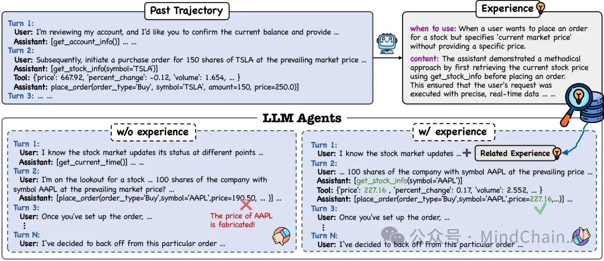

📂 开源链接：
https://github.com/agentscope-ai/ReMe
📄 论文原文：
https://arxiv.org/abs/2512.10696
✨ 一句话点评：
ReMe 用系统化的记忆进化机制证明：与其一味放大模型，不如让智能体真正“记得住、用得对、忘得掉”，程序性记忆正在成为智能体迈向终身学习的关键基础设施。

📌 一句话总结：
本工作提出 ReMe（Remember Me, Refine Me），一个面向 LLM 智能体的动态程序性记忆框架，通过“提炼—复用—淘汰”的闭环机制，让智能体在不重新训练参数的情况下持续进化推理与执行能力。
🔍 背景问题：
当前多数智能体记忆系统存在三大核心瓶颈：
1️⃣ 记忆以“被动堆积”为主，往往只是存储原始轨迹或粗粒度总结，难以抽象出可迁移的关键经验；
2️⃣ 历史经验缺乏上下文自适应能力，检索到的记忆往往难以直接指导新任务；
3️⃣ 缺乏有效的更新与清理机制，导致记忆库随时间退化，掺杂大量低价值甚至有害信息。
💡 方法简介：
ReMe 从“记忆生命周期”视角系统性重构了智能体经验学习流程：
提出多视角经验蒸馏机制，从成功模式、失败触发点以及成败对比中提炼关键步骤级经验，而非整条轨迹；
设计上下文自适应的经验复用流程，基于“使用场景”索引进行检索，并通过重排序与重写，将历史经验转化为当前任务可直接使用的推理指导；
引入基于效用的记忆精炼机制，对高频但低贡献经验进行自动淘汰，仅保留真正提升成功率的高价值记忆，形成自我净化的经验池；
整体构成“记住—用好—修正”的动态闭环，使记忆从静态存储进化为可塑的认知结构。 
📊 实验结果：
在 BFCL-V3 与 AppWorld 两个工具调用型基准上，ReMe 在不同规模模型上均显著优于无记忆与主流记忆基线；
Qwen3-8B + ReMe 可在 Avg@4 与 Pass@4 上超过无记忆的 Qwen3-14B，验证了“记忆质量可替代模型规模”的 scaling 效应；
动态版本 ReMe 在稳定性与成功率上进一步优于固定记忆设置，错误分析显示其显著减少多步推理错误与关键动作遗漏；
整体结果表明，高质量、可进化的程序性记忆是提升智能体长期能力的关键杠杆。

# 参考

[1] 上交提出 ReMe：让智能体从“存经验”走向“用经验、淘汰经验”的自进化之路, https://mp.weixin.qq.com/s/bu9aZmcAlDmSEXEHeBnM-A