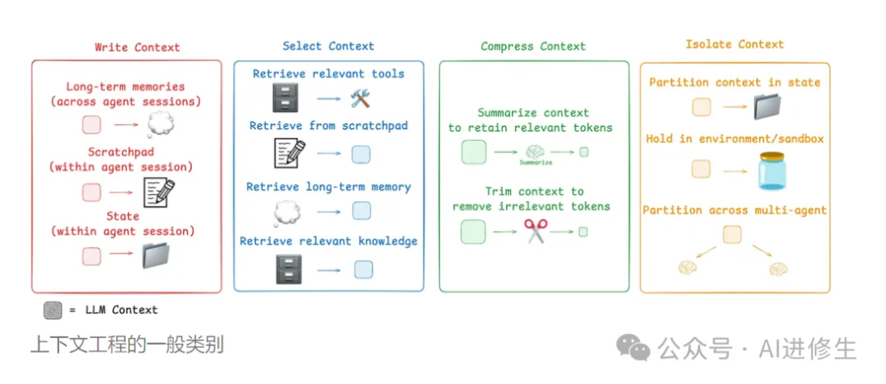

# 资源

- 推荐阅读：https://blog.langchain.com/context-engineering-for-agents/
- 推荐项目：https://github.com/coleam00/context-engineering-intro/

# 介绍

上下文工程，跟传统的提示词工程，是两种思路：

提示词工程
- 关注怎么巧妙地措辞。
- 局限于你怎么描述一个任务。
- 就像给人递了张便利贴。

上下文工程
- 是一套提供完整上下文的系统。
- 包括文档、示例、规则、模式和验证。
- 就像写了个完整的剧本，细节全有。

为啥上下文工程这么重要？

1. 减少 AI 犯错: 大多数 AI Agent 的失败，不是模型不行，是上下文没给够。
2. 保证风格统一: AI 会遵循你项目的模式和惯例。
3. 搞定复杂功能: 有了合适的上下文，AI 能处理多步骤的实现。
4. 自我修正: 通过验证循环，AI 能自己修复错误。

用上下文工程，你会用到所有这些不同的上下文。 几种常见策略——编写、选择、压缩和隔离。

上下文，是模型在生成任何东西之前看到的一切。这包括：状态、历史记录、用户提示、可用工具、RAG 指令、还有长期记忆。有了这么完整的上下文，模型就能在一个地方参考所有这些东西，得到结构最好的输出。

本质上，就是要在正确的时间，一步步地把必要、有用、结构化的信息喂给 AI，找到那个完美的平衡点。

# 参考

[1] https://mp.weixin.qq.com/s/etWY8sHU5YfE12uqXi2FgA