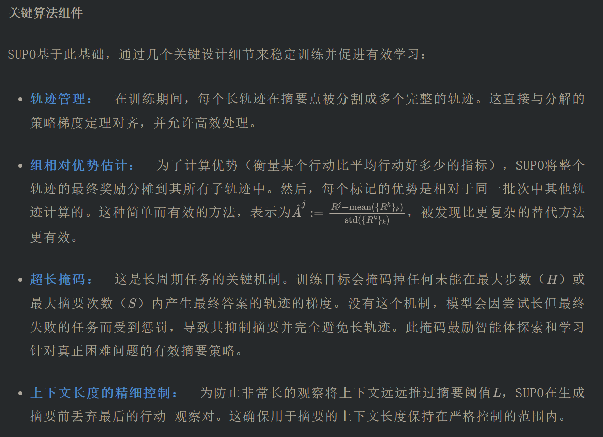

# 1. 资源

标题：Scaling LLM Multi-turn RL with End-to-end Summarization-based Context Management

日期：2025-10-08

机构：ByteDance Seed, Stanford University, Carnegie Mellon University

链接：http://arxiv.org/pdf/2510.06727v1

一句话总结：本文提出了SUPO强化学习框架，通过训练大型语言模型生成摘要来管理上下文，使其能够解决超出固定上下文限制的复杂长程任务。

# 2. 原理

标题：Scaling LLM Multi-turn RL with End-to-end Summarization-based Context Management

日期：2025-10-08

机构：ByteDance Seed, Stanford University, Carnegie Mellon University

链接：http://arxiv.org/pdf/2510.06727v1

一句话总结：本文提出了SUPO强化学习框架，通过训练大型语言模型生成摘要来管理上下文，使其能够解决超出固定上下文限制的复杂长程任务。

关键在于，该摘要并非使用固定的、基于规则的模板创建。它是由LLM智能体自身作为其决策过程的一部分生成的。这意味着可以通过RL训练智能体，使其学会保留哪些关键信息、如何抽象复杂细节以及可以安全丢弃哪些无关信息。通过联合优化智能体的行动及其摘要策略，该方法使模型能够维持一个紧凑但信息量丰富的历史表征，从而将其推理能力扩展到远超固定上下文窗口的范围。

介绍SUPO：一个支持端到端RL与摘要的框架
基于这一见解，该研究引入了一个原则性框架，将摘要直接集成到RL训练循环中。这是通过将用于多轮工具使用的标准马尔可夫决策过程（MDP）重新表述为摘要增强的MDP（记为）来实现的。

为了将该框架付诸实践，论文引入了摘要增强的策略优化（SUPO），这是一种可扩展的RL算法，旨在以端到端的方式联合优化工具使用行为和摘要策略。

SUPO如何工作：联合学习行动与摘要
SUPO是一种策略梯度算法，使LLM智能体能够学习如何行动以及何时总结、总结什么。其设计基于一个使训练可行且高效的关键理论结果。

分解的策略梯度
SUPO的基石是一种新颖的策略梯度公式（定理3.2）。它证明了一个可能涉及多个摘要步骤的整个长周期轨迹的策略梯度，可以分解为几个较短"子轨迹"的梯度之和。每个子轨迹以对过去的摘要（或初始提示）开始，以智能体为当前工作片段生成新摘要结束。

这种分解是强大的，因为它允许对现有的、为标准的非摘要轨迹优化的RL训练基础设施进行最小修改即可使用。一个单一的、复杂的、带摘要的轨迹可以被视为一批较小的、独立的轨迹，从而大大简化了实现。

实践检验：SUPO在编程和网络搜索中的表现
SUPO在两个具有挑战性的多轮工具使用环境中进行了评估：CodeGym（一个需要迭代函数调用来解决编程问题的合成环境）和BrowseComp-Plus（一项要求高的网络搜索任务）。

表1所示的结果证明了SUPO的有效性。在BrowseComp-Plus上，SUPO实现了 53.0% 的最终成功率，比基线GRPO算法绝对提升了 +14.0% ，即使使用了相同的64K工作上下文长度。在CodeGym上，SUPO能够实现比使用32K上下文的基线更高的成功率（+3.2%），而SUPO本身仅使用 4K工作上下文 结合最多7次摘要步骤（等效上下文为32K）。这凸显了SUPO在显著降低轨迹生成期间计算需求的同时实现强大性能的能力。

图2中的训练和验证曲线表明SUPO能够稳定有效地学习。对训练动态的进一步分析揭示了关键见解：

增加的工具使用：图4显示，SUPO激励智能体使用其工具的频率比基线高出最多3倍，这对于收集足够信息以解决复杂问题至关重要。

# 参考

[1] 告别上下文溢出：字节斯坦福提出SUPO框架，让AI智能体处理超长任务成功率飙升14%, https://mp.weixin.qq.com/s/19xeYAdEUnJD-MiK98Xz7g