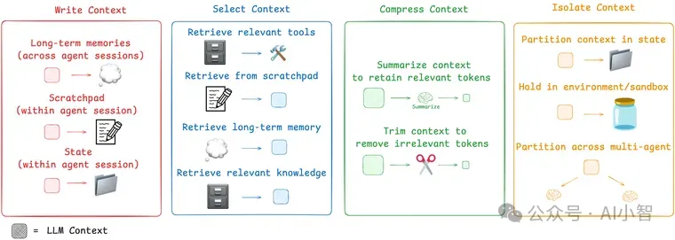
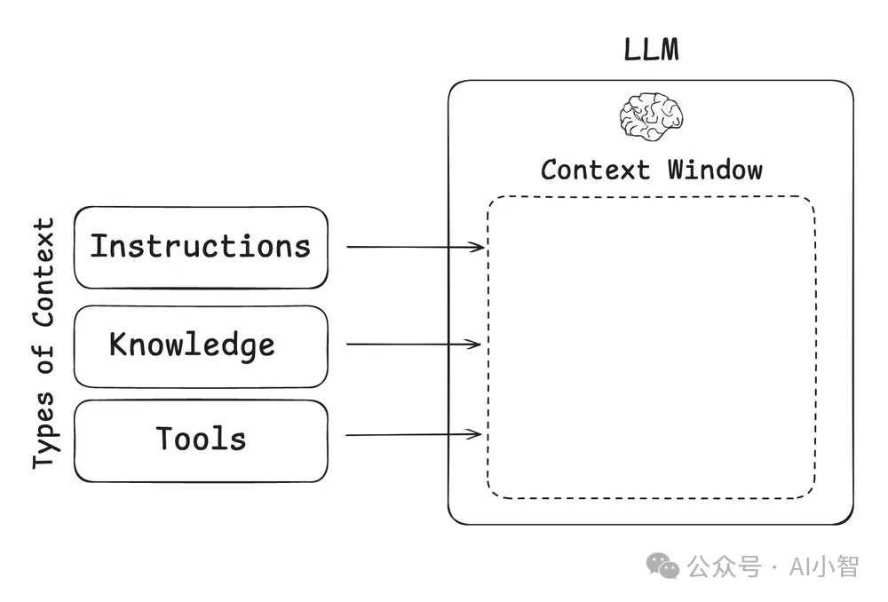
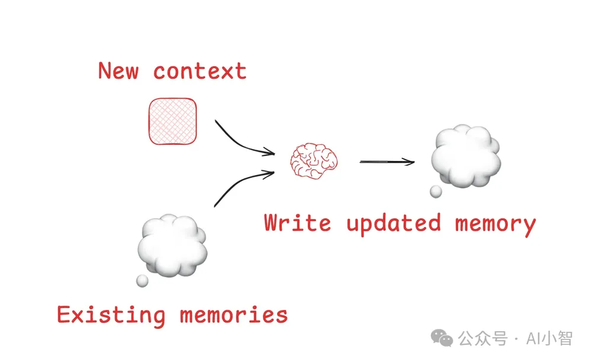
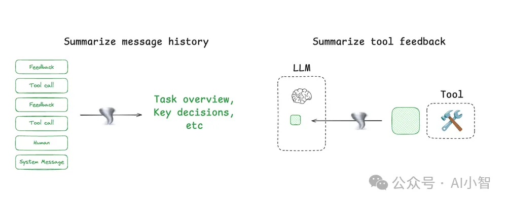
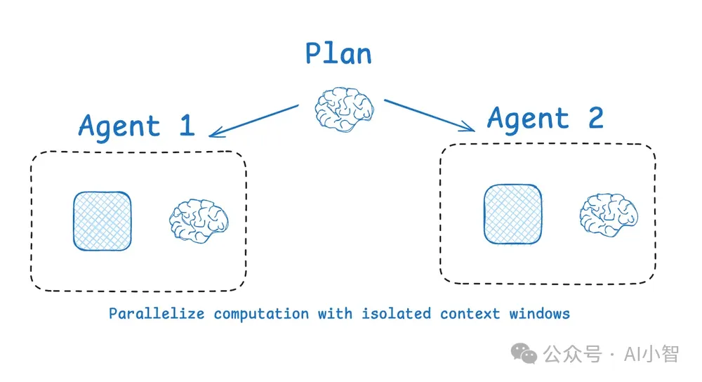
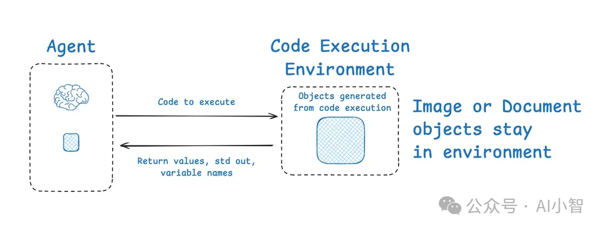
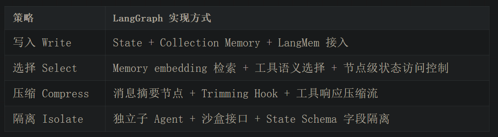
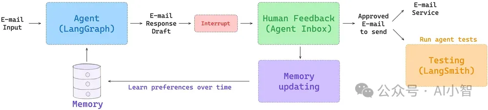

上下文工程的四大核心策略

# 一、什么是 Context Engineering？
LLM（大语言模型）的 context window 类似“短时记忆”，用于存储对话历史、工具结果、系统指令等一切信息。

但问题在于，当前的上下文容量依然有限，尤其在任务复杂、多轮交互时极易“爆仓”。这会带来：

🧨 上下文污染：幻觉信息混入决策链
😵 上下文混淆：冗余信息导致推理错误
🔄 上下文冲突：不同轮之间信息自相矛盾
📉 上下文干扰：重点内容被淹没，性能下降

因此，上下文工程的目标是：

在任务执行过程中，以最小 token 成本动态组织最关键的信息结构。

**二、Context Engineering 的四大核心策略**

策略一：写入（Write）—— 将信息“暂存”到上下文之外
目的：外部化 Agent 中间状态与经验，避免信息遗失。

📒 Scratchpad（便签本）：记录中间步骤、计划，防止被截断。

例如 Anthropic 的 LeadResearcher Agent 会主动将任务进度写入 Memory。
💾 Memory（长期记忆）：通过 LangMem、Reflexion 等机制持久化代理经验。

被 ChatGPT、Cursor 等广泛应用于个性化对话与任务记忆。

LangGraph 支持 thread memory + collection memory，同时接入 LangMem，支持本地与远程记忆混合使用。

🔍 策略二：选择（Select）—— 精准注入“当前最相关”的信息

目的：从写入的数据中“召回”最有用的上下文片段。

🧠 记忆召回：结合嵌入向量、时间戳或知识图谱，动态选择 episodic / semantic / procedural 记忆。

例如 ChatGPT 在检索用户位置时因召回错误导致性能滑坡。
🛠 工具选择：通过 ToolRAG 等方法动态筛选最相关工具，提升调用成功率达 3 倍。

📚 知识检索：如 Windsurf 使用混合检索机制（语义 + grep + symbol）召回函数定义等代码块。

📌 LangGraph 配合 BigTool 子库，可进行工具 embedding 检索与参数选择；长期记忆支持文档 + chunk + 向量检索组合。

🧊 策略三：压缩（Compress）—— 减少 token 开销，保留关键信息
目的：在不丢失任务必要信息的前提下缩短上下文长度。

📜 摘要 Summarization：如 Claude Code 代理使用层级摘要压缩整个交互历史。
✂️ 修剪 Trimming：自动移除无关消息或过期信息（如 Provence 模型通过打分删减历史片段）。

📌 LangGraph 允许你将压缩策略以自定义节点形式插入任意流程，并配合 LangSmith 实时监控 token 使用趋势。

🧩 策略四：隔离（Isolate）—— 拆分上下文空间，避免信息冲突
目的：减少认知干扰、提升多任务并发能力。

👥 多 Agent 并行协作：如 Anthropic Swarm 架构中，不同专家 Agent 拥有独立上下文。
🧪 工具沙盒：如 HuggingFace CodeAgent 将代码运行移出主上下文，通过 E2B 等平台隔离执行环境。
📦 状态字段隔离：LangGraph 支持结构化 State Schema，可指定哪些变量暴露给模型、哪些用于系统逻辑。

📌 多 Agent 架构可配合 LangGraph 的 Swarm / Supervisor 库一键实现，支持上下文隔离与异步执行。

# 三、如何落地：LangGraph + LangSmith 构建“上下文感知”的 AI Agent

🎯 LangSmith 提供两大支持功能：

实时观测：监控 token 使用趋势、上下文冗余度
评估验证：量化每种上下文策略的收益（响应质量、工具命中率、思维链长度）

# 结语：上下文，是构建智能体真正的“操作系统”
上下文工程的四大策略，不是孤立使用，而是可以自由组合的编排模块 —— 这正是 LangGraph 引入状态驱动架构的意义所在。回顾本文：

写入（Write）：记笔记，存经验
选择（Select）：精召回，准决策
压缩（Compress）：控 token，提效率
隔离（Isolate）：分上下文，控干扰

# 参考

[1] 上下文工程：LangGraph四大高效调度策略，Agent告别“记忆过载”！https://mp.weixin.qq.com/s/p6CP_0MQmbkQ-izniX6Nmg