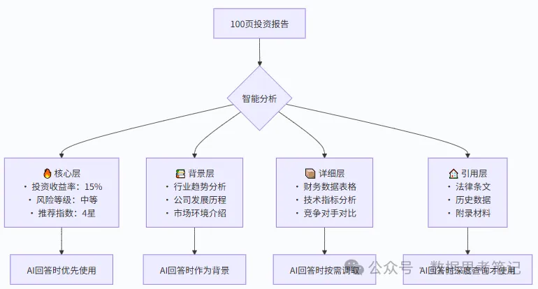

一、产生背景：为何需要上下文工程？

1. 大模型的核心瓶颈

（1）固定上下文窗口限制：

即使支持128K tokens的模型（如GPT-4 Turbo），处理整本书、长期对话或代码库时仍面临信息丢失和理解偏差问题。

（2）长文本性能衰减：

研究表明，当关键信息位于文本中段时，模型召回率下降40%以上（来源：Stanford CRFM）。

（3）成本与效率挑战：

重复输入长上下文会显著增加计算成本。

2. 传统方案的不足

（1）提示工程（Prompt Engineering）：

优化指令设计（如Few-shot示例），但无法解决信息过载问题。

（2）简单截断（Truncation）：

随机丢弃文本，导致关键信息缺失。

上下文工程的使命：

在有限上下文窗口内，最大化关键信息的密度与可用性。

二、上下文工程概念

上下文工程（Context Engineering）是一门专注于优化大语言模型上下文窗口使用的技术学科。它涉及如何在扩展的上下文空间中有效地组织、结构化、检索和利用信息，以最大化模型的理解能力和输出质量。包含四个核心要素：

信息组织：如何结构化地安排上下文中的信息；

动态管理：如何在对话过程中维护和更新上下文；

信息检索：如何从大量上下文中快速定位相关信息；

质量优化：如何确保上下文信息的准确性和相关性。

三、上下文工程vs提示工程

1. 核心差异对比

# 技术维度

已转为 Markdown 表格：

| 技术维度                       |                        操作对象 | 技术焦点                    | 依赖能力       | 典型工具           |
| -------------------------- | --------------------------: | ----------------------- | ---------- | -------------- |
| 提示工程（Prompt Engineering）   |           单一提示词（如 “总结以下文本”） | 优化指令表达（如使用“逐步分析”替代“分析”） | 自然语言表达技巧   | 提示词模板库、指令微调数据集 |
| 上下文工程（Context Engineering） | 多源异构信息集合（提示词 + 背景数据 + 历史记录） | 优化信息供给（如筛选最相关的 3 条历史对话） | 信息检索与结构化能力 | 向量数据库、上下文压缩算法  |

2. 协同关系

上下文工程不是提示工程的替代，而是其延伸和补充：

以“撰写产品评测”任务为例：

提示工程：设计提示词 “请从性能、价格、外观三个维度评测 [产品名]，要求突出与竞品的差异”。

上下文工程：除提示词外，自动导入该产品参数表、用户差评高频词、竞品评测报告摘要（各取 200 字），并按 “重要性 = 参数匹配度 × 用户关注度” 排序。

两者协同效果：提示工程明确 “怎么写”，上下文工程提供 “写什么”，共同提升评测的专业性和针对性。

四、核心技术原理

核心思想：“不是塞入更多，而是塞入更精确的上下文”。

类比：图书管理员不会搬入整个图书馆，而是抽取最相关的书页并添加索引标签。

1. 信息分层架构：就像整理一个超级书架

基本思想：将上下文信息按重要性和相关性分层组织，就像图书管理员整理图书馆一样。

类比：想象有一个神奇的书架，它会根据需求自动调整书籍的摆放位置：

手边区域：最常用的参考书，伸手就能拿到；

视线范围：重要但不常用的书，扫一眼就能看到；

储藏区域：偶尔需要的资料，需要时可以取出；

仓库区域：很少用但不能丢的书，按需调取。

实际例子：

假设AI要帮您分析一份100页的投资报告：

为什么这样做有效？

就像人类阅读一样，我们总是先看重点，再看细节；

AI也需要知道什么信息最重要，避免被细节淹没。

2. 动态上下文管理：像智能助理一样调整桌面

工作原理：根据对话进展动态调整信息，就像一个聪明的助理会根据老板的需求调整桌面文件一样。

类比：想象您有一个超级智能的秘书，ta会根据当前在做什么，自动在桌面上摆放最需要的文件：

早上开会 → 摆放会议资料和日程安排

中午谈合同 → 摆放法律文件和合同模板

下午做预算 → 摆放财务报表和计算工具

实际例子 - 在线医疗咨询：

更详细的动态管理流程：

3. 语义检索与匹配：像搜索引擎一样聪明

核心技术：AI能够理解问题的真正含义，然后在海量信息中找到最相关的内容，就像Google搜索一样智能。

类比：想象在一个巨大的图书馆里找资料：

传统方法：只能按书名查找，“Python”只能找到书名带“Python”的书；

语义检索：理解您要学编程，能找到所有编程相关的书，即使书名是“计算机语言入门”。

工作原理图解：

实际检索过程示例：

AI把所有信息都转换成“数字指纹”（向量）；

相似的内容有相似的“指纹”；

通过计算"指纹"的相似度快速找到相关信息。

4. 上下文架构设计模式

（1）分层存储模式

（2）滑动窗口模式

保持固定大小的上下文窗口，但内容会根据对话进展动态更新：

保留最重要的核心信息

维护最近的对话历史

动态加载任务相关信息

五、应用场景与实践建议

1. 典型应用场景

（1）智能客服升级：电商平台通过上下文工程，提升用户咨询响应准确率。实现方式：

自动关联用户最近 3 次订单信息；

提取历史对话中的核心诉求（如 “退货”“换货”）；

动态插入对应商品的售后政策。

（2）代码辅助生成：在 IDE 插件中，上下文工程会：

导入项目中已有的函数定义；

分析用户当前编辑的代码片段；

检索相似功能的开源代码示例。

（3）医疗辅助诊断：整合患者电子病历（结构化数据）、过往处方（文本）、检查影像报告（OCR 转化），辅助医生生成诊断建议，减少误诊风险。

（4）法律文档审查：自动从合同中提取 “付款条件”“违约责任” 等关键条款，关联相关法律条文，生成风险提示，提升审查效率。

2. 实践建议

（1）从小规模开始

先在具体场景中验证效果

逐步扩展到更复杂的应用

（2）动态管理

根据任务需求调整上下文内容

保持信息的时效性和相关性

（3）质量优先

宁缺毋滥，确保信息准确性

建立信息质量评估机制

（4）持续优化

收集用户反馈

不断改进上下文策略

总结

上下文工程是长文本时代的核心基础设施——它让大模型从“短文本专家”蜕变为“复杂知识管家”。与提示工程结合时，可构建完整的输入优化链：提示工程控制“思维方向” + 上下文工程提供“思维素材”。上下文工程作为大模型时代的新兴技术领域，为我们提供了有效利用长上下文能力的系统性方法。它不仅仅是技术的升级，更是思维方式的转变——从关注单一指令的优化转向整个信息空间的管理和利用。

# 参考

[1] 大模型上下文工程（Context Engineering）详解, https://mp.weixin.qq.com/s/g9_ukvyMXnt7RcXsGZLtLA