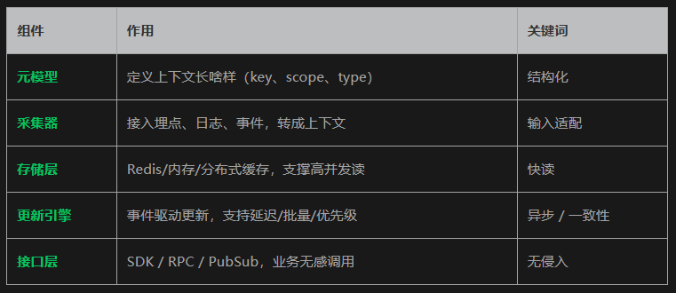

# 1. 资源

Github (2.5k stars): https://github.com/volcengine/MineContext

MineContext 是字节开源的「上下文中台」，把用户/环境/行为的动态状态，统一抽象为可查询、可订阅、可扩展的共享服务，让业务再也不用各自造轮子。

 

MineContext 是一个具有上下文感知能力的主动式 AI 伙伴。它基于屏幕截图+内容理解的方式（未来还将支持其他来源的多模态信息，包括文档、图片、视频、代码、外部应用数据），能够看到并看懂用户的数字世界上下文，然后再基于底层的上下文工程框架，主动推送洞察、日/周总结 、待办、活动记录等高质量信息，同时支持用户基于 Context 和生成的信息进行再创作。

MineContext 专注于四个核心功能：无负担收集、主动推送、智能浮现和上下文工程架构。

📥 无负担收集 支持收集和处理海量的 Context，并通过设计存储管理来实现海量收集却没有心智负担。
🚀 主动推送 支持日常主动推送关键信息和洞见，能够提炼 Context 中的总结信息，比如每日总结，每周总结，tips，todo，主动推送到主页。
💡 智能浮现（实现中） 支持创作时智能浮现，可以随时浮现相关有用的 Context，确保辅助创作又不会被淹没
🎯 上下文工程架构 支持多模态、多源数据的完整生命周期——从捕获、处理和存储到管理、检索和消费——支持生成六种类型的智能上下文。

# 2. 原理

核心功能
（一）屏幕信息挖掘与分析
MineContext 能够每 5 秒截取一次屏幕，通过 pHash 算法进行去重处理，避免重复信息的分析，提高效率。然后将截图批量发送给视觉语言模型（VLM）进行分析，提取出结构化的上下文信息，涵盖人物、产品、公司档案等六种类型。

（二）主动生成信息
与传统的被动式信息管理工具不同，MineContext 能够主动推送高质量信息，如日报、待办、洞察等，无需用户被动提问。它会根据用户的上下文信息，自动生成总结和待办事项，帮助用户更好地管理和规划工作。

（三）多模态信息处理
MineContext 不仅支持屏幕截图，未来还将兼容文档、图片、视频、代码、外部应用数据等多模态信息来源。这使得用户可以将各种类型的信息整合在一起，形成一个完整的知识体系。

（四）隐私保护
MineContext 非常注重用户隐私，所有数据存储于本地，确保用户隐私和信息安全。此外，它还支持自定义模型服务，用户可以使用完全本地的模型，确保数据不会离开本地环境。

（五）开源与定制化
作为一个开源项目，MineContext 允许开发者自由检查、修改和构建代码库，实现完全定制化。这使得用户可以根据自己的需求和喜好，对工具进行个性化的调整和优化。

（六）成本控制
用户可以使用自己的API 密钥，避免订阅费用，实现成本自主控制。这使得 MineContext 成为一个经济实惠的信息管理工具，适合各种规模的用户使用。

技术揭秘
（一）屏幕截图与去重
MineContext 通过每 5 秒截取一次屏幕，利用 pHash 算法进行去重处理，避免重复信息的分析，提高效率。这种技术确保了系统能够快速处理大量的屏幕截图，同时减少了不必要的计算资源浪费。

（二）多模态信息分析
MineContext 利用视觉语言模型（VLM）对屏幕截图等多模态信息进行分析，提取结构化的上下文信息。这种技术使得系统能够理解各种类型的信息，并将其转化为有用的结构化数据。

（三）混合架构设计
MineContext 采用存储本地、分析云端的混合架构，确保数据隐私的同时，利用云端的强大计算能力进行高效分析。这种架构设计既保证了用户数据的安全性，又提高了系统的性能和效率。

（四）核心组件协同
MineContext 包含元模型、采集器、存储层、更新引擎和接口层五个核心组件，这些组件协同工作以实现上下文的采集、存储、更新和调用。这种模块化的设计使得系统具有良好的可扩展性和可维护性。

（五）事件驱动更新
MineContext 基于事件驱动机制进行上下文更新，支持延迟、批量和优先级处理，提高系统的响应速度和灵活性。这种技术使得系统能够快速响应用户的操作，并及时更新上下文信息。

（六）开源与可扩展性
作为开源项目，MineContext 提供 SDK、RPC 和 PubSub 等接口，方便开发者进行定制化开发和扩展。这使得用户可以根据自己的需求，对系统进行个性化的调整和优化。

# 参考

[1] AI Infra：MineContext，字节开源、主动的上下文感知AI伙伴, https://mp.weixin.qq.com/s/cBLgZpz1pA_5XfO4-HoZYQ
[2] https://mp.weixin.qq.com/s/01hfqDZQ9xMXSxpBnhU7eg