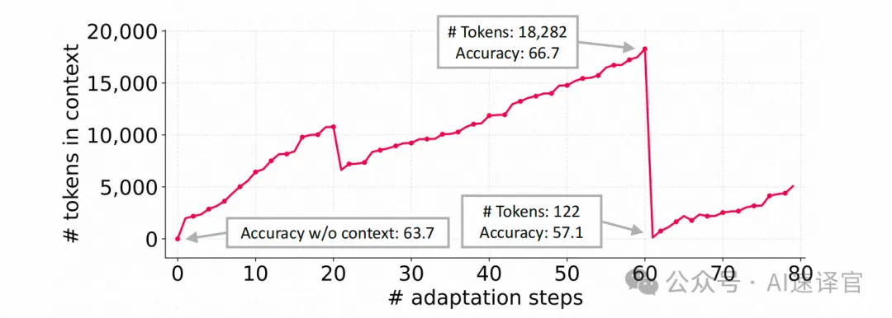
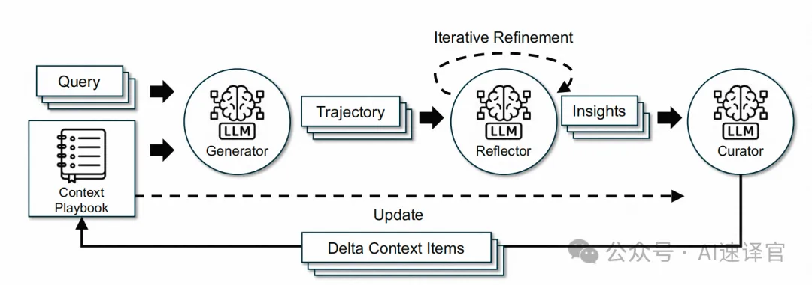
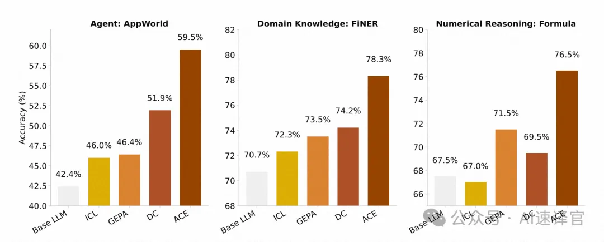
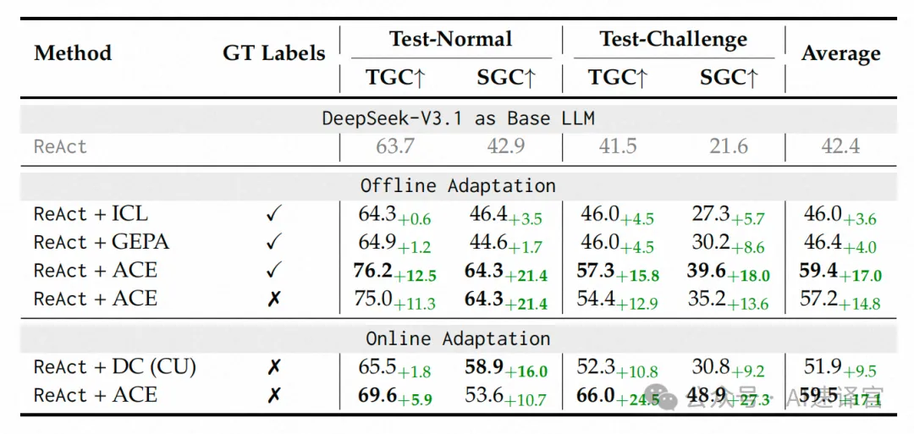
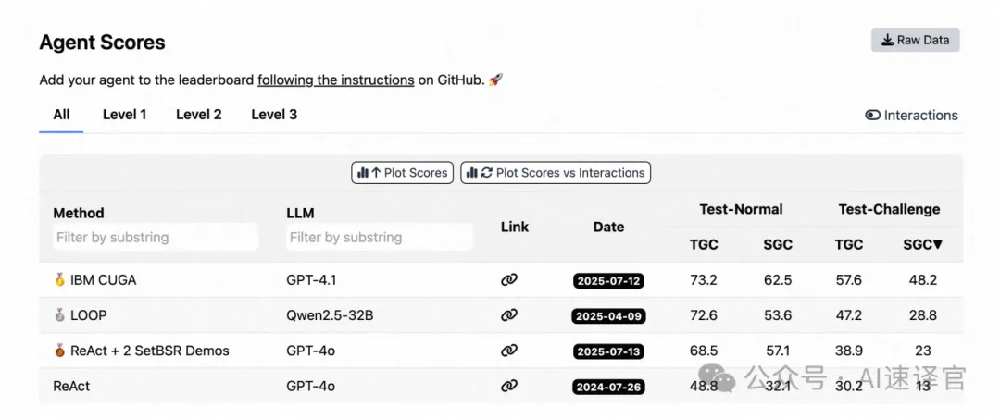
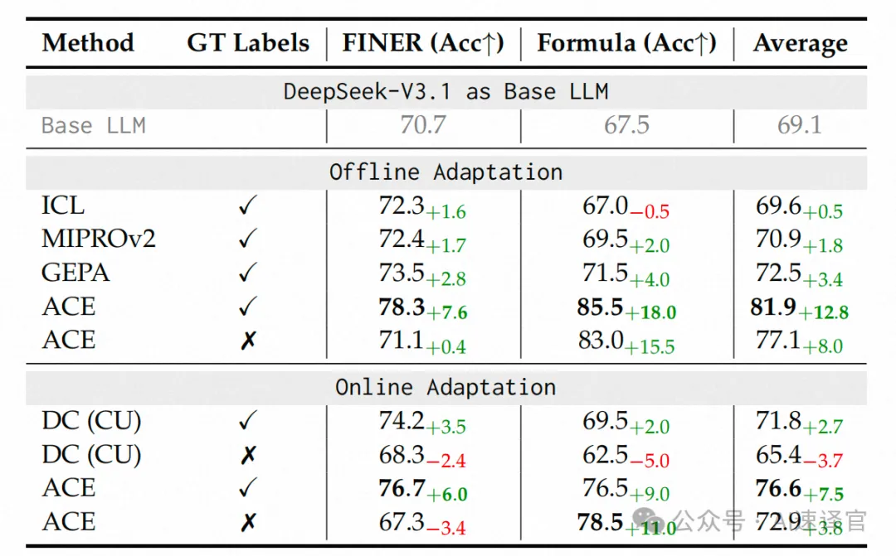
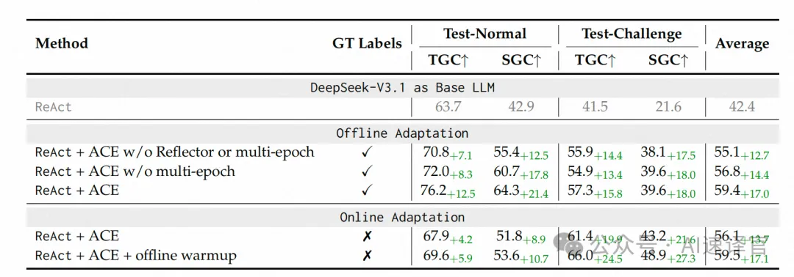
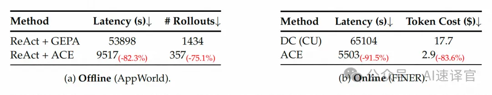

# 1. 资源

论文链接：https://arxiv.org/pdf/2510.04618

# 2. 问题

今天我们分享解读的是来自斯坦福大学、加州大学伯克利分校与SambaNova Systems的研究团队联合发布的重磅研究——ACE (Agentic Context Engineering)。这篇论文提出了一种颠覆性的范式，旨在解决当前大语言模型（LLM）应用（尤其是AI智能体）面临的核心挑战：如何让AI在不更新模型权重的情况下，通过动态优化其“上下文”来实现自我提升。

我们知道，要让一个LLM在特定任务上表现更好，除了微调模型本身，更常见的方法是“上下文适应（Context Adaptation）”——也就是在输入中给它提供更清晰的指令、更有效的策略，或是更相关的知识。这个“上下文”可以是系统提示（System Prompt），也可以是智能体的记忆（Memory）。

现有的上下文优化方法普遍存在两个致命缺陷：

1. “简洁性偏见”（Brevity Bias）：很多Prompt优化器倾向于生成简短、通用的指令，却丢掉了那些在特定领域里真正有用的、细节满满的“独门秘籍”或“避坑指南”。
2. “上下文坍塌”（Context Collapse）：当让LLM不断地重写和总结自己的“记忆”或“经验”时，这些宝贵的信息会随着一次次迭代而逐渐流失，最终变成一堆毫无信息量的空话，导致性能急剧下降。

为了解决这些问题，作者们认为，我们应该把“上下文”看作是一本不断进化的“攻略本”（Playbook），而不是一份一成不变的“说明书”。这本攻略本应该能够持续地积累、提炼和组织新的策略与知识。

基于此，他们提出了ACE（智能体上下文工程）框架。ACE通过一个生成-反思-策展的模块化流程，让AI智能体的“攻略本”能够自我进化，并且通过结构化的增量更新机制，既保留了宝贵的细节，又避免了“上下文坍塌”的发生。

本文将带你深入理解：

- 为什么传统的Prompt优化方法正在走向死胡同？
- ACE框架如何通过模仿人类“复盘-总结-归纳”的学习过程，来构建一本活的、不断生长的“攻略本”？
- 为什么说ACE是实现AI智能体自我改进和可扩展学习的关键一步？

这项工作为构建更强大、更高效、更可靠的自学习AI系统，提供了一个全新的、极具潜力的方向。论文资源在文末。

2. 背景与动机：现有上下文适应方法的困境
在深入ACE框架之前，我们必须先理解为什么需要它。现有的上下文适应方法虽然取得了一定的成功，但其固有的局限性也日益凸显。

2.1 上下文适应的现状
当前主流的方法是利用自然语言反馈来迭代优化上下文。其基本流程是：

1
LLM根据当前上下文执行任务。
2
另一个（或同一个）LLM观察执行过程（如推理步骤、工具调用、错误信息）和最终结果。
3
这个“观察者”LLM生成一段自然语言反馈，指出当前上下文的优缺点以及如何修改。
4
将反馈整合进上下文中，完成一次迭代。
代表性的工作包括：Reflexion（通过反思失败来改进规划）、TextGrad（用文本模拟梯度反馈来优化Prompt）、GEPA（结合遗传算法和反思来进化Prompt），以及Dynamic Cheatsheet（在测试时动态构建一个包含策略和代码片段的外部记忆）。

2.2 现有方法的两大“原罪”
尽管这些方法很灵活，但它们普遍存在两个致命问题：

1. 简洁性偏见 (The Brevity Bias)

很多Prompt优化器的目标是生成一个“短小精悍”的通用指令。例如，在测试用例生成任务中，优化器可能最终会收敛到一句“创建单元测试以确保方法行为符合预期”这样的空话。这种抽象化的概括，完全丢掉了那些在特定领域里至关重要的、细节满满的知识，比如：

•
处理某个特定API时需要注意的边缘情况。
•
某个金融概念在计算时需要遵循的特殊规则。
•
智能体在与某种环境交互时常见的失败模式和规避方法。
对于需要深度领域知识和复杂多步推理的AI智能体应用来说，这种“简洁”恰恰是性能的毒药。

2. 上下文坍塌 (Context Collapse)

这个问题更加致命。当一个不断增长的上下文（比如智能体的长期记忆）被反复要求由一个LLM进行“整体重写和总结”时，灾难就会发生。

作者通过一个实验生动地展示了这一点：

•
在第60步，智能体的“记忆”上下文有18,282个词元，任务准确率为66.7%。
•
在第61步，当要求LLM重写这个记忆时，它将其“压缩”成了仅有122个词元的简短摘要。
•
结果是，任务准确率暴跌至57.1%，甚至比没有任何上下文（63.7%） 时还要差！
这说明，让LLM进行无约束的整体重写，会导致宝贵知识的灾难性遗忘。这就像一个学霸的厚厚一摞笔记，被要求浓缩成一张A4纸，结果最重要的细节和解题技巧全没了。

核心论点：上下文应该是“攻略本”，而非“说明书”

基于以上困境，作者们提出了一个核心论点：我们应该重新思考“上下文”的角色。它不应该是一份追求简洁的“说明书”，而应该是一本详尽、丰富、不断演进的“攻略本”（Playbook）。

与人类不同，LLM并不总是从简洁的概括中受益。相反，研究表明，给LLM提供更长、更详细的上下文，让它自己在推理时去筛选和利用相关信息，效果往往更好。因此，我们的目标应该是保存和组织细节，而不是压缩和丢弃它们。

# 3. 原理

ACE：智能体上下文工程框架
为了实现上述目标，作者提出了ACE（Agentic Context Engineering）框架。ACE的核心是模仿人类“复盘-总结-归纳”的学习过程，通过一个模块化的、分工明确的智能体架构，来系统性地构建和维护这本“攻略本”。

CE框架由三个专门的角色组成：

•
生成者 (Generator)：负责执行任务。它接收查询（Query），并利用当前的“攻略本”（Context Playbook）来生成解决问题的完整轨迹（Trajectory），包括思考过程和行动步骤。
•
反思者 (Reflector)：扮演“复盘专家”的角色。它审视生成者的轨迹和最终结果（成功或失败），从中提炼出有价值的“洞见”（Insights），比如哪些策略是有效的，哪些是常见的陷阱，并给出具体的改进建议。
•
策展人 (Curator)：扮演“知识库管理员”的角色。它接收来自反思者的“洞见”，将其合成为结构化的“增量更新项”（Delta Context Items），并负责将这些新内容合并到主“攻略本”中。
这个分工明确的架构，避免了让单个LLM承担所有责任的瓶颈，使得整个上下文进化过程更加高效和高质量。

3.1 增量式增量更新 (Incremental Delta Updates)
为了从根本上避免“上下文坍塌”，ACE放弃了整体重写的思路，转而采用结构化的增量更新。

“攻略本”不再是一整块文本，而是由一系列结构化的“子弹点（bullets）”组成。每个子弹点是一个独立的知识单元，包含：

•
元数据：唯一的ID，以及被标记为“有用”或“有害”的计数器。
•
内容：一个具体的、可复用的策略、领域概念或常见失败模式。
当生成者在解决新问题时，它可以标记哪些子弹点对当前任务有帮助，哪些造成了误导。这些反馈会传递给反思者。

反思者和策展人不会重写整个攻略本，而是生成一个紧凑的增量上下文（Delta Context），其中只包含新增的或需要修改的子弹点。最后，一个轻量级的、非LLM的逻辑模块负责将这些增量内容合并到主攻略本中。

这种设计带来了三大好处：

1
局部化：更新只影响相关的子弹点。
2
细粒度检索：生成者可以只关注最相关的知识。
3
高效增量适应：合并、修剪、去重等操作变得非常高效，并且可以并行处理。
3.2 增长与精炼 (Grow-and-Refine)
为了防止攻略本无限膨胀、变得冗余，ACE引入了增长与精炼机制。

•
增长：新的子弹点被添加进去，已有的子弹点则更新其元数据（如“有用”计数器+1）。
•
精炼：系统会定期或在上下文窗口达到上限时，进行一次去重操作。通过比较子弹点的语义嵌入，可以识别并修剪掉冗余或相似的知识点，保持攻略本的精炼和高效。
通过“增量更新”和“增长与精炼”这两大机制，ACE确保了“攻略本”能够稳健、可扩展地进化，既保留了宝贵的细节，又避免了信息的冗余和坍塌。

# 4. 实验

作者在两类最能从ACE中受益的应用上进行了广泛评估：（1）需要多轮推理和工具使用的AI智能体；（2）需要专业领域知识的特定领域任务（以金融分析为例）。

[Figure 1: 整体性能结果图]

从图1的概览中就可以看出，ACE（红色条）在智能体、金融实体识别和数值推理任务上，均一致且显著地超越了所有基线方法。

4.3 在智能体基准上的结果 (AppWorld)
AppWorld是一个极具挑战性的智能体基准，要求AI与真实的应用API（如邮件、文件系统）交互来完成任务。

[Table 1: 在AppWorld智能体基准上的结果]

表1的结果揭示了几个惊人的发现：

•
性能巨大提升：在离线适应（优化系统提示）场景下，ReAct + ACE相比基线ReAct平均提升了17.0%。在在线适应（测试时动态更新记忆）场景下，相比强大的Dynamic Cheatsheet，ACE也平均高出7.6%。
•
无需标签的自学习：最关键的一点是，即使没有提供标准答案（GT Labels），ACE依然能通过分析代码执行成功/失败等自然执行反馈，实现高达14.8%的性能提升。这证明了ACE具备强大的自学习和自我改进能力。
•
挑战顶尖闭源模型：在AppWorld的公开排行榜上（图5），使用开源模型DeepSeek-V3.1的ACE，其平均性能（59.4%）已经追平了当时排名第一的、基于GPT-4.1的生产级智能体IBM-CUGA（60.3%）。在更难的test-challenge部分，ACE甚至超越了它！

4.4 在特定领域基准上的结果（金融分析）
[Table 2: 在金融分析基准上的结果]

在需要精确金融知识的FiNER和Formula任务上，ACE同样表现出色：

•
ACE通过构建包含金融概念和XBRL规则的详尽“攻略本”，平均性能提升了8.6%。
•
实验也指出了一个局限性：当缺乏可靠的反馈信号时（比如没有标准答案，也没有执行反馈），上下文适应方法（包括ACE和DC）的性能可能会下降。这说明高质量的反馈是上下文进化的关键。
4.5 消融研究与成本分析

设计的有效性：消融研究表明，ACE的每个设计都是必不可少的。特别是独立的“反思者”角色和多轮次优化，都对最终性能有巨大贡献。
•
效率的巨大优势：由于采用了增量更新，ACE的适应过程极其高效。与GEPA相比，ACE的适应延迟降低了82.3%，所需的执行次数减少了75.1%。与DC相比，延迟更是降低了91.5%，Token成本减少了83.6%。
思考与总结：更高维度的审视与未来展望
ACE框架的提出，不仅仅是提供了一个新的上下文优化工具，它更像是一场关于如何构建自学习AI系统的“思想革命”。

更高维度的概括

1
上下文的“生命周期管理”：ACE的本质，是为LLM的“上下文”引入了一套完整的生命周期管理体系。它不再将上下文视为一个静态的、一次性的输入，而是将其视为一个有生命的实体，这个实体会经历诞生（生成）、成长（积累）、反思（提炼）、新陈（精炼） 的全过程。这是一种全新的、更可持续的知识管理范式。

2
从“提示工程”到“上下文工程”：我们正从“提示工程”（Prompt Engineering）的时代，迈向一个更宏大、更系统的“上下文工程”（Context Engineering）时代。前者关注的是如何写好单条指令，而后者关注的是如何设计一个能够自我进化、动态适应的完整信息环境。ACE正是这个新时代的开创者之一。

3
“分工”是复杂智能的关键：ACE的“生成者-反思者-策展人”三位一体架构，深刻地揭示了模块化和专业化分工对于构建复杂智能系统的重要性。它将“做事”、“复盘”和“归纳”这三个不同认知层次的任务解耦，让每个角色都能专注于自己最擅长的事情，从而实现了1 > 1+1+1的系统涌现能力。

未来的可能方向

1
“攻略本”的共享与迁移：既然ACE能为一个任务生成一本高质量的“攻略本”，那么这本攻略本能否被迁移到相似但不同的任务上，实现知识的复用和快速冷启动？更进一步，我们能否构建一个“攻略本市场”，让不同的AI智能体可以共享和交易它们在特定领域进化出的专业知识？

2
在线与离线的无缝融合：ACE已经展示了在离线和在线场景下的威力。未来的终极形态可能是将两者无缝结合：通过大规模的离线进化，构建一个强大的通用“基础攻略本”；然后在在线应用中，根据实时反馈进行快速的、个性化的增量更新。

3
更深层次的“反思”：目前ACE的“反思者”主要基于执行结果进行反思。未来的反思者能否具备更深层次的能力？比如，通过反事实推理（“如果我当时那么做，结果会怎样？”），或者通过与人类专家对话来获取更深刻的洞见，从而产生更高质量的上下文更新。

4
硬件与系统的协同进化：ACE的思想对未来的AI系统设计提出了新的要求。正如论文所讨论的，虽然ACE生成的上下文更长，但这并不一定意味着更高的成本。未来的AI芯片和服务器架构需要为这种“长上下文、高复用”的应用模式进行优化，例如通过更智能的KV Cache管理和压缩技术，让“上下文工程”变得更加普惠。

总而言之，ACE为我们描绘了一幅激动人心的蓝图：未来的AI系统不再是被动接受指令的工具，而是能够主动学习、持续进化的“伙伴”。通过为它们构建一个能够自我演进的“知识大脑”，我们正在开启一个智能体能够实现真正可扩展、可信赖的自我完善的新纪元。

# 参考

[1] 别再“优化”你的Prompt了！斯坦福与SambaNova提出ACE：让AI的“攻略本”自我进化, https://mp.weixin.qq.com/s/yyz76Th39hheT6oXzTx5iw