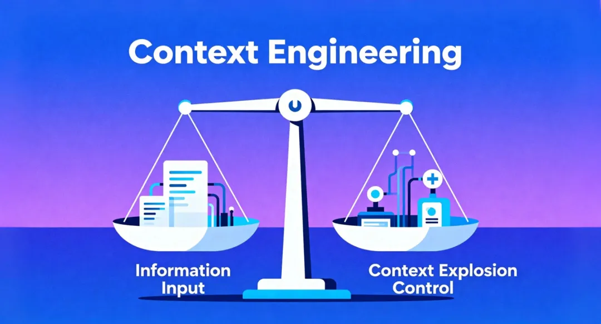
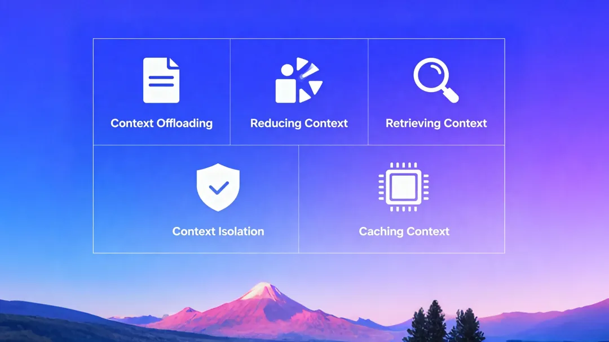

一句话总结：上下文工程，就是控制信息输入和上下文爆炸的平衡艺术。
想驯服“上下文”这头猛兽，有五大核心手段：
📤 上下文卸载 (Offloading): 别直接喂整个文件，给它一个“地址”（比如文件路径或ID），让它自己去取，随用随拿。
✂️ 上下文精简 (Reducing): 人脑会抓重点，AI也得学。在信息输入前，先进行总结或压缩。
🔍 上下文检索 (Retrieving): 把你的知识库当成“外挂硬盘”。需要时，用搜索（RAG/grep）精准调取，而不是把所有东西都塞进内存。
🛡️ 上下文隔离 (Isolation): 像项目组一样，为专门任务创建“子智能体”(Sub-Agents)。每个 Agent 只携带自己的小上下文，互不干扰，高效协作。
⚡ 上下文缓存 (Caching): 高频、复杂的任务，善用 KV Cache。记住，别在运行时动态增删工具集，这会让缓存失效，严重拖慢速度。
实战Tips:
工具过载怎么办？ 主 Agent 只带最核心的工具，专业工具包交给“子智能体”隔离。
grep 还是 RAG？ 追求实时、无需索引的临时场景用 grep；需要理解和推理的长期知识库，上 RAG。

# 参考

[1] 深扒了 Manus 1.5 的上下文工程 (Context Engineering)，干货满满, https://mp.weixin.qq.com/s/c0j9j-jeL9QrGhf-S3l3yQ