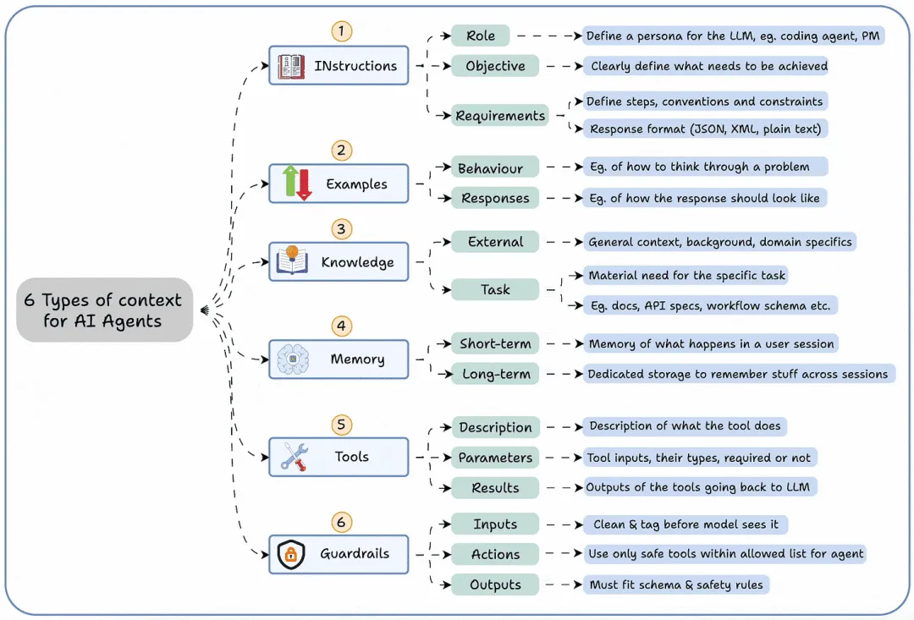
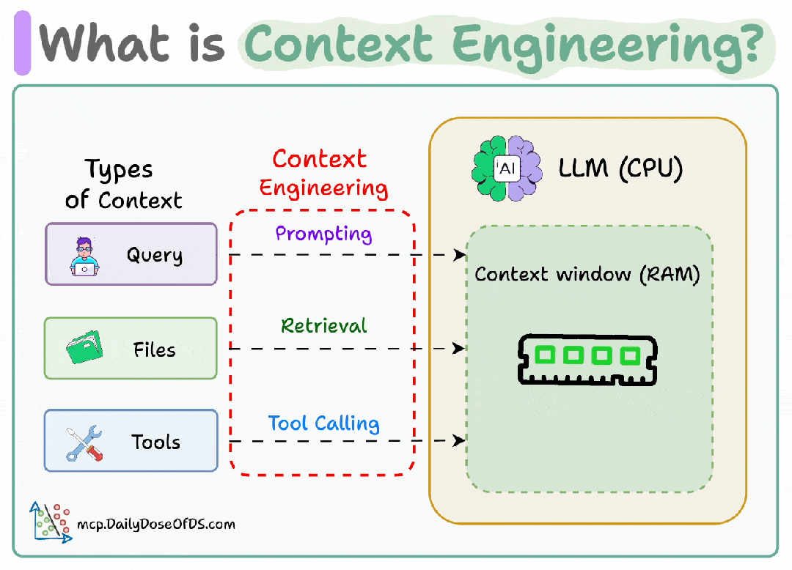
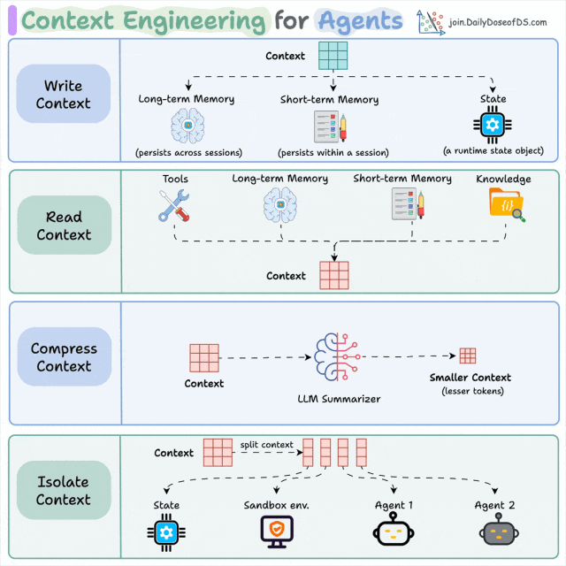
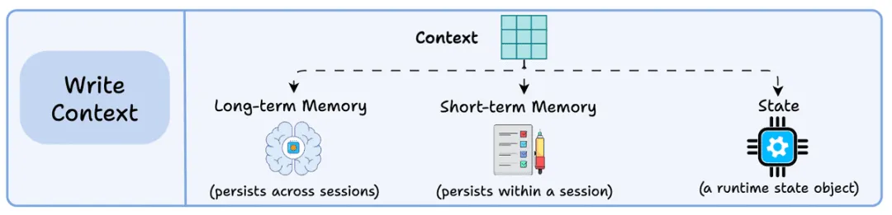
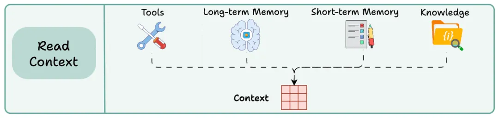
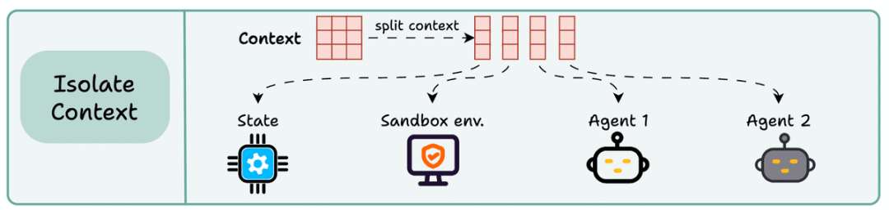

一句话：上下文工程就是“在正确的时间，以正确的格式，把正确的信息递给大模型”的艺术与科学。

以下是 Andrej Karpathy 对上下文工程的评述……

要理解“上下文工程”，首先得弄清“上下文”到底指什么。

如今的智能体早已不只是聊天机器人。

下图概括了智能体正常运转所需的 6 类上下文：

指令

示例

知识

记忆

工具

护栏

这告诉我们，光给智能体“扔一句提示”远远不够——你必须把输入（即上下文）当成工程问题来设计。

可以这样理解：

如果把大模型（LLM）比作 CPU。

那么上下文窗口就是内存（RAM）。

你其实是在这块“内存”里，为 AI 写入最恰当、最精密的指令。

具体怎么做？

上下文工程可拆成 4 个基本阶段：

编写上下文  

挑选上下文  

压缩上下文  

隔离上下文  

我们来逐个拆解——  

1) 编写上下文（Writing Context）  

把信息先“写出去”，存到上下文窗口之外，供智能体随用随取。常见落盘位置： 

- 长期记忆（跨会话持久）  

- 短期记忆（会话内持久）  

- 状态对象（结构化变量）  

2) 读取上下文（Read Context）  

在需要时把相关信息“读进来”，载入上下文窗口，来帮助智能体来执行某个具体任务。来源可以是：  

- 工具返回  

- 记忆系统  

- 知识库（文档、向量数据库等）  

3) 压缩上下文（Compressing Context）  

只保留任务真正需要的 token，去掉冗余。  

多轮工具调用易产生重复内容，既费钱又干扰模型；可通过摘要、去重、信息融合等手段瘦身。  

4) 隔离上下文（Isolating Context）  

把上下文按职责切开，防止互相污染。常用手段：  

- 多智能体/子智能体，各自持有私有上下文  

- 为代码执行单独起沙箱  

- 用状态对象显式划分作用域  

所以，所谓上下文工程，就是设计一条“上下文流水线”：作为一名上下文流水线的工程师，你能够让 LLM 在正确的时间、以正确的格式、看到正确的信息。  

类比传统 ML：  

- 无用特征要删掉  

- 高度相关特征有时反而添乱  

……同理，对 LLM 也要“特征工程”——只是这里的特征就是上下文。 

# 参考

[1] 可视化解读--面向智能体的上下文工程, https://mp.weixin.qq.com/s?__biz=MzIyNDkxMjQ3OA==&mid=2247485294&idx=1&sn=1e2585ffe4181a187828104997814177&chksm=e9f849f5231d3ff8e40a1e7275b411104f83e2595118a34eeea60746e43547f27691286bea58&mpshare=1&scene=1&srcid=1020yHTbtibHkt9onettOBxG&sharer_shareinfo=7a6bc56fc953167b492071e0b2d86ca8&sharer_shareinfo_first=7a6bc56fc953167b492071e0b2d86ca8#rd