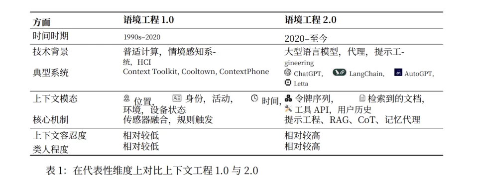
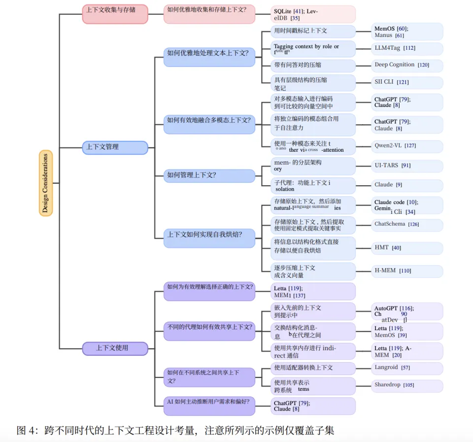
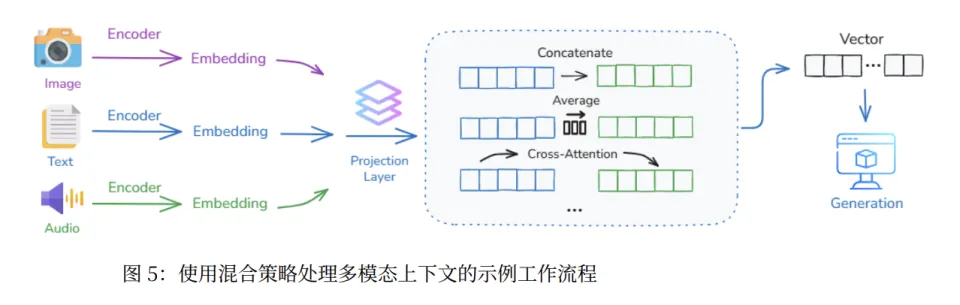
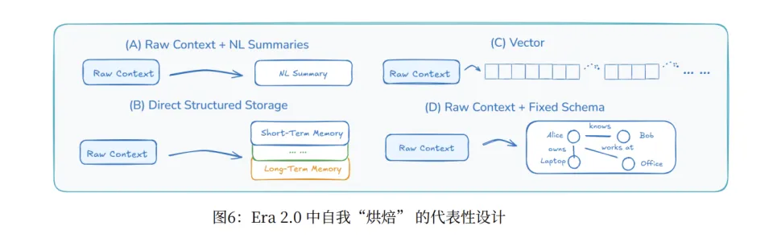

- Github (188 stars): https://github.com/GAIR-NLP/Context-Engineering-2.0

包含各类上下文工程相关的博客和论文

上下文工程是什么？
一门关于熵减的古老学科
要理解上下文工程，必须先回答：为什么人与机器的交流如此困难？

论文认为，这是因为人类与机器之间，存在一道认知鸿沟。

人类的交流是高熵的，他们的表达无序、混乱、充满隐含信息。当我对同事说"帮我搞定那个报告"，他需要记忆中的"那个报告"指什么、从我的语气判断紧急程度、理解"辛苦"背后的社交暗示。这些都是海量的、模糊的、非结构化的上下文。

而机器是低熵生物，它无法接受足够多的上下文，只能理解明确的、毫不含糊的指令。

为了弥合这道鸿沟，人类必须将"高熵"意图转化为机器可理解的"低熵"指令。其手段，就是建立更丰富有效的上下文。正如马克思所说，人的本质是社会关系的总和。想要让AI更理解我们，就得让它理解人身处的一切情景。

这就是上下文工程的本质，通过更好的上下文，达成系统性的熵减过程。

在这个系统中，最重要的是实体，即人、应用、环境。上下文，就是描述实体状态的所有信息 。

上下文工程则是设计和优化上下文的收集、管理、使用， 以提升机器理解和任务表现的努力。

从这个意义上讲，上下文工程根本不是新概念。在AI之前，它已经发展了20多年，而现在，我们已经在上下文工程 2.0 时代了。

翻译的中间层消失了，设计师和程序员的熵减工作也随之消失。

但普通用户发现，虽然和 AI 说话不需要翻译了，它依然理解不了话语背后的信息。

熵减的需求并没有消失，只是转移到了用户身上。他们必须学会精确表达意图、构建有效 prompt、调试输出。

这就是提示词工程爆发的原因，人们在试图重新发明一种结构化的自然语言来减少沟通中的障碍。

但除了规范自己的表达，我们也可以从模型本身下手，给它提供更好的脚手架和系统，让它更好地理解我们的意图。

这就是上下文工程诞生的背景。

02
AI与人沟通，为什么还是有理解差距？
既然上下文工程是为了解决目前人与AI沟通的Gap，那它做不到和我们人类一样可以高熵交流的核心原因都有什么呢？

论文通过与人类沟通做对比，总结了八大AI的缺陷，我们可以把它归结成四种。正是因为这些缺陷存在，它理解不了我们的高熵交流，造成了Gap。

首先，AI的感官是残缺的。人类沟通时会接收大量文字外信息，而 AI 只能获得用户明确的输入。它看不见我们所处的环境，上下文收集存在先天缺陷。

第二是AI的理解能力有限。与人类相比，AI理解和整合上下文的能力很有限。就算它感官不残缺，即使把所有信息都喂给 AI，它也不一定理解其中关系。当前模型难以处理复杂逻辑和图像中的关系信息。

第三个最要命，就是记忆的缺失。Transformer 架构存在长上下文性能瓶颈，导致模型既没有长期记忆系统，也难以捕捉长距离依赖关系。AI记不住过去的对话，就不可能像人一样建立背景共识。正是这些"我们都知道的过去"，让人类说话如此省力。而当前试图去存储记忆的方法，如RAG等，仍然效率较低。

第四是相对于人来讲，AI的注意力是涣散的。这被论文称为“上下文选择困难”。就算我们解决了上一个问题，给 AI 外挂了长期记忆，比如RAG，理论上讲就是可以存储所有内容。但面对海量信息时，AI 并不知道该看哪里。

针对这些缺点，过去提示词工程通过添加"前情提要"修补记忆缺失，通过手动精炼信息、规范化表达减少理解和注意力负担。它就是上一代针对模型缺陷的全面补丁。

但这个过程太耗费力气了。

因此一个好的上下文工程，就是尽可能搭建脚手架，让模型借助脚手架，解决当下能力不足的问题。让AI真的可以成为人的数字存在（Digital Presence），人们可通过上下文"数字永生"，让你的对话、决策、交互轨迹可以持续演化。

但这个过程太耗费人力。一个好的上下文工程，应该搭建脚手架，让模型借助系统解决当前能力不足的问题。

03
上下文工程，AI时代的泥瓦匠
为了解决模型当前问题，论文提出了一个包含收集、管理、使用三个阶段的完整上下文工程体系。这张技术地图详细说明了我们为弥补 LLM 缺陷而必须搭建的庞大脚手架系统。

构件一：上下文收集与记忆系统
这一构件主要修复 AI 的"感官残缺"与"记忆缺失"。

上下文收集方面，我们必须超越简单的文本输入，转向多模态、分布式的收集。

多模态融合，就是将文本、图像、音频通过各自编码器映射到共享向量空间，让模型真正理解多模态意涵。

构件二：上下文管理
这主要解决 AI 理解能力有限，难以处理复杂逻辑和关系信息的问题。

核心是上下文抽象，论文称之为"自我烘焙"(Self-Baking)。既然 AI 看不懂原始的、高熵的上下文，这个脚手架就充当预处理器，主动将上下文消化并烘焙成 AI 能理解的低熵结构。

这并非简单摘要，而是区分记忆存储和学习的关键。没有它，智能体只是在回忆；有了它，智能体才是在积累知识。

目前流行实现方法从简单到高级分为三种：

自然语言摘要：让 AI 自己摘要重要信息，但它是纯文本，缺少结构，难以深度推理。

模式化提取：从原始上下文提取关键事实（人、地点、事件），按固定模式存入知识图谱。AI 不再需要理解复杂关系，只需查询已准备好的结构化关系图。

在线蒸馏：如 Thinking Machine 提出的方法，将上下文渐进式压缩为向量，转化成模型自己的知识。

构件三：上下文使用
这个构件主要解决 AI 注意力涣散问题，规范收集和管理后的上下文如何进行协作和推理。

论文提出的解决方法也很直接，即构建高效的上下文选择机制，先过滤注意力。

当前，模型在 RAG 中搜索记忆时过于依赖语义相关性（向量搜索），会搜出大量信息，导致上下文过载，理解能力大幅下降。

因此，我们需要一个更高效的搜索机制。它需要满足以下几个特质：

理解逻辑依赖。让AI使用RAG搜索时用逻辑关系，而不是简单地问“什么信息在语义上最像？”

平衡新近度与频率。优先关注“最近使用过”或“经常使用”的信息

最终，模型能够达到主动需求推断的水平。系统不再被动地等待你提问，而是基于上下文，对你隐藏目标做分析，主动推断你下一步可能需要什么信息，并提前为你准备好。

至此，这个上下文工程框架通过收集、管理、使用上下文，弥补了 AI 在"感官"、"理解"、"记忆"和"注意力"上的四大缺陷，形成了一整套关于上下文的闭环工作流程。

在这个流程下，我们可以把提示词工程的重担转移回模型自身，让它通过系统尽可能好地理解我们。

# 参考

[1] 一篇论文，读懂上下文工程的前世今生｜上交大新论文解读, https://mp.weixin.qq.com/s/GLp3FFmE8q9nEIKwzjtv5A
