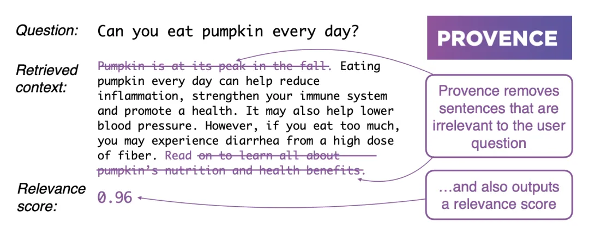
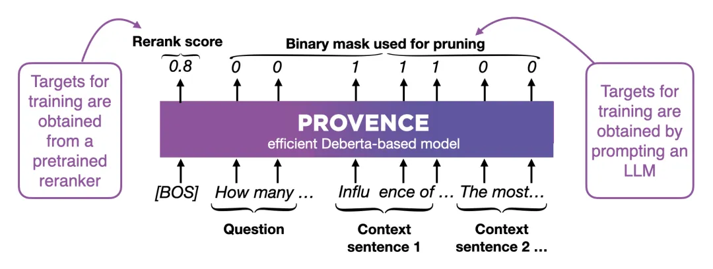
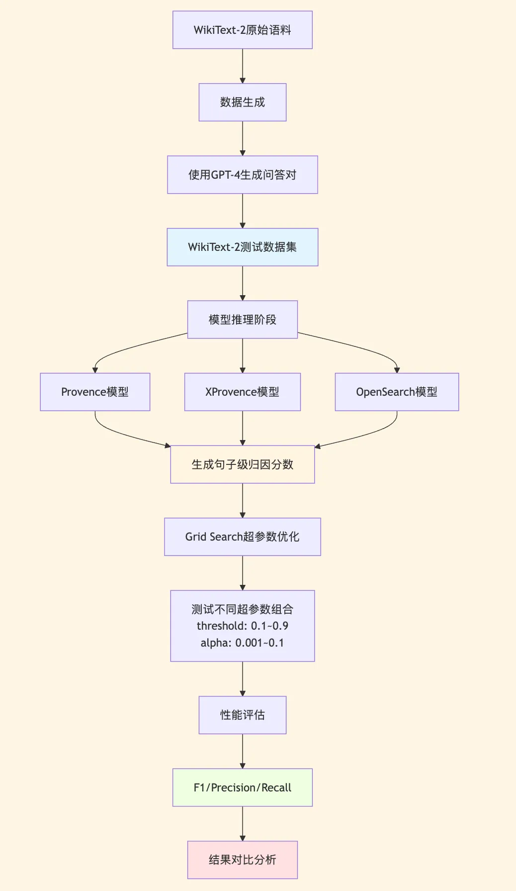
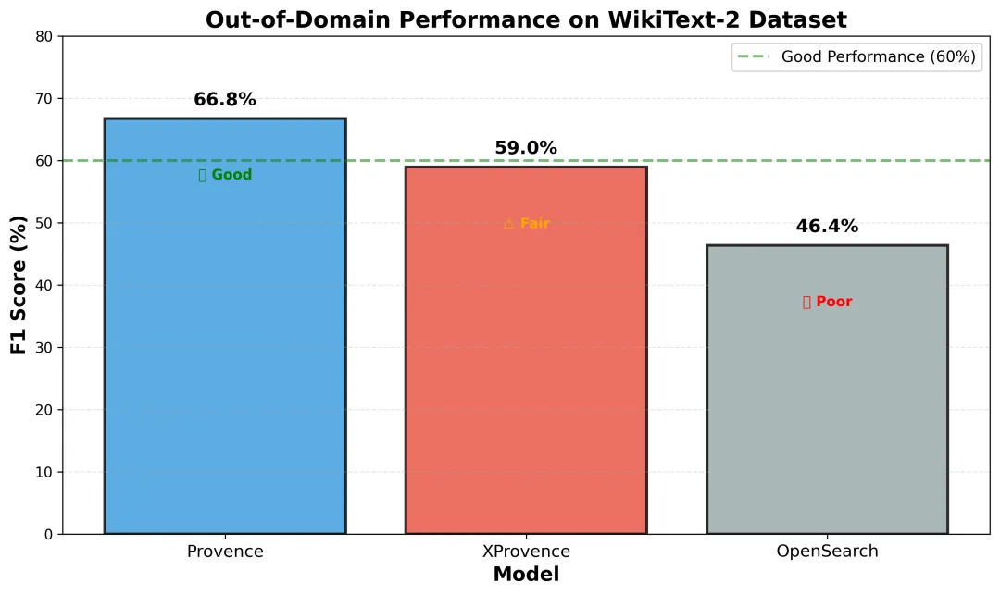
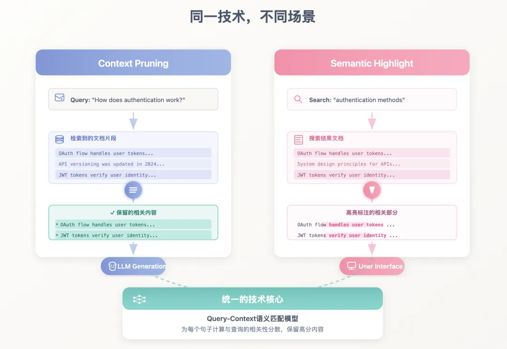

# 1. 资源

相关链接：

How to Fix Your Context: https://www.dbreunig.com/2025/06/26/how-to-fix-your-context.html

Provence论文: https://arxiv.org/abs/2501.16214

Provence官方博客: https://huggingface.co/blog/nadiinchi/provence

Provence模型: https://huggingface.co/naver/provence-reranker-debertav3-v1

XProvence模型: https://huggingface.co/naver/xprovence-reranker-bgem3-v1

OpenSearch: https://github.com/opensearch-project/

WikiText-2: https://huggingface.co/datasets/mindchain/wikitext2

Milvus: https://milvus.io

# 2. Context Pruning

研究Context Pruning的时候，我发现了两个有意思的宝藏开源模型：Provence和XProvence，来自Naver AI Lab的工作

Provence的核心功能很简单：给它一个问题和一段检索回来的文档，它会帮你筛选出真正相关的句子，把无关的内容过滤掉。

这样既加快了LLM生成速度，又减少了噪声干扰。而且它是即插即用的，可以配合任何LLM或检索系统使用。

Provence有几个让我印象深刻的特点。

第一是它会整体理解文档。不像有些方法单独看每个句子，Provence会把所有句子放在一起看。

这很重要，因为文档里经常有"它""这个"这样的指代词，单独看一句话可能不知道在说什么，但放在上下文里就清楚了。这样可以显著提高剪枝的准确性。

第二是它会自己判断该留几句话。不需要你告诉它"给我留5句话"或"留10句话"，它会根据具体情况决定。有些问题可能一句话就够了，有些可能需要好几句，Provence都能自动处理。

第三是效率很高。一方面它是个轻量级模型，比调用大型LLM快多了；另一方面它把剪枝和重排序（Reranking）合在一起做了，基本不增加额外成本。

第四是它有跨语言版本。XProvence是Provence的跨语言版本，它是另外单独训练的一个模型，支持多种语言，包括中文、英文、韩文等。训练模式大致和Provence一样，只是数据集不同。

实现上，Provence采用了比较巧妙的设计。它的输入很简单：把问题和文档拼起来，一起送进模型。这种 Cross-Encoder 架构，让模型能同时看到问题和文档的全貌，理解它们之间的关联。

此外，Provence是基于DeBERTa训练微调的，作为一个轻量级的Encoder模型，训练时它同可以时做两件事：

1. 给整个文档打分（Rerank score）- 判断这段文档和问题的相关程度，比如0.8分表示相关度很高

2. 给每个词打标签（Binary mask）- 用0和1标记每个词是否相关，1表示相关要保留，0表示无关可以删掉

这样训练出来的模型，既能判断文档相关性，又能精准地做句子剪枝：推理时，Provence会给每个词打分，然后按句子聚合：如果一个句子里标记为1（相关）的词比标记为0（无关）的词多，就保留这个句子，否则就删掉。通过调整阈值，就能控制剪枝的激进程度。

最重要的是，Provence复用了重排序的能力，所以在RAG流程中几乎是零成本加入的。

04 
定量评估实验
前面我们介绍了Provence的设计原理和技术特点，那么它在实际应用中的表现如何？与其他模型相比有何优劣？为了回答这些问题，我们设计了一套完整的定量评估实验，对比其他模型在真实场景下的剪枝质量。

实验有两个核心目标：

1. 定量评估Context Pruning的效果：通过标准指标（Precision、Recall、F1）量化模型的剪枝质量

2. 测试域外泛化能力（Out-of-Domain）：评估模型在与训练数据分布不同的场景下的鲁棒性

为此，我们选择了三个代表性的模型进行对比：

Provence (naver/provence-reranker-debertav3-v1)

XProvence (naver/XProvence)

OpenSearch Semantic Highlight (opensearch-project/opensearch-semantic-highlighter-v1)，同样基于BERT架构训练的剪枝模型

05 
实验设计
数据集选择：我们选择WikiText-2作为测试集。这是一个基于维基百科文章的数据集，文章结构多样，答案往往分散在多个句子中，语义关联也比较复杂。

更重要的是，它与模型通常的训练数据存在较大的分布差异，同时又很接近日常业务场景——这正是我们想要的out-of-domain测试环境。

问题生成与标注：为了确保out-of-domain的效果，我们使用GPT-4o-mini从WikiText-2原始语料中自动生成问答对。每个样本包含三个部分：

问题（Query）：从文档内容生成的自然语言问题

文档（Context）：完整的原始文档

答案标注（Ground Truth）：标注出哪些句子包含答案（应保留），哪些句子不相关（应剪枝）

这种构造方式天然形成了一个Context Pruning任务：模型需要根据问题，从完整文档中识别出真正相关的句子。答案句子作为"正样本"（应保留），其他句子作为"负样本"（应剪枝），这样我们就可以通过Precision、Recall、F1等指标量化评估模型的剪枝准确性。

更重要的是，这样生成的问题不会出现在任何模型的训练数据中，能够真实反映模型的泛化能力。我们一共生成了300个样本，涵盖简单事实类、多跳推理类、复杂分析类等不同类型的问题，尽可能贴近实际应用场景。

实验流程：

参数优化：使用Grid Search对每个模型进行超参数优化。测试不同的超参数组合，最终选择F1最优的配置。

06 
实验结果

从实验结果来看，三个模型的表现存在明显差异。

Provence表现最好，F1达到66.76%。Precision（69.53%）和Recall（64.19%）相对平衡，显示出良好的域外泛化能力。最优参数为threshold=0.6，alpha=0.051，说明模型输出的分数分布较为合理，阈值设置也相对直观。

XProvence的F1为58.97%，略微有些高召回（75.52%）、低精确度（48.37%）的特征。这种"宁可错选不可漏选"的策略在某些场景下具有优势，比如医疗、法律等对信息完整性要求高的领域。但同时也会引入更多的误判，降低精确度。好在XProvence支持多语言，它可以弥补Provence在除了英文以外场景的不足。

OpenSearch的F1为46.37%（Precision 62.35%，Recall 36.98%），在三个模型中相对较弱，显著低于Provence和XProvence，说明在out-of-domain场景下，模型输出的分数校准和泛化能力还有提升空间。

07 
Context Pruning与Semantic Highlight
顺带提一下，Context Pruning与一个新兴的搜索系统功能——Semantic Highlight（语义高亮），他们在技术本质上是同一件事。

可能说到Highlight，大家可能更熟悉Elasticsearch里的传统Highlight功能——它基于关键词匹配，用<em>标签高亮查询词出现的位置。但这种方式很机械，只能匹配字面相同的词。

而Semantic Highlight则完全不同，它基于语义理解，通过深度学习模型判断文本片段与查询的语义相关性，即使没有相同关键词也能准确识别相关内容。

仔细想想，Context Pruning与Semantic Highlight的本质都是：

基于query和context的语义匹配，找出最相关的部分，排除掉不相关的部分。

因此，它们本质上是同一个技术在不同场景下的应用。

这意味着同一个模型可以服务多个场景，提高了技术的可复用性。

而伴随着Semantic Highlight逐渐成为一个新兴的功能需求，Milvus团队正在规划内置Semantic Highlight功能。

目前当Milvus提供向量检索时，用户反馈检索返回大量chunk后，难以快速识别哪些句子真正有用。而借助提供基于模型的Semantic Highlight功能，能够与向量检索pipeline无缝融合。

这样Milvus将演进为集成检索、重排序、上下文剪枝的智能检索归因平台，覆盖RAG优化、搜索高亮、文档摘要等多个场景。
# 参考

[1] RAG效果要提升，先搞定高质量Context Pruning, https://mp.weixin.qq.com/s/u0wq-5e0mZzRlyUqXQYnBA