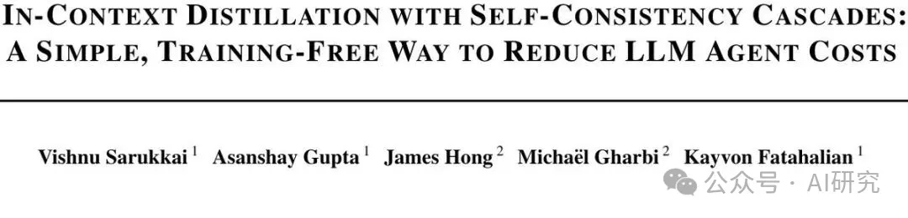
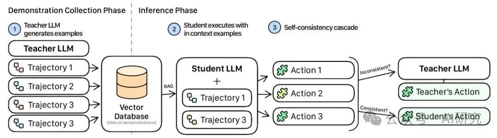
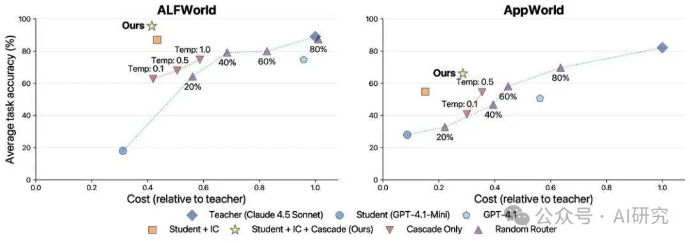

# 1. 资源

ArXiv URL：http://arxiv.org/abs/2512.02543v1

来自斯坦福大学等机构的研究者给出了一份惊艳的答卷。他们提出了一种极其简单却高效的免训练方法，在保持与顶级模型相当的准确率下，将Agent的推理成本降低了整整2.5倍！其核心秘诀就是“上下文蒸馏”与“自洽级联”的巧妙结合。

# 2. 原理

核心思想：当“上下文蒸馏”遇上“自洽级联”
传统的降本方法，如模型微调（fine-tuning），不仅耗时耗力，还需要大量的专业知识，这与追求敏捷开发的理念背道而驰。而这篇论文提出的新范式，完全绕开了训练过程。

它的核心由两大组件构成：

1. 上下文蒸馏（In-Context Distillation）：这个概念借鉴了经典的“知识蒸馏”，但实现方式完全不同。它不再需要通过训练让“学生模型”学习“教师模型”。取而代之的是，在每次推理时，动态地从一个预先准备好的“教师模型范例库”中，检索出最相关的几个案例，直接放进“学生模型”的上下文中。这就像一个学徒（学生模型）在解题时，能够随时翻阅宗师（教师模型）的解题笔记，从而“现场”模仿其思考和行动方式。
2. 自洽级联（Self-Consistency Cascades）：有了“偷师”的机会，学生模型的能力大大增强，但我们如何知道它何时学得到位，何时又会出错呢？“自洽级联”就是这个“质检员”。它让学生模型对同一个问题，生成多个（例如3个）答案。如果所有答案都完全一致，说明学生胸有成竹，我们就采纳它的答案。如果答案不一致，则说明学生感到困惑，此时系统会自动“级联”，将这个难题交给昂贵的教师模型来解决。

图1：上下文蒸馏与自洽级联的工作流。首先收集教师模型的示范存入数据库，推理时为学生模型检索相关范例，并通过自洽性检查决定是否求助教师模型。

这种策略非常聪明，它只在最关键、最没把握的步骤上才动用“王牌”，而在绝大多数情况下，都由成本低廉的学生模型完成，从而实现了成本和性能的最佳平衡。

两步走：新方法如何工作？
整个系统的工作流程清晰地分为两个阶段：

阶段一：构建教师示范数据库
这一步是准备工作。研究者先用一个高性能的“教师模型”（如Claude 3 Sonnet），在一个小的任务集上运行Agent，并将其成功的轨迹——包括每一步的思考（reasoning）和行动（action）——完整记录下来。

这些宝贵的经验被转换成向量，存储在一个向量数据库  中，以备后续快速检索。这个过程是一次性的，其成本在后续的大规模应用中可以被迅速摊薄。

阶段二：推理与动态决策
当一个新任务来临时，“学生模型”（如GPT-4.1-mini）开始上场。在Agent执行任务的每一步 ：

1. 检索：系统会根据当前的目标 、计划  和观察 ，从数据库  中检索出最相关的教师示范。
2. 蒸馏：这些检索到的“笔记”被注入到学生模型的提示词（Prompt）中，学生模型得以在上下文中学习教师的行为模式。
3. 自洽检查：学生模型被要求生成  个候选动作 。系统会检查这些动作是否完全一致。
4. 决策：
• 如果所有动作都一致（），则采纳学生模型的动作 。
• 如果动作不一致，说明学生模型没有把握，系统则将这一步交给教师模型  来决策。
这个循环在任务的每一步都会发生，确保了Agent在整个执行过程中既高效又可靠。

惊艳的实验效果：成本与精度的双赢
口说无凭，实验数据最能说明问题。该研究在两个主流的Agent基准测试ALFWorld和AppWorld上进行了验证。

图2：成本与准确率的帕累托前沿。黄色星星代表的“IC + Cascade”（本文方法）在两个基准上都显著优于其他方法，实现了更低的成本和更高的准确率。

结果令人振奋：

• 显著的成本降低：在ALFWorld上，该方法在达到甚至超越教师模型准确率的同时，实现了2.5倍的成本降低（单次任务成本从
降
至
0.024）。在更复杂的AppWorld上，也达到了同等准确率下2倍的成本降低。
• 快速的成本回收：在ALFWorld上，收集教师范例的初始成本仅需843次任务即可完全收回。如果部署规模达到100万次任务，预计可节省超过$34,900！
• 普适性强：该方法不仅适用于顶级的闭源模型，在开源模型（如Llama 3）上也表现出了一致的有效性，证明了其广泛的适用性。
更有趣的是，在ALFWorld上，装备了“上下文蒸馏”的学生模型表现甚至超过了它的老师（96% vs 89%）。研究者推测，这是因为检索到的多个范例不仅展示了教师的思考过程，还间接提供了关于环境动态的丰富信息。

总结：让高级Agent走向平民化
这项研究最大的价值在于，它为在实际生产环境中大规模部署LLM Agent提供了一条极其务实且经济的路径。

它告别了复杂的模型训练和繁琐的提示工程，通过一种“即插即用”的动态检索与决策机制，让开发者可以继续享受敏捷开发带来的高效，同时将运营成本控制在可接受的范围内。

# 参考

[1] Agent推理成本降低2.5倍：斯坦福提出上下文蒸馏！https://mp.weixin.qq.com/s/x27JxVlG6TkWXrJIWX-ayw