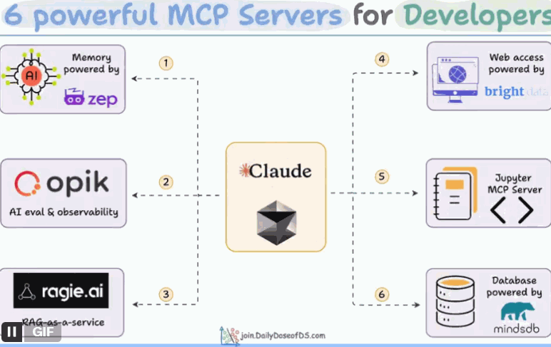

Graphiti: github.com/getzep/graphiti

Opik: github.com/comet-ml/opik-mcp

Ragie: github.com/ragieai/ragie-mcp-server

Bright Data: github.com/luminati-io/brightdata-mcp

Jupyter MCP: github.com/datalayer/jupyter-mcp-server

MindsDB: github.com/mindsdb/mindsdb

此外，还有两个：

1、Markdownify MCP Server  (网页转 Markdown)

2、用于任务管理系统的MCP

别自己瞎搞了，已经有更聪明的人帮你把活干了：

1.   Taskmaster AI  ( https://www.task-master.dev/ )

2.   Cline Task Tool  ( https://docs.cline.bot/getting-started/for-new-coders )

TaskMaster AI。它的 MCP 跟 Cursor 配合得很好，直接用 CLI (命令行) 也行。这是一款呼声很高的mcp。
