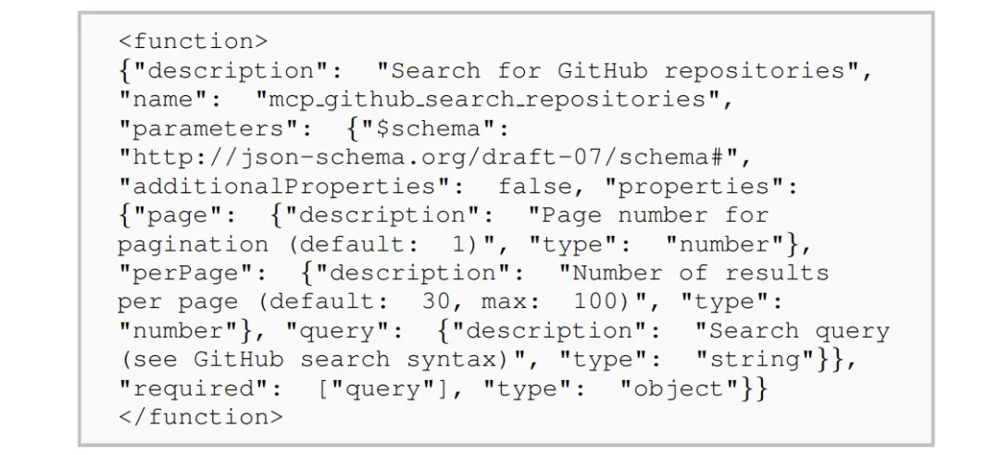
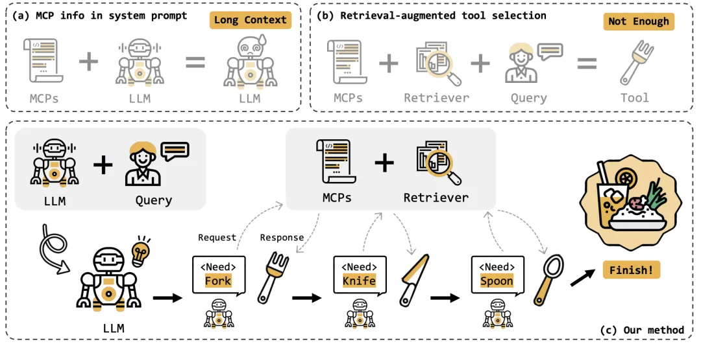
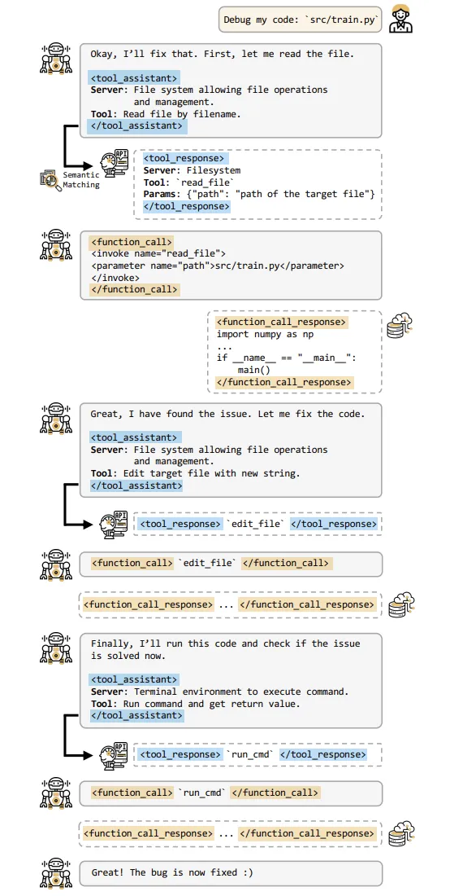
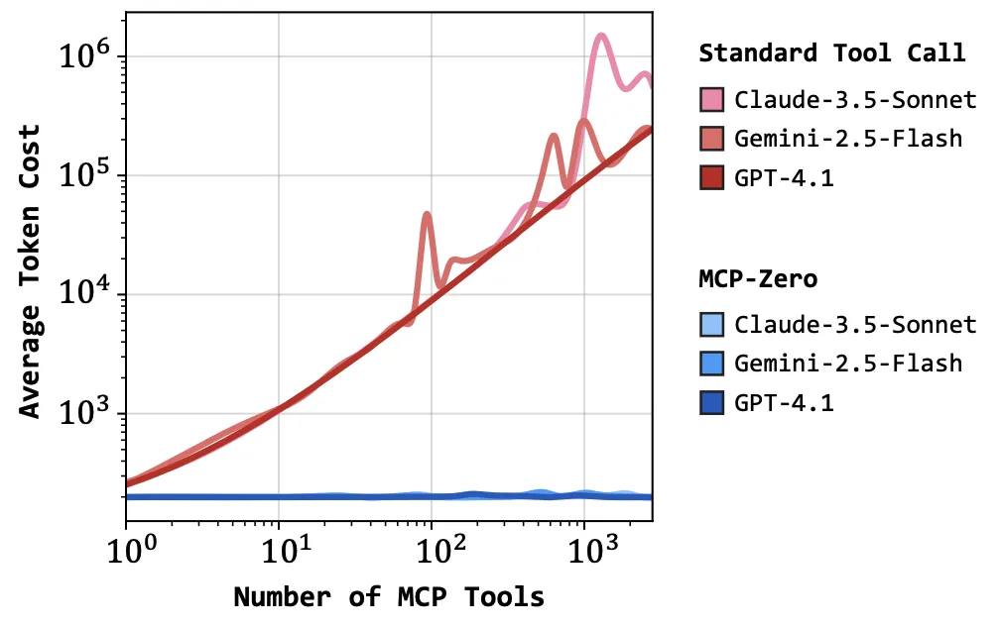
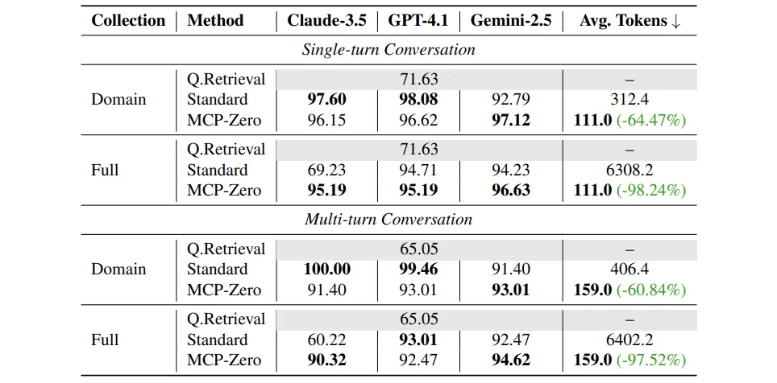

# 资源

- 论文：https://arxiv.org/pdf/2506.01056
  - MCP-Zero: Active Tool Discovery for Autonomous LLM Agents
  - 2025.6.24
- Github (217 stars): https://github.com/xfey/MCP-Zero

# 1. 问题

当AI需要“外挂”（工具），麻烦来了！

想象一下，你家的超级AI助手ChatGPT不仅会聊天写诗，还能帮你订外卖、查股票、改代码！这靠的是让它调用外部工具（API），就像给它装上了“外挂”。但问题来了：现在“外挂”成千上万，怎么告诉AI哪个能用呢？

传统做法简单粗暴：把所有工具的使用说明书（JSON Schema）一股脑塞进给AI的提示词里。想想看，光一个“GitHub工具包”的说明书就要4600多个token（相当于几千个中文字符），更别说几千个工具了！



展示了这种“文档膨胀”有多恐怖。

结果呢？

- 贵：处理这么多token，算力成本蹭蹭涨！
- 慢：提示词太长，留给AI真正思考和回答的空间被严重挤压。
- 笨：工具太多太杂，AI在“说明书海洋”里晕头转向，经常找不到真正需要的那个。

这成了AI Agent（能使用工具的AI）发展的大瓶颈！急需一种更聪明、更省钱的方案。

# 2. 原理

## 2.1 MCP-Zero登场：让AI学会“主动要工具”

MCP-Zero的核心理念很颠覆：别让AI被动等“喂”工具，让它自己学会“主动要”！



怎么“要”？

当AI在处理任务时，发现自己搞不定（比如需要读写文件、执行命令），它不会干瞪眼。

它会主动生成一个清晰的“工具需求单”，格式是固定的：

```text
server: ...  # 说明需要哪个“平台”或“领域”的工具 (比如操作系统、数据库、代码管理)
    tool: ...    # 说明具体想做什么“操作”+“对象” (比如“文件系统_读文件”、“执行_命令行”)
    </tool_assistant>
```

这个需求单是结构化的，不是用户那种口语化的“帮我调试下代码”。这好处大大的：
- 更精准：AI自己知道缺啥能力，比用户描述更到位。
- 更匹配：需求单的措辞和工具官方文档很接近，找起来更准，避免了“你想吃薯条，结果搜到马铃薯种植技术”的尴尬（语义鸿沟）。

## 2.2 高效找工具：分层检索的“两步走”策略
AI发出了清晰的需求单（“我要操作系统领域的，能读文件的工具”），接下来怎么快速从几千个工具里找到它？MCP-Zero用了一个聪明的“两步走分层检索”：

第一步：锁定“服务商” (Server-Level) ：
系统拿着需求单里的server字段（比如filesystem），去匹配所有工具“服务商”（MCP Server）的描述。
先快速圈定几个最相关的“服务商”。这步像先确定“菜系”（川菜、粤菜）。

第二步：精选“工具” (Tool-Level) ：
在第一步选出的几个“服务商”内部，系统再拿着需求单里的tool字段（比如read_file），去匹配每个服务商提供的具体工具描述。
找出这个“菜系”里最符合你点菜要求的那道“菜”。

打分秘诀：
最终工具排名不是简单相加，而是用公式 score = (s_server * s_tool) * max(s_server, s_tool)。意思是：server匹配度和tool匹配度都重要，而且任何一个维度匹配得特别好，总分就会很高。这确保了好工具不会被漏掉。

这种方法，就像先在购物网站选大类（电子产品->手机），再筛选品牌和型号，比直接搜“好用的手机”精准高效太多了！大大减少了无用功。

## 2.3 动态搭积木：迭代构建“工具链”
很多任务不是靠一个工具能搞定的。比如老板让你“调试那个文件”，这可能需要：

用文件系统工具读取文件内容。
用代码工具修改代码。
用命令行工具运行调试。

MCP-Zero的厉害之处在于支持迭代式、按需构建工具链：

AI不会一开始就把所有可能用到的工具说明书都塞进脑子（太占地方！）。
而是走一步，看一步，要一个：
它先发现需要读文件，发出<tool_assistant>请求，检索并引入文件读取工具，用掉。
接着发现要改代码，再发请求，检索并引入代码修改工具，用掉。
最后要运行调试，再发请求，引入命令行执行工具，搞定！
更智能的是：如果找回来的工具不好用（比如功能不匹配），AI还能调整需求单，重新检索！有了自我修正能力。下图生动展示了这个迭代过程。



这就像搭积木，缺哪块就找哪块，按需取用，极大地节省了“脑容量”（上下文窗口），同时能搞定复杂的多步骤任务。

## 2.4 支撑：MCP-Tools 数据集

“巧妇难为无米之炊”。为了训练和验证MCP-Zero这套方法，作者们下功夫构建了一个专门的数据集 MCP-Tools：

内容：从官方仓库精心收集、清洗、标准化了 308个工具“服务商”(Server) 和它们提供的 2797个具体工具(Tool)。
关键处理：对每个“服务商”，不仅用原始描述，还用AI生成了更全面、强调功能的server_summary。这大大提升了第一步“服务商”检索的准确性。
价值：这是首个面向MCP领域工具检索的大规模数据集，为未来研究提供了宝贵资源。

有了这个“工具大全”，才能让MCP-Zero在真实的、大规模的环境下接受考验。

## 2.5 效果说话：省！快！准！

理论很美好，实际效果如何？论文用详实的实验数据证明，MCP-Zero确实革命性地提升了效率，还保证了效果：

省到极致 (Token消耗暴降) ：

最震撼的数据：相比传统“全量塞文档”的方法，Token消耗减少了惊人的98%！ 的曲线对比极其鲜明——传统方法消耗随工具数量指数级飙升，MCP-Zero则平稳维持在超低水平。省Token就是省真金白银！



平均减少60%以上的Token消耗是常态。真正做到“只为需要的工具付费”。
快而精准 (大规模下依然准确) ：
在包含近3000个工具的MCP-Tools数据集上，MCP-Zero能在有限的上下文（248k tokens）内准确找到目标工具。证明其分层检索策略在大规模下依然有效。
复杂任务不掉链子 (多轮、跨域稳健) ：
在需要多轮对话交互（APIBank数据集）和跨多个领域协作的复杂场景下，MCP-Zero的准确率保持稳定（单轮到多轮下降很小）。
而传统方法在工具库变大或对话轮次增多后，准确率暴跌（例如从97.6%跌到69.2%），因为“注意力被稀释”了——工具太多太杂，AI看花眼了。下表清晰展示了这些对比数据。



主动请求是关键 ：
实验还对比了直接用用户原始查询去检索工具的方法（Q.Retrieval），其准确率（~65-72%）远低于MCP-Zero（~90-97%）。这强有力地证明了让AI主动生成结构化请求对于精准匹配至关重要。

## 2.6 意义与展望：AI Agent工具生态的“新范式”

MCP-Zero不仅仅是一个技术改进，它代表了一种范式的转变：

从“预装全家桶”到“按需点单”：告别把海量工具文档硬塞给AI的笨重时代，拥抱让AI动态、按需、迭代地发现和调用所需工具的新时代。
解锁实用化AI Agent：它解决了构建能利用海量、动态增长外部工具的AI Agent的核心瓶颈——上下文效率问题。让这类Agent的落地成本大幅降低，可行性大增。
未来充满想象：

与“造工具”结合：论文提到了另一个前沿工作 Alita（能自动搜索代码、构建环境、创建新工具）。MCP-Zero（高效找工具） + Alita（找不到就造工具） = 潜力无限的“自进化AI Agent生态系统”：先找现成的，没有就造一个，造完还能注册供以后使用！
更优匹配：探索结合代码示例、使用模式等多模态信息进行更精准的工具检索。
多Agent协作：让多个AI Agent能互相发现和共享工具，协同完成更宏大任务。
成为基础设施：把MCP-Zero本身打包成一个标准的“工具发现服务”（MCP Server），方便集成到现有生态中。

# 3. 结语

MCP-Zero 像给AI Agent装上了智慧的“雷达”和高效的“物流系统”。它教会AI在需要时清晰地说出“我要什么”，然后用巧妙的分层检索迅速找到，按需取用，动态搭建解决复杂任务的“工具链”。实验结果证明，它能省下98%的算力开销，同时在几千个工具中精准定位，稳定处理复杂协作。这不仅是一项技术创新，更是迈向能真正驾驭庞大工具世界的实用型AI Agent的关键一步。未来，当它与能“创造工具”的AI结合，一个自我装备、自我升级的智能体生态将不再是科幻。AI Agent的“工具自由”时代，或许就此开启！

# 参考

[1] MCP-Zero重塑工具调用范式：让Agent学会“主动要”，而不是被动等“喂”，可省下98%算力！https://mp.weixin.qq.com/s/0fHbbnhqFAcPY8pCi0FC6g