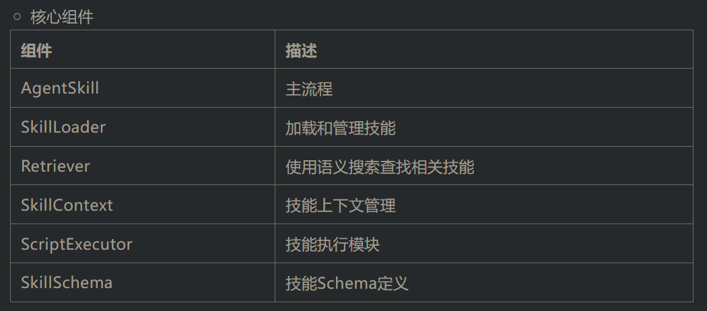

# 1. 资源

MS-Agent中Skills实现：

https://github.com/modelscope/ms-agent/tree/main/projects/agent_skills


Anthropic 关于 Agent Skills的介绍

https://docs.claude.com/en/docs/agents-and-tools/agent-skills

Anthropic Agent Skills官方文档：

https://docs.claude.com/en/docs/agents-and-tools/agent-skills


Anthropic Skills GitHub仓库： 

https://github.com/anthropics/skills

# 2. 原理

1、架构

智能体技能架构


文件夹结构

```text
skill-name/
├── SKILL.md              # Main skill definition           (Required)
├── reference.md          # Detailed reference material     (Optional)
├── LICENSE.txt           # License information             (Optional)
├── resources/            # Additional resources            (Optional)
│   ├── template.xlsx     # Example files
│   └── data.json         # Data files
└── scripts/              # Executable scripts              (Optional)
    ├── main.py           # Main implementation
    └── helper.py         # Helper functions
```

2、SKILL.md 文件格式

SKILL.md 文件使用YAML前置内容定义元数据，后续为详细说明的Markdown内容。


💡 说明：

name和description字段为必填项。

SKILL.md文件的正文部分应提供关于技能的全面描述，包括功能、使用说明、参考资料、资源和示例。SKILL.md示例：https://github.com/anthropics/skills/blob/main/document-skills/pdf/SKILL.md

3、绑定附加内容
附加的文件可以包含在SKILL.md中以扩展技能功能，例如：

References (例如 reference.md 和 forms.md)


Scripts


Scrips目前支持的类型包括python、shell、js等


4、技能和上下文

推荐设置技能文件的token限制，以确保在上下文窗口限制内高效加载


03


技能的实现


1、概览
MS-Agent框架的AgentSkills模块是对Anthropic-Agent-Skills协议的实现（Beta版本）。

Agent Skills实现了多层次渐进式上下文加载机制，有效管理技能的发现与执行：

Level 1 (Metadata): 仅加载技能元数据（名称、描述）以进行语义搜索

Level 2 (Retrieval): 检索相关技能并加载SKILL.md全文

Level 3 (Resources): 进一步加载技能所需的参考资料和资源文件

Level 4 (Analysis|Planning|Execution): 分析技能上下文，自主制定计划和任务列表，并加载所需资源和运行相关脚本

这种方法在提供全面技能能力的同时，最大限度地减少资源消耗。



2、主要特性
📜 标准技能协议：完全兼容 Anthropic Skills 协议

🧠 启发式上下文加载：仅按需加载必要上下文（如 References、Resources 和 Scripts）

🤖 自主执行能力：智能体可根据技能定义，自主分析、规划并决策需调用的脚本与资源

🔍 技能管理支持：支持批量加载技能，并能根据用户输入自动检索与发现相关技能

🛡️ 代码执行环境：可选本地直接执行代码，或通过 ms-enclave (https://github.com/modelscope/ms-enclave) 提供的安全沙箱执行（自动安装依赖、实现环境隔离）

📁 多文件类型支持：支持文档、脚本与资源文件等多种类型

🧩 可扩展设计：技能数据结构模块化，提供如 SkillSchema 和 SkillContext 等实现，便于扩展与定制

# 参考

[1] Agent Skills技术协议与开源实现，让大模型拥有“即插即用”技能, https://mp.weixin.qq.com/s/pXR2yhDLNrrfIfWQIAnqhg