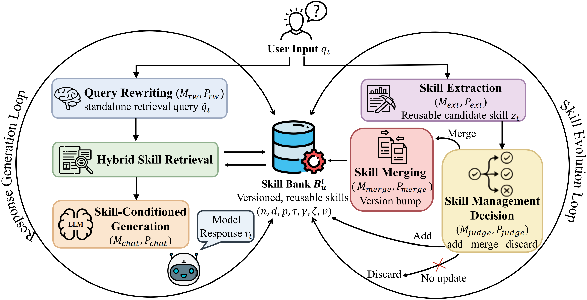

- Github (69 stars): https://github.com/ECNU-ICALK/AutoSkill

AutoSkill 是经验驱动终身学习（ELL）的实用实现。它从真实互动经验（对话 + 行为/事件）中学习，自动创建可重复使用的技能，并通过合并 + 版本更新不断演进现有技能。

自动技能的区别
体验驱动的持续技能演进：直接从真实用户互动和行为痕迹中提取可重用的能力，然后持续维护版本化技能，使系统随着时间推移更好地符合用户需求。
通用技能格式：使用代理技能工件（），并以清晰的解释性和可编辑性为基础：结构透明，内容可审核，人类可根据需要进行修改;这也支持导入现有技能和迁移提取技能到其他系统。SKILL.md
完成对话后的离线技能提取：聊天结束后无需用模型重玩;直接导入现有对话日志（OpenAI 格式），并运行离线提取以生成可重复使用的技能。.json/.jsonl
长期能力价值：AutoSkill将短期互动转化为长期能力资产。它降低了手动技能创作的成本，使能力与真实用户反馈保持一致，并支持跨运行时的转移/重用。
3. 系统工作流程
3.1 吞噬与进化
Experience (messages/events)
  -> Skill Extraction (candidate)
  -> Skill Maintenance (add / merge / discard)
  -> Skill Store (Agent Skill artifact + vector index)
Extractor 每次尝试最多只发出一个高质量候选。
维护者会核对现有技能的相似性，然后决定添加/合并/丢弃。
合并更新，保留并提升功能，然后推送版本。
3.2 检索与响应
User Query (+ recent history)
  -> Query Rewrite (optional)
  -> Embedding + Vector Search
  -> Skill Selection for Context
  -> LLM Response
回收每回合都运行。
相似阈值和控制精度/召回率。top_k
检索到的技能在上下文注入前会再次过滤。
检索到的前1技能（仅当通过时）作为辅助身份上下文传递给提取;提取过程中不会在内部进行第二次取卵。min_score
检索到的技能也会异步审计，以确定最终回复中的实际相关性和使用情况。
使用计数器是每个用户隔离的，可以自动修剪过时的用户技能，默认和。retrieved >= 40used <= 0
3.3 交互式提取策略
extract_mode=auto每回合尝试撤离。extract_turn_limit
extract_mode=always：每回合都尝试。
extract_mode=never：关闭自动提取。
/extract_now [hint]： 强制立即提取当前上下文背景（别名：）。extract_now [hint]
没有用户更正的通用请求（例如一次性报告写作）应不返回技能提取。
编码持久偏好/约束的用户反馈（例如“不要产生幻觉”）应触发提取或更新。
如果已有类似的用户技能，建议合并/更新，而不是创建重复技能。