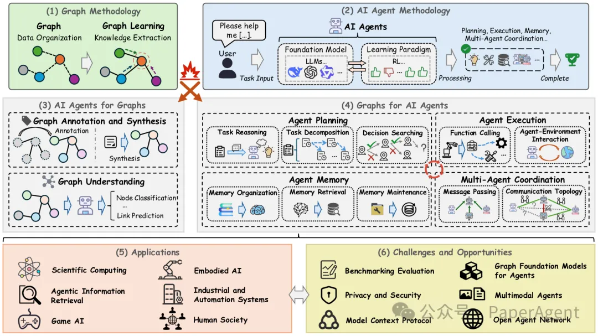
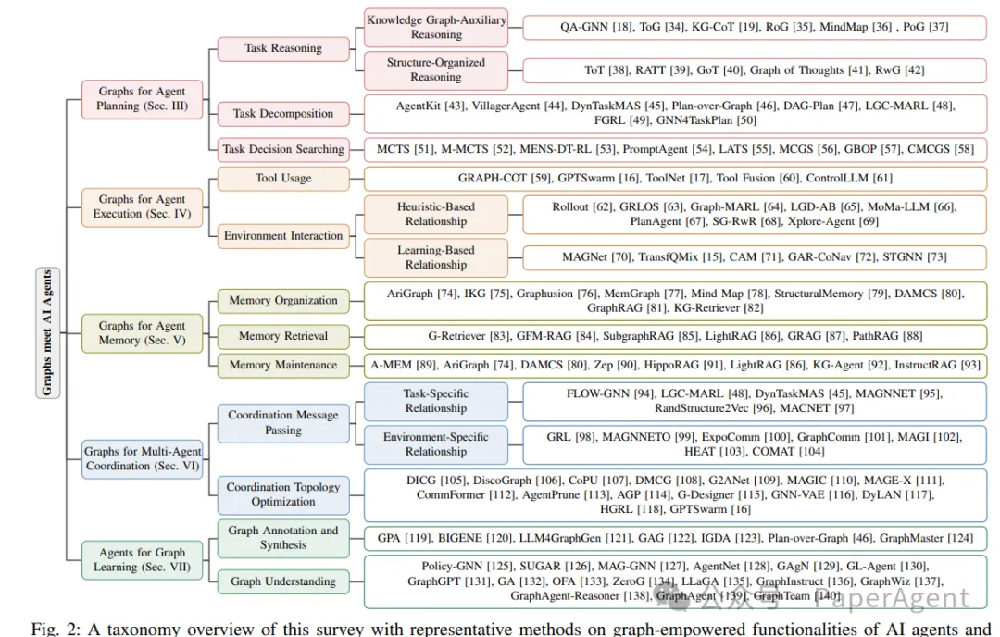
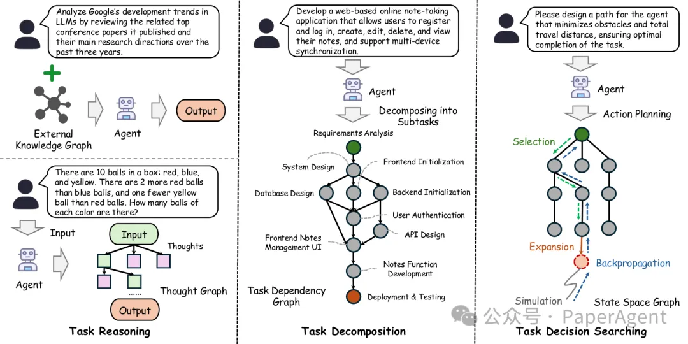
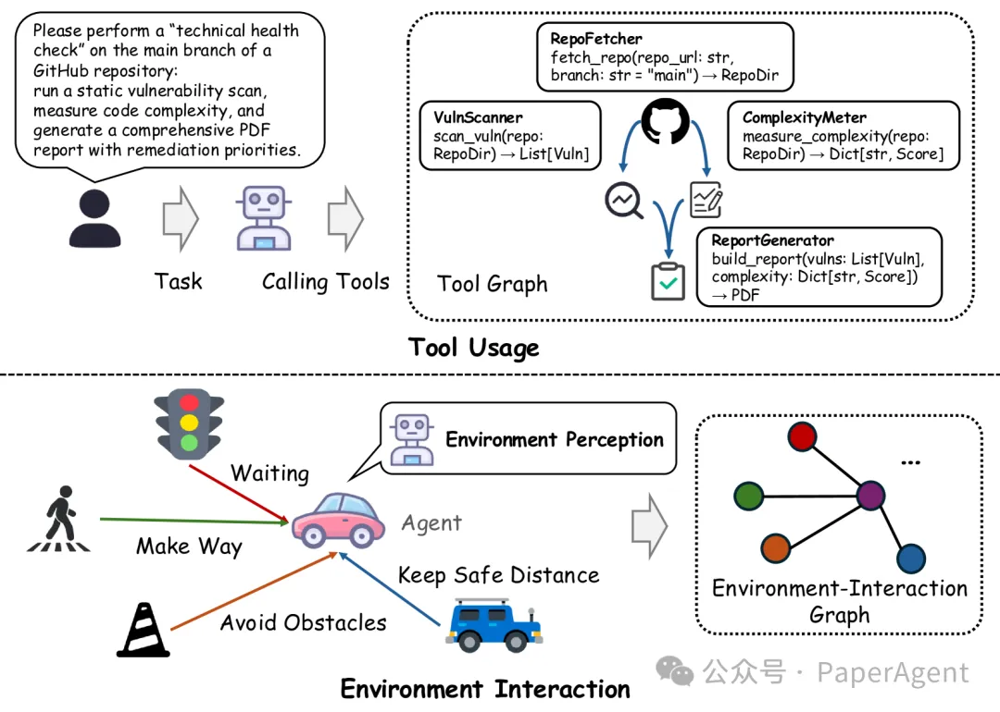
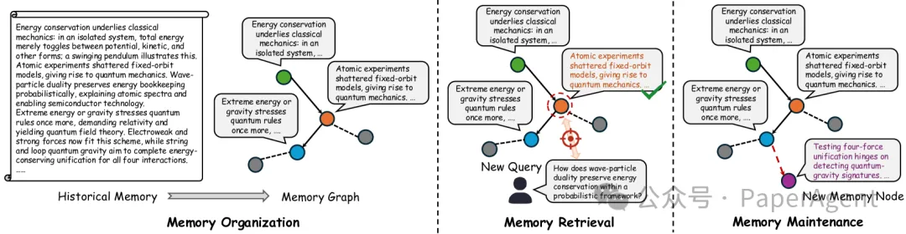
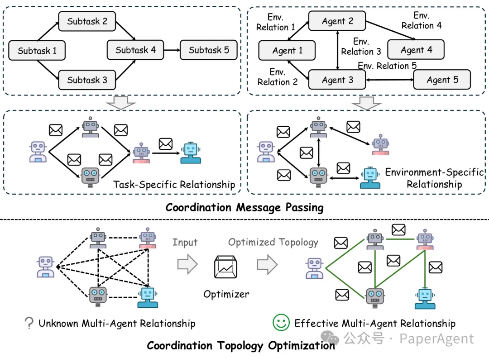

# 1. 资源

- https://github.com/YuanchenBei/Awesome-Graphs-Meet-Agents
- https://arxiv.org/pdf/2506.18019
- Graphs Meet AI Agents: Taxonomy, Progress, and Future Opportunities

最近出了一篇关于图（Graphs）与人工智能代理（AI Agents）结合的综述性研究，提出了一个分类框架来组织这一领域的研究进展，详细讨论了图技术在AI代理的规划、执行、记忆和多代理协调等核心功能中的作用。

# 2. 介绍

Graph与AI Agents相结合的总体示意图。

- 图方法论：利用图进行图数据组织和知识提取
- 人工智能代理方法论：基于大型语言模型（LLM）的基础模型和基于强化学习（RL）的学习范式，构成了人工智能代理的核心流程
- 人工智能代理用于图：代理在图建模和学习方面的强大能力，例如图注释、合成和理解
- 图用于人工智能代理：图和图学习在增强代理核心功能（包括代理规划、执行、记忆和多代理协调）中的作用和潜力
- 代表性应用
- 挑战和未来机遇

# 1. Graph用于Agent规划

1. 任务推理
知识图辅助推理：利用知识图（KG）辅助AI代理进行任务推理，通过提取多跳子图信息，增强代理对任务的理解和推理能力。代表方法包括QA-GNN、ToG、KG-CoT、RoG、MindMap和PoG。

结构化推理：通过树状或图状结构组织LLM代理的中间思考过程，提高推理效率和准确性。代表方法包括ToT、RATT、GoT、Graph of Thoughts和RwG。

2. 任务分解
任务依赖图（TDG）：将复杂任务分解为多个子任务，并构建任务依赖图来表示子任务之间的依赖关系。代表方法包括DAG-Plan、LGC-MARL、VillagerAgent、DynTaskMAS和Plan-over-Graph。

规划方法：利用LLM的推理能力和GNN优化子任务执行路径，提高任务分解和执行的效率。代表方法包括AgentKit、DAG-Plan和FGRL。

3. 任务决策搜索

状态空间图（SSG）：通过构建状态空间图，利用蒙特卡洛树搜索（MCTS）等算法进行高效决策搜索。代表方法包括MCTS、PromptAgent、LATS、M-MCTS、MENS-DTRL、MCGS、GBOP和CMCGS。

优化方法：通过引入记忆机制、进化算法和图结构优化，提高搜索效率和决策质量。

# 2. Graph用于Agent执行
在AI代理的执行阶段，图技术通过优化工具使用和增强环境交互，显著提升了代理的执行效率和准确性。

具体来说：

工具使用：图技术帮助代理更高效地管理和调用大量工具，通过构建工具图和优化工具调用路径，减少令牌消耗，提高工具使用的准确性和效率。

环境交互：图技术通过启发式和基于学习的关系建模，增强了代理对环境的理解和交互能力。场景图和动态学习方法为代理提供了更丰富的环境信息，使其能够更有效地感知和响应环境变化。

# 3. Graph用于Agent记忆管理

1. 记忆组织
知识图谱（KG）：通过构建知识图谱，AI代理能够将知识和经验以结构化的形式存储，便于后续的检索和推理。例如，AriGraph、IKG、Graphusion、MemGraph、Mind Map、StructuralMemory、DAMCS、GraphRAG 和 KG-Retriever 等系统利用知识图谱来组织记忆。

2. 记忆检索
图检索方法：通过结合语义相似性和图度量，设计定制化的检索器，提高从图结构记忆中检索信息的准确性和效率。例如，G-Retriever 和 GFM-RAG 结合语义相似性和图度量进行检索，SubgraphRAG 提供基于查询相关性的灵活子图检索机制，LightRAG 提出双检索系统，GRAG 提出线性时间检索策略，PathRAG 通过流式剪枝减少检索延迟。

3. 记忆维护
动态更新和维护：一些方法关注于如何动态地更新和维护图结构的记忆，以适应新的经验和交互。例如，A-MEM 通过动态索引和链接创建相互连接的知识网络，Zep 通过时间感知的层次化知识图谱引擎动态整合对话数据，HippoRAG 和 LightRAG 采用动态增量图更新策略，KG-Agent 引入 LLM 进行知识图谱更新，InstructRAG 采用 RL 代理进行图维护。

# 4. Graph用于Multi-Agent协调
图技术通过优化消息传递和通信拓扑，显著提升了多智能体系统的协调能力：

1. 协调消息传递
任务依赖关系：利用任务依赖图（TDG）优化消息传递，如 FLOW-GNN 和 LGC-MARL。

任务分配关系：通过任务分配关系优化信息交换，如 RandStructure2Vec 和 MAGNNET。

环境特定关系：基于环境特性建模代理关系，如 GRL 和 MAGNNETO，或动态学习关系权重，如 GraphComm 和 MAGI。

2. 协调拓扑优化
边重要性测量：通过注意力机制或参数化边权重学习潜在边，如 DICG 和 G2ANet。

图自编码器优化：使用图自编码器预测代理节点之间的边，如 G-Designer 和 GNN-VAE。

强化学习：通过奖励函数优化代理节点之间的边，如 HGRL 和 GPTSwarm。

# 参考

[1] 一篇Graph+AI Agents最新技术综述, https://mp.weixin.qq.com/s/Su8hNcATSTKm_Bok0RUX6Q