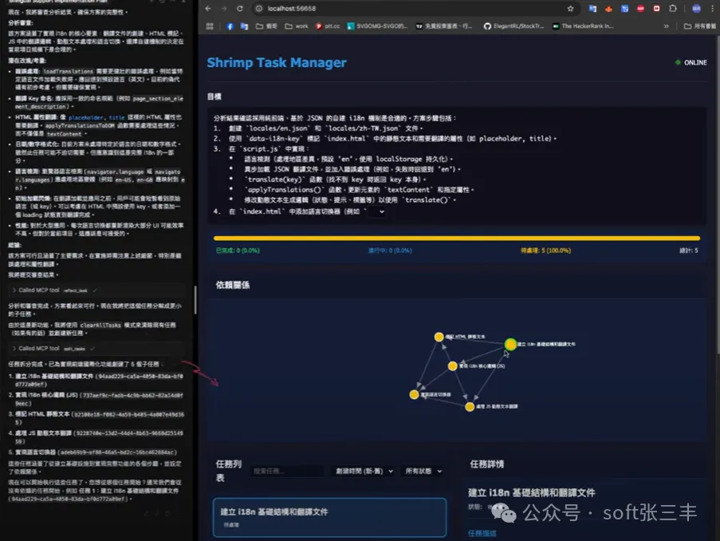
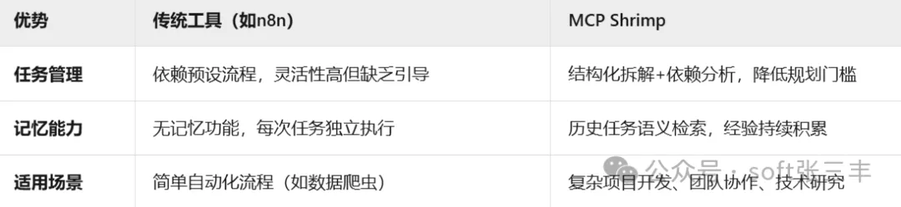

# 资源

Github (1.3k stars): https://github.com/cjo4m06/mcp-shrimp-task-manager

# 问题

AI编程的痛点与突破  

在软件开发领域，开发者常面临两大难题：任务规划混乱（需求拆分不清晰）和重复劳动（相似问题反复解决）。传统工具如n8n、扣子（Coze）虽能实现自动化流程，却缺乏对开发思维的系统性引导。而MCP Shrimp Task Manager（虾米任务管理器）的诞生，通过结构化工作流+AI记忆管理，重新定义了AI编程的协作模式。  

蝦米任務管理器透過結構化的工作流程引導，協助 Agent 系統性規劃程式開發步驟，強化任務記憶管理機制，有效避免冗餘與重複的編程工作。

# MCP Shrimp Task Manager的核心功能  

1. 结构化任务规划引擎  

   - 智能需求拆解：将模糊需求自动拆解为可执行的子任务（如“开发用户登录系统”→ 数据库设计、接口开发、单元测试等），并生成依赖关系图谱。  

   - 研究模式：面对技术选型难题（如框架对比），AI自动调取外部资料（GitHub、技术文档），输出多维度分析报告，辅助决策。  

2. 长期记忆管理机制  

   - 任务历史归档：所有执行过的任务（代码片段、解决方案）自动备份，支持语义检索。例如，下次开发相似功能时，AI会提示：“检测到历史任务中已有类似解决方案，是否复用？”。  

   - 经验学习：通过分析历史错误（如代码漏洞），优化后续任务的执行策略，减少重复踩坑。  

3. 开发流程规范化  

   - 代码规范初始化：一键生成团队编码规范、测试标准，确保协作一致性。  

   - 验证闭环：任务完成后自动执行单元测试和代码审查，确保交付质量。  

MCP的三大核心优势  

# 与同类平台的对比分析 

1. MCP Shrimp Task Manager vs n8n（自动化工作流平台）  

   - 优势：n8n擅长数据流转（如表单→谷歌表格），但需手动配置节点，对编程经验要求高；MCP则提供**AI引导式任务拆解**，降低技术门槛。  

   - 劣势：n8n插件生态丰富（如调用DeepSeek模型），而MCP目前仅支持有限的外部工具集成。  

2. MCP Shrimp Task Manager vs 扣子（Coze，字节跳动自动化平台）  

   - 优势：扣子聚焦无代码自动化（如公众号自动发文），适合运营场景；MCP专攻开发流程管理，支持复杂任务依赖和代码验证。  

   - 劣势：扣子学习成本低，但缺乏对开发思维的深度支持。  

3. MCP Shrimp Task Manager vs 腾讯云AI开发套件  

   - 优势：腾讯方案提供完整的AI开发工具链（如模型训练），但需绑定云服务；MCP轻量化部署，支持本地私有化运行。  

# 适用场景与案例  

- 大型项目开发：某电商团队使用MCP拆分“双11促销系统”，任务完成效率提升40%，代码复用率提高60%。  

- 个人开发者：独立开发者通过“研究模式”快速对比Svelte与React性能，节省3天技术调研时间。  

- 团队协作：多人协作时，MCP自动生成任务依赖图谱，减少沟通成本。  

# 结语：AI编程的未来已来  

MCP Shrimp Task Manager不仅是一款工具，更是开发者的第二大脑。它通过结构化引导和记忆沉淀，让AI从代码执行者进化为项目管理者。随着MCP生态的完善（如插件市场开放），其潜力将进一步释放。  

立即体验：访问 [GitHub仓库]下载体验版，开启你的AI高效编程之旅！  

# 参考

[1] 【开源】告别coze，n8n AI编程革命！MCP Shrimp Task Manager如何用“记忆大脑”让开发效率翻倍？https://mp.weixin.qq.com/s/xiKtOru_W3DaU9-t5Sjn2A