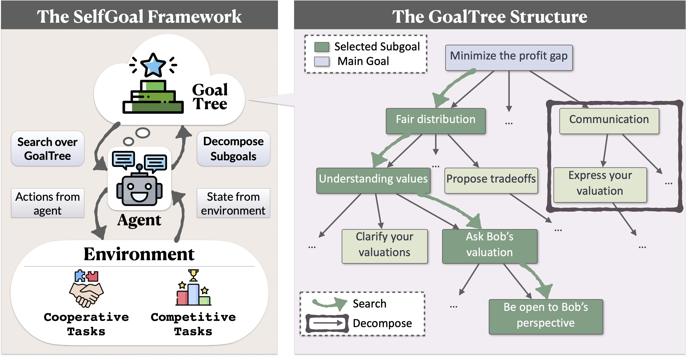
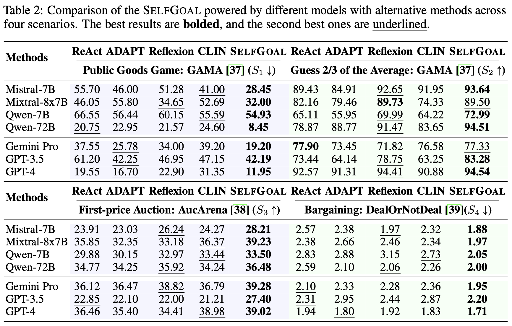
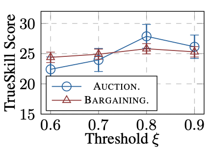
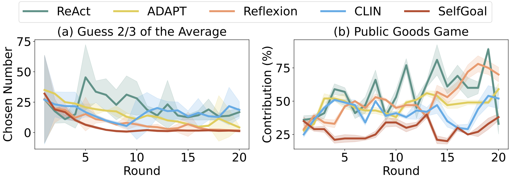
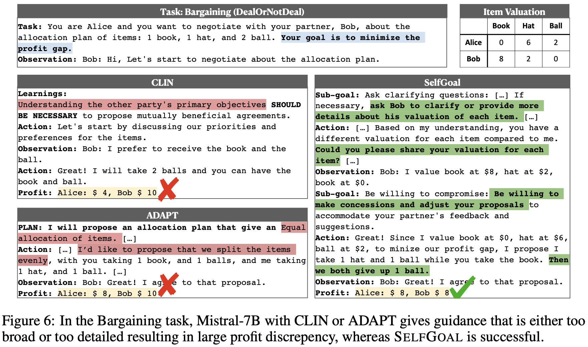

# 1. 资源

- Github (70 stars): https://github.com/rhyang2021/SELFGOAL
- 论文：SELFGOAL: Your Language Agents Already Know Howto Achieve High-level Goals 
  - https://arxiv.org/pdf/2406.04784
  - 复旦大学
  - 2024.6.7
- 博客：https://selfgoal-agent.github.io/

# 2. 原理

抽象
由大型语言模型 （LLM） 提供支持的语言代理作为游戏和编程等领域的决策工具越来越有价值。然而，这些代理经常面临在没有详细说明的情况下实现高级目标以及适应反馈延迟的环境方面的挑战。 在本文中，我们提出了 SELFGOAL，这是一种新颖的自动方法，旨在增强智能体的能力，以在有限的人类先验和环境反馈下实现高级目标。 SELFGOAL 的核心概念涉及在与环境交互的过程中，自适应地将高级目标分解为更实用的子目标的树状结构，同时确定最有用的子目标并逐步更新该结构。 实验结果表明，SELFGOAL 显着增强了语言代理在各种任务中的性能，包括竞争、合作和延迟反馈环境。

自我目标
SELFGOAL 概述
我们的论文《自我目标：您的语言代理已经知道如何实现高级目标》旨在将模块化目标分解与从环境反馈中学习相结合。SELFGOAL 是一种用于语言代理的非参数学习算法，即无需参数更新。 具体来说，SELFGOAL 具有两个关键模块，即分解和搜索，它们分别构建和利用子目标树（即 GoalTree）与环境进行交互。 在 GoalTree 中将任务的高级目标设置为根节点，搜索模块会找到对现状有帮助的节点，如果不够清晰，分解模块会将节点分解为子目标作为叶节点。

详情见SELFGOAL
1）搜索模块：确定当前情境中最合适的子目标，例如选择最有用的子目标以实现主要目标。我们使用当前状态的表示作为与环境交互历史的描述，并将每个分支的叶节点视为潜在的子目标。LLM随后选择最合适的子目标，从而更新下一步的指令提示。

2）分解模块：如果策略树缺乏有效引导智能体的特异性，则根据当前的动作状态场景对策略树进行细化。LLM 解构选定的子目标并提出新的子目标。过滤机制通过检查子目标之间的相似性来确保子目标的唯一性。如果多次尝试后未添加新的子目标，则将停止对策略树的更新。

3）行动模块：从策略树中识别出有用的子目标后，代理更新其指令并与环境交互，使用派生的子目标来指导其行动。

SELFGOAL 在各种环境中优于所有基线框架
我们通过 4 个具有高层次目标的动态任务评估 SELFGOAL，包括公共产品游戏、猜平均值的 2/3、第一价拍卖和讨价还价。 总体而言，我们的 SELFGOAL 在包含高级目标的各种环境中明显优于所有基线框架，其中更大的 LLM 会产生更高的收益。

SELFGOAL 中指导原则的细致性如何影响任务解决？
在这里，我们通过改变阈值来分析SELFGOAL通过不同子目标粒度来调整绩效
. 虽然更深的树状结构最初提升性能，但过多细节最终会降低效果，因为冗余节点会使搜索模块选择有价值的指引变得复杂，常常忽视有益的节点。 这凸显了指导树深度平衡的必要性，以优化代理表现，同时避免过度细节化的陷阱。

SELFGOAL 能改善代理行为的理性吗？
在自目标中，公共物品情景中的主体相较于使用其他方法者，行为更理性。对于猜测游戏，增强模型显示曲线更平滑、更稳定下降，表明收敛速度更快。

个案研究
SELFGOAL 为代理人提供可作的指导，如提出澄清性问题，促使代理人及早关注对手的心理评估和对项目的不同估值。 在获得合伙人的估值后，SELFGOAL 会提供诸如让步等指导，促使代理人提出放弃特定项目以最小化利润差额的方案。

相比之下，CLINE 建议代理商考虑合作伙伴的偏好，这会导致代理商关注对手的偏好，但可能会导致牺牲自身利益来提高对方收入的计划。 ADAPT 会事先分解任务，提供非常广泛的建议，例如平均分配。 这种通用建议旨在最大限度地减少利润差距，但可能不适合缺乏合作伙伴估值的场景。

总之，我们证明SELFGOAL通过动态生成和完善基于环境交互的层级上下文子目标目标树，显著提升了代理绩效。 实验表明，该方法在竞争和合作场景中均有效，优于基线方法。 此外，随着拥有SELFGOAL的代理与环境的进一步互动，GoalTree可以持续更新，使他们能够更精准、更适应地导航复杂环境。

