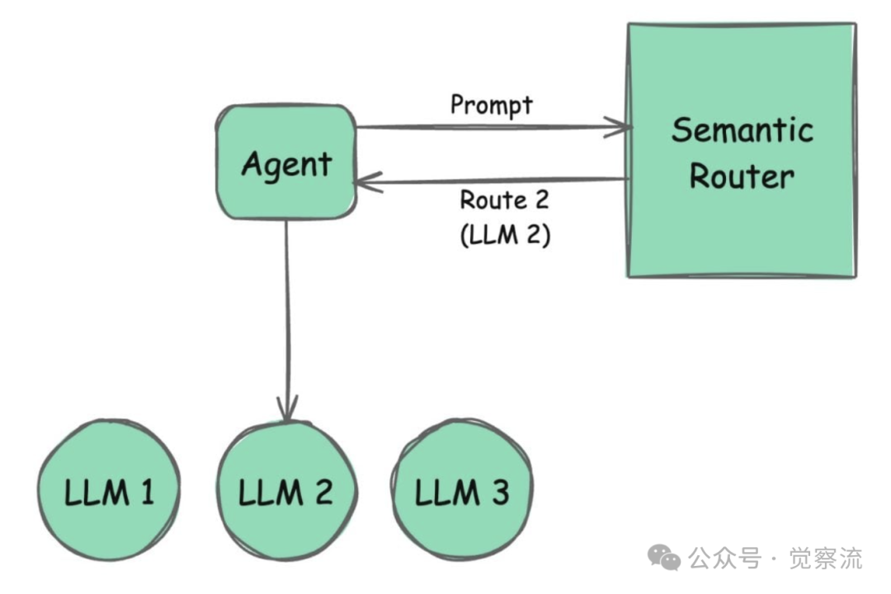

# 1. 资源

- Semantic Router and Its Role in Designing Agentic Workflows
https://thenewstack.io/semantic-router-and-its-role-in-designing-agentic-workflows/
- Semantic Router: A Practical Implementation Guide
https://insights.codegpt.co/semantic-router-llm
- Mastering RAG Chatbots: Semantic Router — RAG gateway
https://medium.com/@talon8080/mastering-rag-chatbots-semantic-router-rag-gateway-part-1-0773cf4e70ad
- aurelio-labs/semantic-router
https://github.com/aurelio-labs/semantic-router

# 2. 原理

目前，智能工作流 (Agentic Workflows) 已经成为企业和开发者关注的焦点。这种工作流模式依赖于大型语言模型（LLM）来进行推理和决策。想象一下，一个工作流中包含多个智能体（agents），每个智能体在执行任务时都要多次调用LLM，这不仅会带来高昂的成本，还会导致延迟增加。那么，有没有一种方法可以解决这个问题呢？答案是肯定的，今天我们就来聊聊一个语义的解决方案——Semantic Router。


**Semantic Router是什么？**

Semantic Router 能够让智能体在执行任务时，根据任务的需求选择最适合的语言模型或Agent，同时减少对这些模型的耦合依赖。听起来有点像我们日常使用的路由器，但它处理的不是网络信号，而是AI任务的决策路径。

Semantic Router背后的核心技术是语义向量空间（Semantic Vector Space）。它通过将输入的文本转换为高维向量，并与预先存储的向量进行比较，来快速找到最匹配的决策路径。这些路径被称为“Routes”，而用来定义路径的样本输入则被称为“Utterances”。通过这种方式，Semantic Router可以基于语义相似度来快速决策，而不需要每次都依赖LLMs生成结果。

**Semantic Router如何工作？**

Semantic Router的核心在于它的语义路由机制。它的工作流程可以分为以下几个关键步骤：

注意：为了便于大家更好地理解语义路由的概念，我在此借助一个工具进行了示例说明。然而，这并不意味着我推荐大家使用该工具。是否采用，还需各位根据自身的业务场景谨慎评估。安装该工具的命令为：

```bash
pip install semantic-router
```

1. 定义路由（Routes）和话语 (Utterances)
    开发者需要预先定义一系列路由，每条路由代表一个潜在的决策路径，并包含一组示例输入 (Utterances）。这是Semantic Router决策机制的基础。开发者可以根据具体需求，灵活定义不同的路径及其对应的样本输入，从而让系统能够快速、准确地识别并处理各种任务。

    

    例如，可以分别为“政治”和“闲聊”定义两个独立的路由：

    ```python
    politics = Route(
        name="politics",
        utterances=[
            "Who are you voting for?",
            "Tell me about politics.",
            "What's your view on the president?"
        ]
    )
    chitchat = Route(
        name="chitchat",
        utterances=[
            "How's the weather today?",
            "How are things going?",
            "Let's go to the chippy."
        ]
    )
    ```
   
2. 初始化编码器（Encoder）

    Semantic Router可以使用任意Embedding模型，如Cohere和OpenAI的编码器。这些编码器将文本转换为向量（Vector），并存储在语义空间中。通过比较向量之间的距离，系统可以快速判断输入的语义含义。开发者可以根据需要选择合适的编码器：
    
    ```python
    import os
    os.environ["OPENAI_API_KEY"] = "YOUR_API_KEY"
    encoder = OpenAIEncoder()
    ```

3. 创建路由层（RouteLayer）或决策层（Decision Layers）
   这是Semantic Router决策的核心机制，能够依据用户输入和预定义的路径，迅速做出精准决策。

   

   它可以根据业务需要，进行本地模型或云端模型的无缝混合使用，充分发挥各自的优势。开发者可以将定义好的路由与编码器有机组合，构建出一个高效的路由、决策层，专门用于处理用户的输入指令：

4. 处理用户输入
   当用户输入一个查询时，Semantic Router会将其与预定义的路由进行语义匹配，并返回最匹配的路由：

   ```python
   user_input = "Tell me about politics."
   matched_route = rl(user_input).name
   ```
   
5. 基于路由结果进行响应
   
   根据匹配到的路由，系统可以决定如何响应用户输入。例如，如果匹配到“政治”路由，可以选择拒绝回答，或者调用特定的LLM：

   ```python
   if matched_route == "politics":
       response = "I'm sorry, I can't discuss politics."
   else:
       response = "The weather is lovely today!"
   ```
   
# 3. Semantic Router的实际应用场景
Semantic Router的灵活性和高效性使其在多种场景中表现出色：

1. 管理敏感话题，构建内容审查
通过为敏感话题（如政治、宗教、情色、暴力等）定义路由，Semantic Router可以避免生成不当或离题的回答，确保交互的安全性和专业性。

2. 优化多模态数据处理
Semantic Router不仅支持文本输入，还可以扩展到图像等多模态数据，帮助AI系统更高效地处理复杂任务。

3. 个性化用户体验
开发者可以根据用户偏好定义定制化的路由，为用户提供更个性化的交互体验。

4. 虚拟助手和聊天机器人
在虚拟助手或聊天机器人中，Semantic Router可以快速将用户输入路由到合适的API或工具，减少对LLMs的依赖，提高响应速度。

# 4. Semantic Router的优势

Semantic Router的核心优势在于其高速决策、灵活性和可扩展性。它能够在毫秒级别内完成决策，显著降低了系统的延迟。此外，它支持多种嵌入模型和本地化部署，开发者可以根据需求选择最适合的组合方案。

Semantic Router通过语义向量空间的高效机制，为智能工作流带来了前所未有的灵活性和效率，同时解决了LLM在成本、延迟和上下文限制上的瓶颈。它不仅是一个技术工具，更是AI系统开发中的一个重要突破。如果你正在构建AI应用，Semantic Router绝对值得你深入探索！

# 参考

[1] Semantic Router：如何用语义技术优化AI决策？https://mp.weixin.qq.com/s?__biz=Mzk2NDA0MzcxNw==&mid=2247484375&idx=1&sn=a884625e69c7f2ca497570a3b1c1207d&chksm=c478357df30fbc6be781805db3ef21478b922ca08b0050ee7efb7a43cd6880f0a335dff46879&cur_album_id=3820320836491411457&scene=189#wechat_redirect