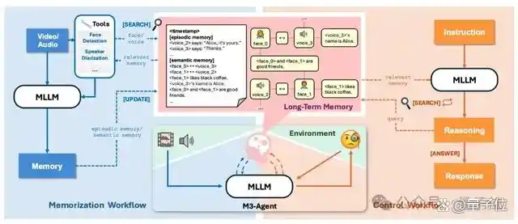
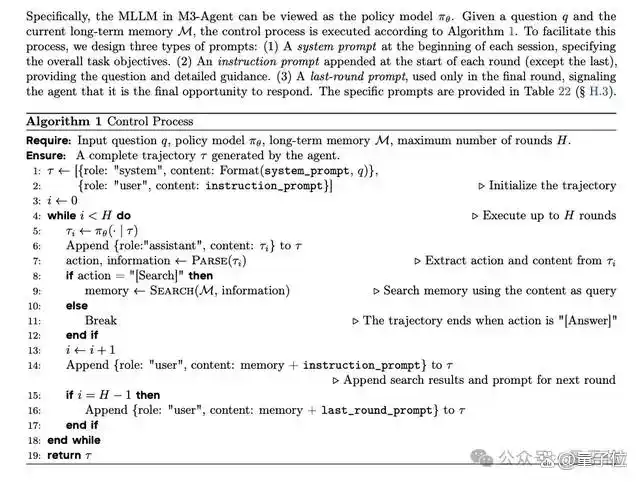
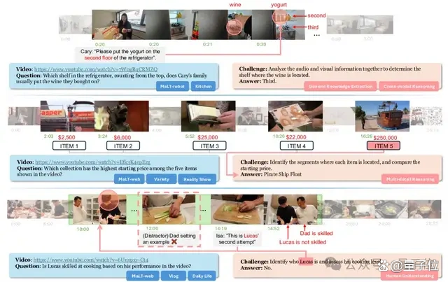
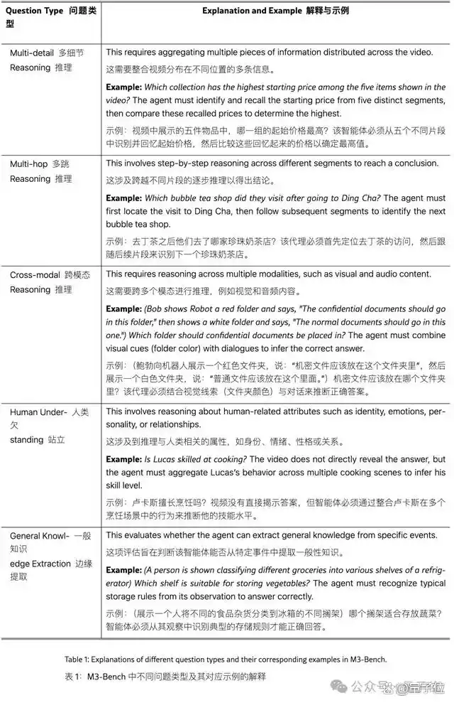
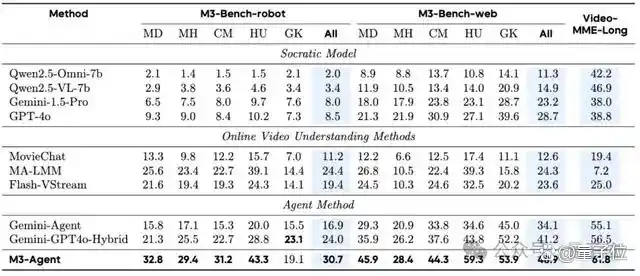

# 1. 资源

- 参考链接：https://x.com/omarsar0/status/1956773240623235076
- 论文：https://www.arxiv.org/abs/2508.09736
- 代码：https://github.com/bytedance-seed/m3-agent

字节Seed发布开源多模态智能体M3-Agent，能听会看、具备长期记忆，在多个基准测试中超越GPT-4o等商业模型。研究表明，以实体为中心的长期记忆和迭代检索推理显著提升智能体性能。

实验表明，通过强化学习训练的M3-Agent在多个基准测试中表现均显著优于基线模型（包括基于商业模型如Gemini-1.5-Pro和GPT-4o的智能体）。

# 2. 原理

对于多模态智能体而言，达到像人类一样的智能水平根本上依赖于三种能力：
（1）通过多模态传感器持续感知世界；
（2）将经验存储在长期记忆中，并逐步构建关于环境的知识；
（3）基于积累的记忆进行推理，以指导其行动。
为实现这些目标，字节Seed团队提出了M3-Agent，一个配备长期记忆的新型多模态代理框架。
它通过两个并行过程运作：记忆过程和控制过程。
记忆过程持续感知实时多模态输入以构建和更新长期记忆；控制过程则解释外部指令，对存储的记忆进行推理，并执行相应的任务。

在记忆过程中，M3-Agent会实时处理输入的视频流，通过生成两种记忆类型来同时捕获细粒度细节和高级抽象信息，类似于人类认知系统：
事件记忆
记录视频中观察到的具体事件。例如，“爱丽丝拿起咖啡说，‘早上没有这个我无法离开’”，以及“爱丽丝将空瓶子扔进绿色的垃圾桶”。
语义记忆
从片段中推导出一般知识。例如，“爱丽丝喜欢早上喝咖啡”和“绿色的垃圾桶用于回收”。
生成的记忆随后会被存入长期记忆库中，该库支持人脸、语音和文本知识等多模态信息存储。
此外，记忆以实体为中心的结构进行组织，例如与同一个人相关的信息（例如他们的脸、声音和相关知识）会以图的格式连接起来，随着智能体不断提取和整合语义记忆，这些关联关系会逐步建立完善。
在控制过程中，M3-Agent利用其长期记忆进行推理并完成任务。
M3-Agent并非使用单轮检索增强生成（RAG）将记忆加载到上下文中，而是采用强化学习来实现多轮推理和迭代记忆检索，能自主从不同维度（如事件或角色）的长期记忆中检索相关信息，从而提高任务成功率。

M3-Bench基准

对于多模态智能体而言，记忆形成与在线视频理解密切相关，而在线视频理解是一项需要实时处理视频流并根据过去的观察做出决策的、具有挑战性的任务。
传统的长视频理解方法（例如在多模态模型中扩展上下文窗口或压缩视觉标记以增加时间覆盖范围）对于无限长的视频流来说，并不具备有效的扩展性。
为了提高可扩展性，基于记忆的方法引入了记忆模块来存储编码的视觉特征以供未来检索。这些架构适合在线视频处理，但它们面临一个基本限制：难以保持长期一致性。
由于它们只存储视觉特征，这些方法难以在长时间内保持对人类身份或演变事件等实体的连贯跟踪。
随着大型多模态和语言模型的快速发展，苏格拉底模型框架已成为已成为在线视频理解领域的一种颇具前景的研究方向。
该方法通过利用多模态模型生成视频描述作为基于语言的记忆，有效提升了系统可扩展性；但它在保持复杂、演变视频内容的长期一致性方面仍然面临挑战。
为此，研究团队提出了M3-Bench，一个用于评估多模态智能体长期记忆推理能力的 LVQA 数据集。
M3-Bench中的每个实例包含一个模拟智能体感知输入的长视频，以及一系列开放式问答对。
该数据集分为两个子集：
M3-Bench-robot，包含 100 个从机器人第一人称视角录制的真实世界视频；
M3-Bench-web，包含920个网络来源的视频，涵盖更广泛的内容和场景。
为了全面评估智能体回忆过去观察结果和基于记忆进行推理的能力，研究团队整理了五种不同类型的问答题，如下图所示。

总体而言，M3-Bench 的特点是：
长时长的真实世界视频，涵盖了与多模态智能体部署相关的多样化现实场景；
具有挑战性的问题，这些问题超越了浅层感知理解，需要基于长期上下文的复杂推理。

# 3. 实验

如上表所示，M3-Agent在M3-Bench-robot、M3-Bench-web和VideoMME-long上均优于所有基线模型。

具体而言，在M3-Bench-robot 上，M3-Agent比最强的基线模型MA-LLM提高了6.3%的准确率；在 M3-Bench-web和VideoMME-long上，它分别比最强的基线模型Gemini-GPT4o-Hybrid高出了7.7%和5.3%。

研究团队在M3-Bench中针对不同问题类型，将M3-Agent与所有基线进行了进一步评估。结果显示，M3-Agent 在人类理解和跨模态推理方面表现出色。

具体来说，与M3-Bench-robot上表现最佳的基线 MA-LMM 相比，M3-Agent 在人类理解和跨模态推理方面分别提升了4.2%和 8.5%；

在M3-Bench-web上，M3-Agent超越了顶尖基线Gemini-GPT4o-Hybrid，在相应类别中分别取得了15.5%和6.7%的提升。

这些结果表明，M3-Agent在保持角色一致性、深化人类理解以及有效整合多模态信息方面具有卓越能力。

# 参考

[1] 字节Seed开源长线记忆多模态Agent，像人一样能听会看, https://mbd.baidu.com/newspage/data/landingsuper?rs=294689588&ruk=h9CVHUmui2FToeZnV2s7Tw&urlext=%7B%22cuid%22%3A%220iSnugiu28_Uu-fo_a2hu_a82ajJ828e0ivhuluk2fKu0qqSB%22%7D&isBdboxFrom=1&pageType=1&sid_for_share=&context=%7B%22nid%22%3A%22news_10486444188405077551%22,%22sourceFrom%22%3A%22bjh%22%7D