# 1. 资源

- 论文标题：Training-Free Group Relative Policy Optimization
- 论文链接：https://arxiv.org/pdf/2510.08191
- 2025.9
- Github (3.6k stars): https://github.com/TencentCloudADP/youtu-agent/tree/training_free_GRPO

# 2. 原理

## 2.1 Vanilla GRPO

为了理解 Training-Free GRPO 的创新之处，我们首先需要回顾其“有训练”的前身——Vanilla GRPO。GRPO 是一种用于优化 LLM 策略的强化学习算法，它旨在让模型生成更高奖励（reward）的输出。与需要训练一个独立评价模型（critic model）的传统 Actor-Critic 算法不同，GRPO 通过比较“一组”输出的相对好坏来直接估计优势（advantage），从而避免了对评价模型的依赖。

一个标准的 Vanilla GRPO 流程如下：

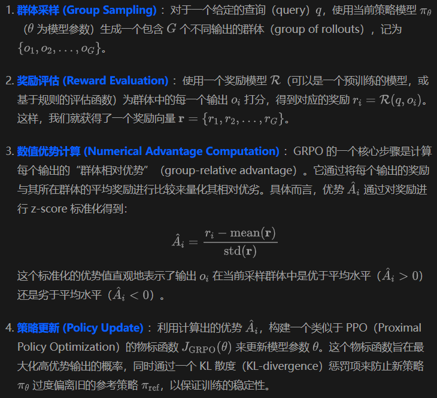

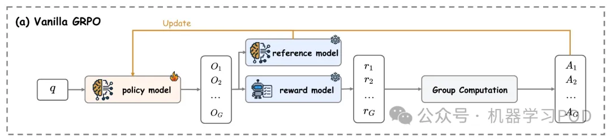

整个过程是一个闭环：采样、评估、计算优势、更新参数，然后用更新后的模型进行下一轮迭代。通过这种方式，模型的策略  被逐步引导，以生成更符合奖励模型偏好的内容。其本质是在高维的参数空间中，通过梯度上升（gradient ascent）来搜索最优的参数 。

## 2.2 Training-Free GRPO
Training-Free GRPO 继承了 Vanilla GRPO 的 Group 比较思想，但摒弃了参数更新的步骤。它将优化的目标从模型内部的权重  转移到了模型外部的一个“经验知识库”（experiential knowledge library）。这个知识库由一系列自然语言形式的、关于如何更好地完成任务的策略或启发式规则组成。

下面，我们详细拆解 Training-Free GRPO 的工作流程，并与 Vanilla GRPO 进行对比。

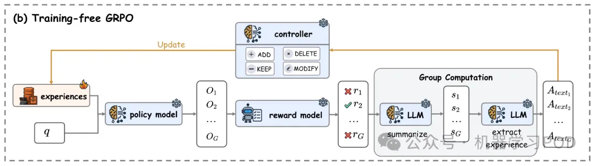

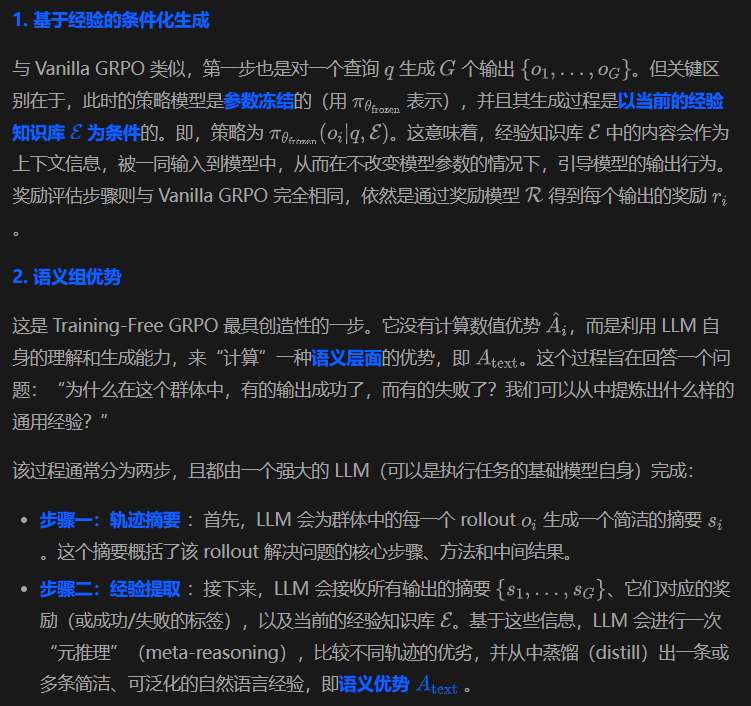

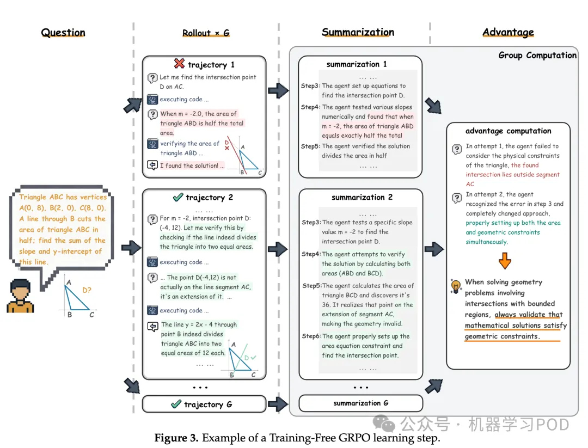

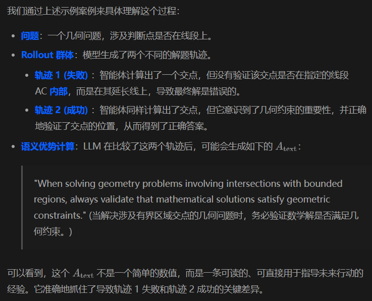

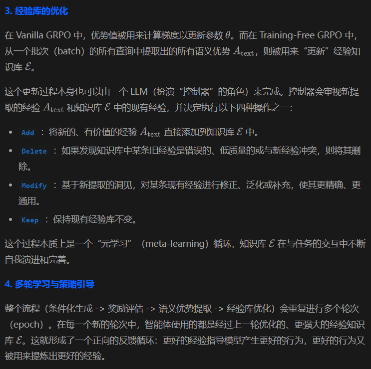

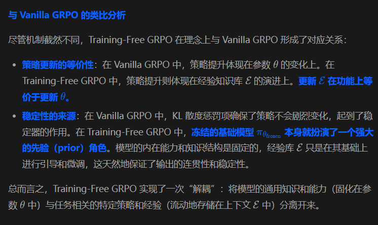

# 3. 实验

该论文通过在数学推理和网页搜索这两大具有挑战性的智能体任务上进行的大量实验，系统地验证了 Training-Free GRPO 的有效性。

1. 数学推理任务

设置：
基座模型：DeepSeek-V3.1-Terminus，一个强大的闭源 API 模型。
评估基准：AIME 2024 和 AIME 2025，这是两个高难度的数学竞赛题库，可用于评估模型的域外泛化（out-of-domain）推理能力。
训练数据：仅从 DAPO-Math 数据集中随机采样 100 个问题用于学习经验。
评估指标：Mean@32，即对每个问题独立运行 32 次，计算成功解答的平均比例（Pass@1）。

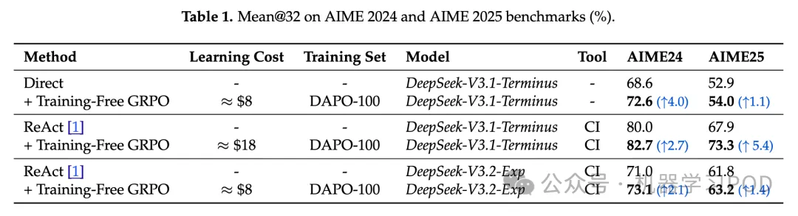

AIME 2024 和 AIME 2025 benchmark 上的 Mean@32 结果 (%)
主要结果：

实验结果显示，无论是对于纯文本提示（Direct Prompting）还是结合代码解释器工具的 ReAct 框架，应用 Training-Free GRPO 都带来了显著的性能提升。以更强的 ReAct 为例，在 DeepSeek-V3.1-Terminus 上，AIME24 的成绩从 80.0% 提升至 82.7%（绝对提升 2.7%），AIME25 的成绩从 67.9% 提升至 73.3%（绝对提升 5.4%）。考虑到 AIME 基准的难度，这是一个相当可观的进步，而这一切仅仅是基于 100 个训练样本和零参数更新实现的。

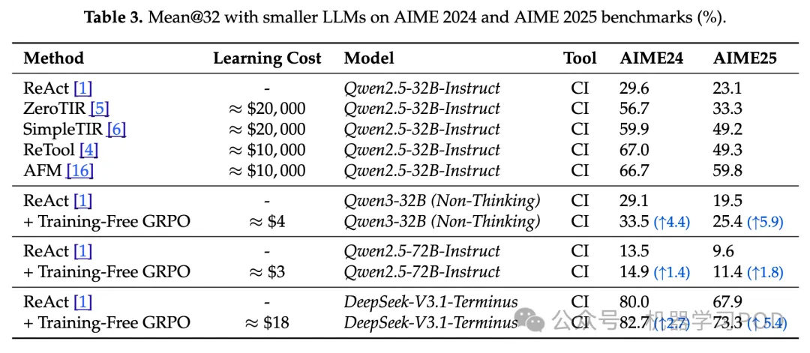

在 AIME 2024 和 AIME 2025 benchmarks 上与更小 LLM 的 Mean@32 结果对比 (%)
与 SOTA RL 微调方法的对比： 这是论文中最具说服力的部分之一。作者将他们的方法（在 DeepSeek 模型上，学习成本约 $18）与多种在 32B 开源模型（如 Qwen2.5-32B）上进行完整 RL 微调的 SOTA 方法（如 ReTool、AFM，训练成本约 $10,000）进行了比较。结果发现，Training-Free GRPO + DeepSeek 的性能（AIME24: 82.7%, AIME25: 73.3%）远超那些经过昂贵微调的 32B 模型（例如 AFM 的成绩为 66.7% 和 59.8%）。 这个对比有力地证明了论文的核心论点：在现实应用中，与其耗费巨大资源去微调一个能力较弱的模型，不如通过一种轻量级的方法去引导一个强大的、参数冻结的模型。前者的性价比远低于后者。

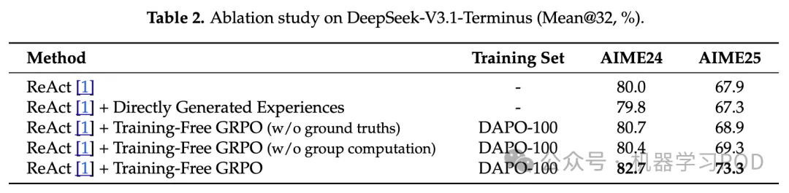

DeepSeek-V3.1-Terminus 上的消融研究 (Mean@32, %)
消融实验： 通过一系列消融研究，论文验证了其方法设计的合理性：
经验的有效性：直接生成一些经验作为上下文（不经过群体比较和提炼）并不能提升性能，甚至会带来轻微的下降。这说明 Training-Free GRPO 学到的经验质量很高。
群体计算的必要性：如果将群体大小设为 1（即每次只看一个 rollout），性能提升会大幅减弱。这证实了通过比较多个轨迹来提炼经验是至关重要的。
对奖励信号的鲁棒性：即使在没有真实答案（ground truth）作为奖励信号的情况下，仅通过 LLM 的自我判别和多数投票（majority voting）来比较群体内的优劣，该方法依然能取得不错的性能提升。这极大地扩展了其在缺乏标注数据的场景下的适用性。
2. 网页搜索任务

设置：在 WebWalkerQA 基准上进行评估，这是一个需要智能体理解自然语言指令并在真实网页环境中进行多步操作以寻找答案的任务。训练经验从 AFM 数据集中采样的 100 个样本中学习。

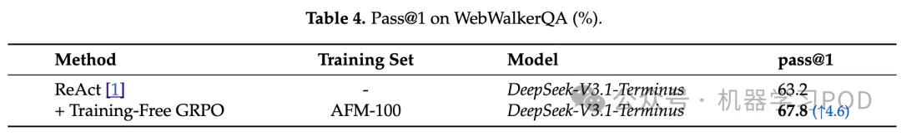

WebWalkerQA 上的 Pass@1 结果 (%)
结果： 与数学推理任务类似，在 DeepSeek-V3.1-Terminus 上应用 Training-Free GRPO 后，WebWalkerQA 的 Pass@1 分数从 63.2% 提升至 67.8%，再次证明了该方法的有效性和跨领域的通用性。
3. 跨领域迁移能力分析

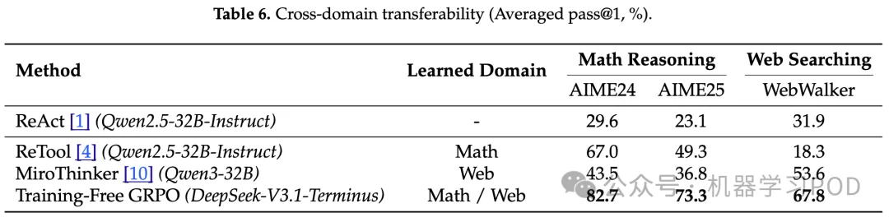

跨领域迁移能力 (平均 Pass@1, %)
这是 Training-Free GRPO 相对于参数微调方法的另一个核心优势。实验显示，一个在数学任务上微调的模型（如 ReTool），当被直接用于网页搜索任务时，其性能会急剧下降（从数学上的 67.0% 降至网页搜索上的 18.3%），表现出极差的迁移能力。反之亦然。

而 Training-Free GRPO 由于不改变模型的基础参数，完全保留了 LLM 的通用能力。研究者可以为数学任务学习一个经验库 ，为网页搜索任务学习另一个经验库 。在执行任务时，只需“即插即用”地加载相应的经验库到上下文中，就能在两个领域都达到顶尖性能。这种灵活性是参数微调方法难以企及的。

4. 成本与收益

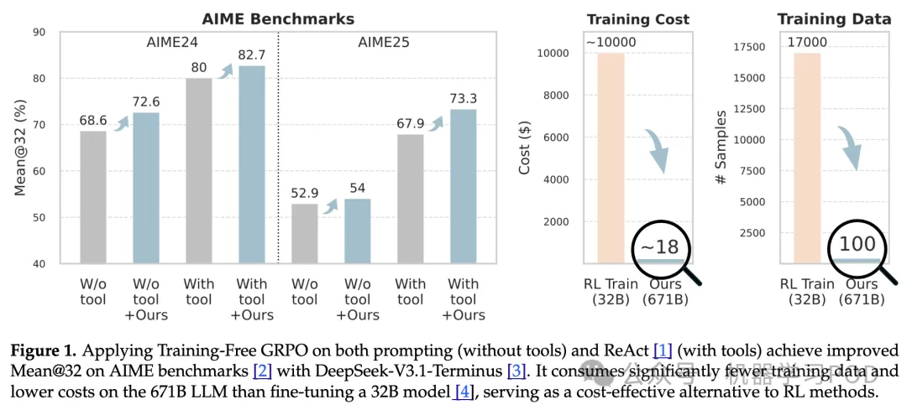

训练成本和训练数据对比
训练成本：Training-Free GRPO 的训练成本几乎可以忽略不计。论文估算，在 DeepSeek API 上完成 3 个 epoch 的学习过程，总共的 token 消耗费用仅为 $18。相比之下，复现一个像 ReTool 这样的 RL 微调流程，大约需要 20,000 GPU 小时，成本高达 $10,000。两者之间存在超过两个数量级的差异。

推理成本：这是一个需要辩证看待的问题。由于 Training-Free GRPO 需要将整个经验知识库  放入上下文中，其单次推理的 token 数量会比普通提示更多，导致单次调用的成本相对较高。相比之下，一个部署好的微调小模型单次推理成本可能更低。 然而，后者的低成本是建立在持续、高昂的固定基础设施投入（如保持 GPU 集群运行）之上的。对于许多真实世界的应用场景，特别是那些流量不稳定、需求呈突发性或总体调用量不大的专业领域，维持一个专用的微调模型在经济上是不划算的。Training-Free GRPO 这种“即用即付”（pay-as-you-go）的模式，与大型 API 模型的计费方式完美契合，将成本与实际使用量严格绑定，从而在整体上更具经济效益。

# 参考

[1] 腾讯优图提出免训练GRPO，在上下文空间中实现策略优化, https://mp.weixin.qq.com/s/EonVQZk8N4nghA5P45uy1w