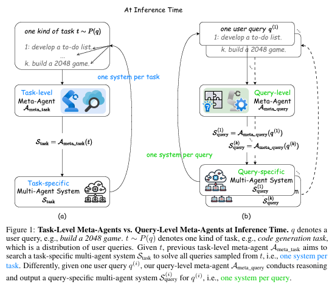
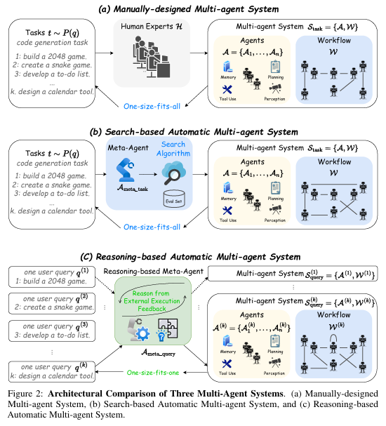
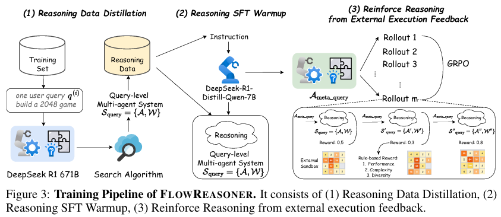

# 1. 资源

- Github: https://github.com/sail-sg/FlowReasoner
- 论文
  - https://arxiv.org/pdf/2504.15257
  - FlowReasoner: Reinforcing Query-Level Meta-Agents
  - 2025.4.21

效果： surpasses o1-mini by 10.52% accuracy across three benchmarks

