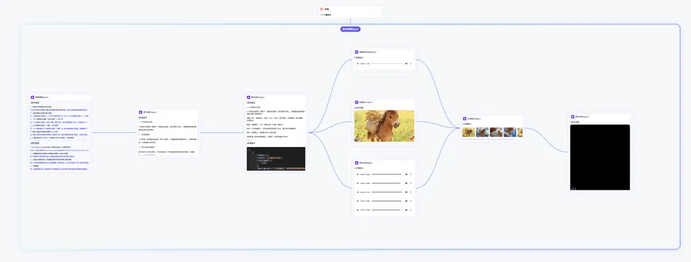

「只需要一句提示词」，它就把文案，背景音乐，绘本封面，分镜图片，分镜旁白等，全都自动开发好了，如下截图所示，这就是生成的工作流：

- 体验：https://agent.xfyun.cn/home?ch=xc_B2h7R
- Github (5.6k stars): https://github.com/iflytek/astron-agent.git
- 星辰 AgentRPA（面向流程自动化的 RPA 系统）
- Github (3k stars): https://github.com/iflytek/astron-rpa

# 参考

[1] 又一个开源王炸！一句话就能自动生成智能体工作流，真的太赞了！https://mp.weixin.qq.com/s/f3MREZa3OGPSIVN1ozjPaA