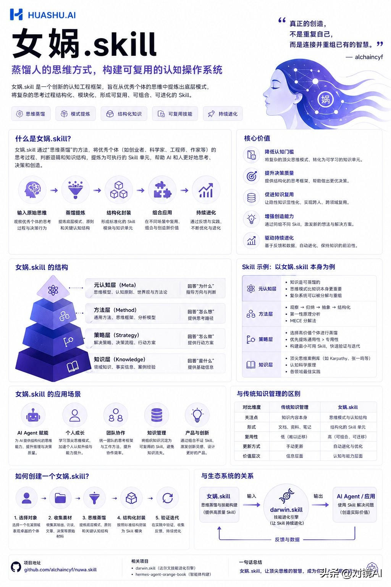

- Github (16.4k stars): https://github.com/alchaincyf/nuwa-skill

支持人物、主题蒸馏

你想蒸馏的下一个员工，何必是同事。蒸馏任何人的思维方式——心智模型、决策启发式、表达DNA。Distill how anyone thinks.

蒸馏各领域最强的人，需要提取比日常工作习惯更深的东西。女娲提取五层：

| 层次 | 说明 |
|------|------|
| 怎么说话 | 表达DNA——语气、节奏、用词偏好 |
| 怎么想 | 心智模型、认知框架 |
| 怎么判断 | 决策启发式 |
| 什么不做 | 反模式、价值观底线 |
| 知道局限 | 诚实边界 |

女娲造Skill，达尔文 让Skill进化。

受 Karpathy autoresearch 启发，达尔文.skill 用自主实验循环批量优化所有Skill：8维度评估、棘轮机制（只保留改进，自动回滚退步）、独立子agent评分。女娲的 Phase 5 双Agent精炼就内置了达尔文的评估体系，这也是女娲生成的Skill质量高的原因之一。

# 参考

https://www.toutiao.com/w/1863611887917129/?app=&category_new=text_inner_flow&chn_id=94349612189&module_name=Android_tt_others&req_id_new=20260430121036D9B3FF26577660987663&share_did=MS4wLjACAAAAfpDr-ijO6LMaBG3guMzOCQ10tRyBPlAqr9XYy74tPPg&share_uid=MS4wLjABAAAASJ52mqDdigxLhqMJfM5ZomQxfcafAdqZtTMnWgi93p0&timestamp=1777522237&tt_from=wechat&upstream_biz=Android_wechat&use_new_style=1&utm_campaign=client_share&utm_medium=toutiao_android&utm_source=wechat&share_token=e736d6d0-5f22-49a0-8ddc-c68b6d9c9586&source=m_redirect