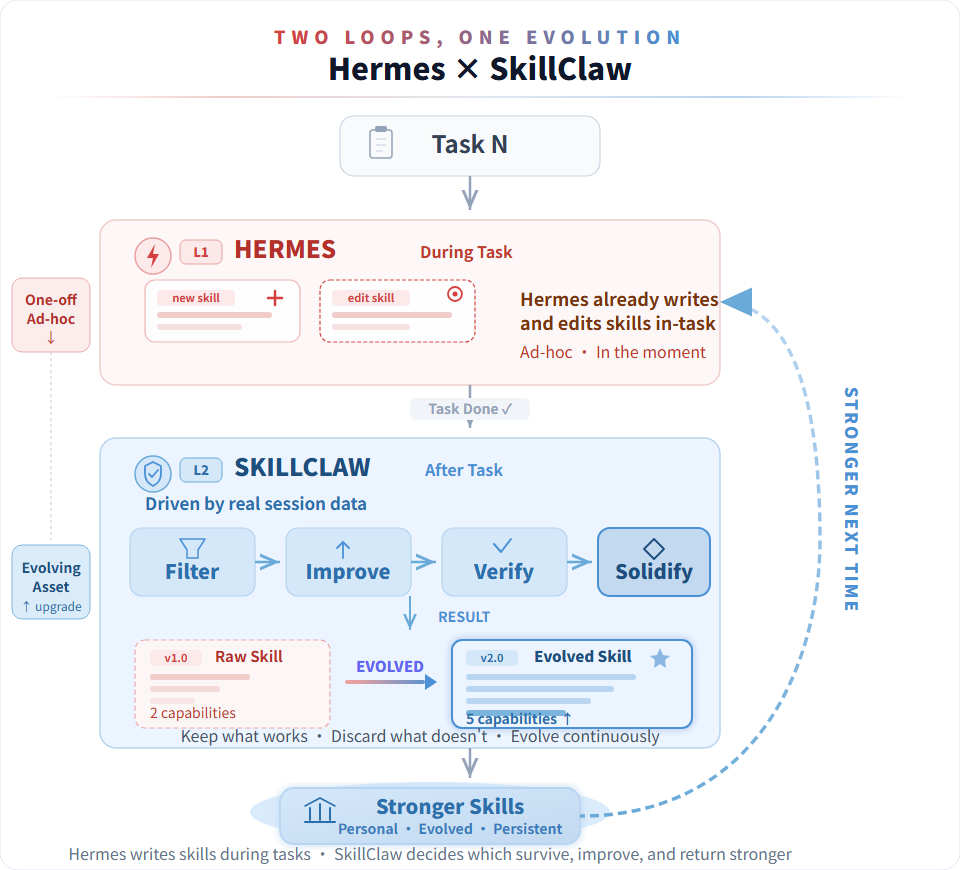
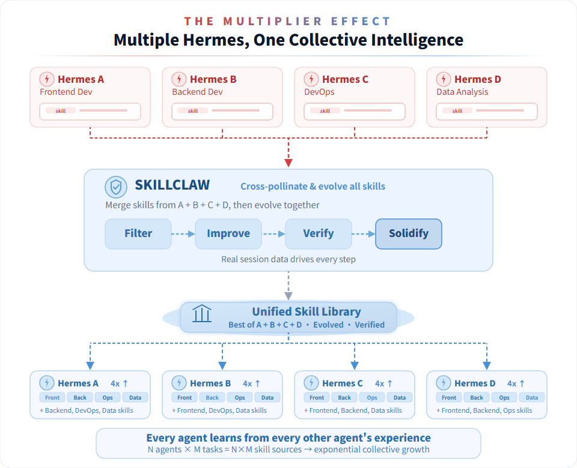
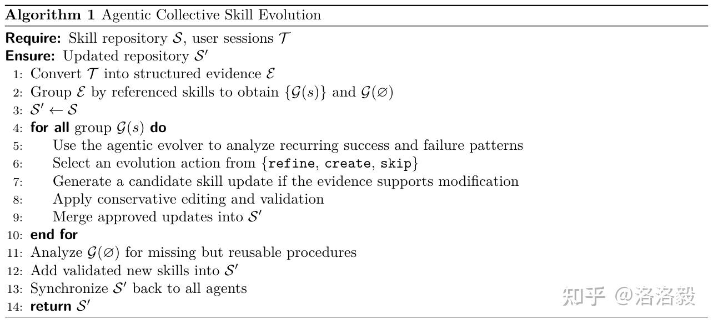

GitHub：github.com/AMAP-ML/SkillClaw
• 论文：arXiv:2604.08377
• 协议：MIT
• 语言：Python 3.10+
• Star 数：约 450+（开源仅数天）

SkillClaw 想打破这种 "经验孤岛"。它的思路很简单：把 Agent 和用户的每一次真实对话都当成学习材料，从中提炼出可复用的 "技能"（Skill），然后让整个集群共享这些技能，实现持续进化。
用赫尔墨斯有一段时间了——你的技能库还是一团糟吗？重复的、过时的、半成品的，全都堆成一团，像个未分类的战利品箱。问题不在于赫尔墨斯学得不够多——而是没人帮它消化。

SkillClaw就是为此设计的。自动进化、自动去重、自动提升质量。它不会改变你的工作方式，也不会打断你的流程——它只是悄悄地重写你的经纪人的成长曲线。

SkillClaw并没有让赫尔墨斯学到更多——它让赫尔墨斯所学的一切都变得有意义。

