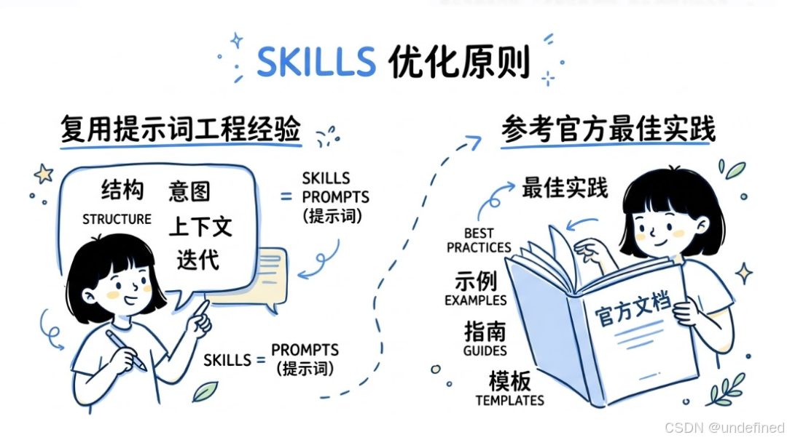

- Github (67): https://github.com/hqhq1025/skill-optimizer

诊断和优化你的 Agent Skills（SKILL.md 文件）— 基于真实 session 数据 + 学术研究支撑的静态分析，输出 P0/P1/P2 优先级修复报告。

支持 Claude Code、Codex 以及所有兼容 Agent Skills 开放标准的 agent。自动检测平台并扫描对应路径。

大多数 skill 审计工具只做 SKILL.md 的静态检查。这个工具还会挖掘你的真实 session 记录，量化触发率、用户满意度、workflow 完成率和漏触发缺口，最终为每个 skill 打出 5 分制综合评分。

# 参考

[1] https://blog.csdn.net/w605283073/article/details/159203331
