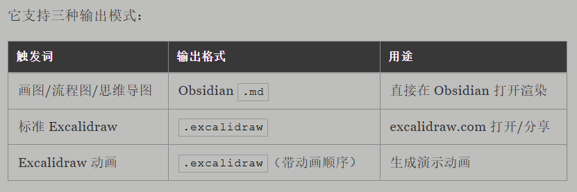

excalidraw-diagram内容写出来了，摘要卡片有了，可文章里还有一个高频空洞：配图。Agent 写作最大的问题就是配图跟不上，基本只能写完稿子后再单独调用配图插件或者技能。画出来的图因为受到其他不相关内容的影响，总是会各式各样的问题，尤其是文本生成图片模型，扭曲到不行。可以试试excalidraw-diagram 这个技能。配合我前面第一个写作技能的范式，你可以实现：Agent 写一段内容调用这个画图技能，把写完的那一段内容绘制成可视化图表

https://github.com/coleam00/excalidraw-diagram-skill