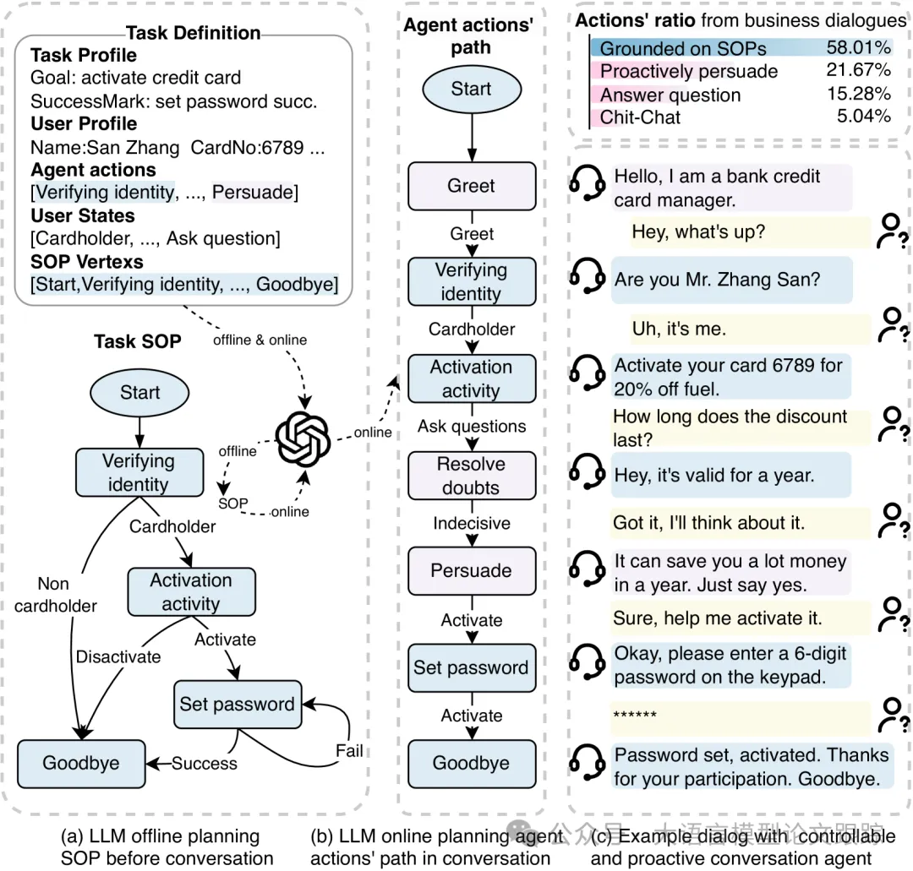
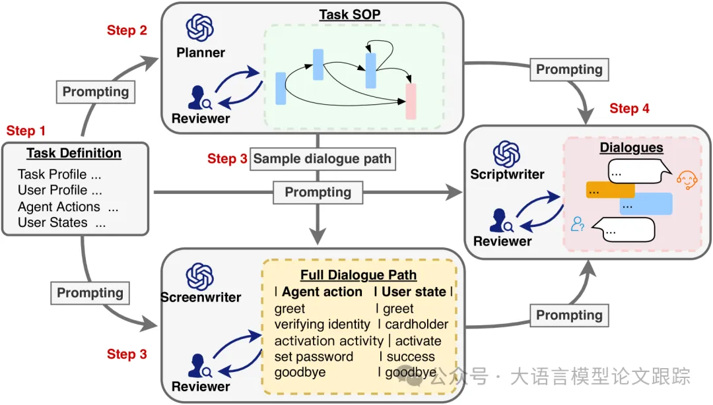
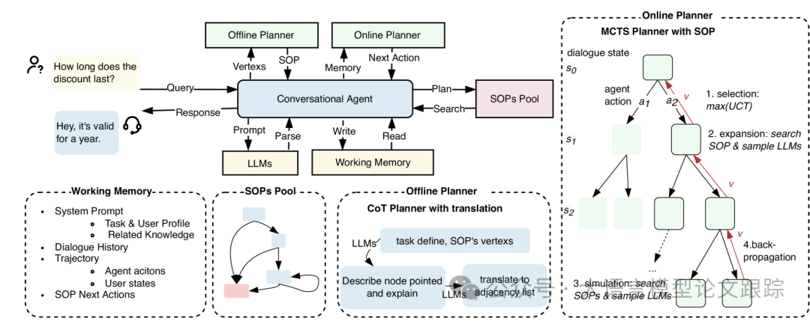
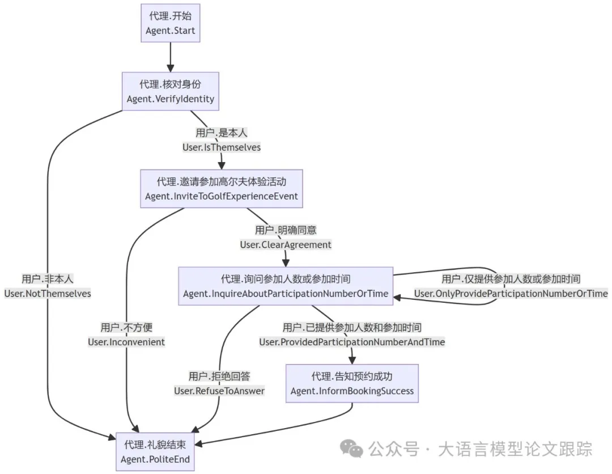
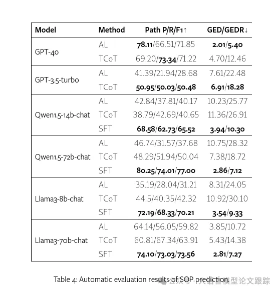
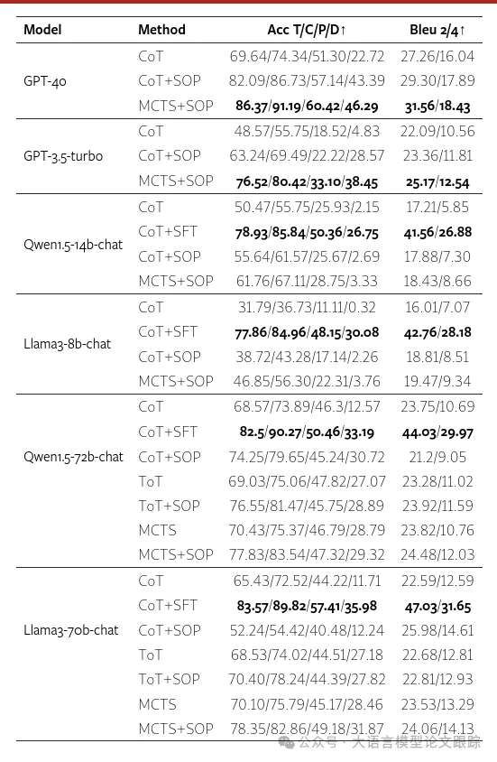

# 1. 资源

Planning with Large Language Models for Conversational Agents
- https://arxiv.org/abs/2407.03884

数据和代码：可能会在近期公开

# 2. 介绍

自主对话代理（CAs）的核心在于可控性与主动性。可控性意味着 CAs 需遵循标准操作流程（SOPs），如激活信用卡前的身份验证；主动性则要求 CAs 在用户不配合时引导对话达成目标，如进行说服性交流。当前研究难以兼顾这三者：可控性、主动性与低成本的手动标注。为此，我们创新性地提出了一个基于计划的大型语言模型（LLMs）驱动的对话代理框架（PCA），仅需人类设定任务与目标。对话前，LLM 离线制定关键 SOP；对话中，LLM 在线依据 SOP 规划最优行动，确保对话过程的可控。此外，我们构建了半自动对话数据生成框架，并精心打造了高质量对话数据集（PCA-D）。我们还研发了多种 PCA 变体及评估标准，如采用蒙特卡洛树搜索（PCA-M）的规划方法，该方法在遵守 SOP 的同时，寻找最优对话策略，增强对话的主动性。实验表明，经 PCA-D 微调的 LLMs 性能大幅提升，且能适应新领域。PCA-M 在多个维度上超越传统基线，适用于实际工业对话场景。相关数据集与代码已公开于 XXXX。

对话智能体（CAs，Conversational Agents）或对话系统一般用来向用户提供以自然语言交流为主要方式的功能服务。目前主要的方法包括：

- 会话式问答：CQA，Conversational Question Answering

- 开放领域对话：ODD，Open-Domain Dialogue

- 任务导向对话：TOD，Task-Oriented Dialogue

- 对话推荐系统：CRS，Conversational Recommender Systems

CQA和ODD的主要目标是回答用户问题，提供知识性或者趣味性的对话，但是他们的缺陷是缺乏主动性。

CRS通过设定特定主题，如“推荐电影《喜剧之王》”，自主规划与用户对话的最佳路径，引导对话顺畅进行。但是，在复杂任务中，对话一般需要遵循严格的顺序约束，这在标准化操作程序（SOPs）中很常见。如上图，信用卡激活的说服前提条件是用户必须是持卡人。但是，CRS在全局可控的对话行动路径规划上存在不足。

TOD旨在根据服务流程提供功能服务，但他的可控性依赖于手动绘制的对话树或预定义的意图、槽位和行动训练数据。它可以主动引导用户提供信息，但在用户不合作的情况下，如说服或谈判对话，就显得无能为力。

可见，主动性、可控性以及减少对人工干预的依赖对于构建自主业务CA至关重要。

因此，作者设计了一种新的对话系统框架，基于规划的对话智能体（PCA），如上图所示。与其他框架不一样的是，PCA只需要人类为LLMs提供任务定义和目标，以便在对话前离线规划核心和必要的SOP。在对话过程中，LLM根据SOP在线规划最佳行动路径并生成响应，以实现过程控制。对于SOP之外的行动，如回答问题和说服，LLM能够自主规划，实现主动对话。

# 3. PCA框架

实现PCA系统需完成两项任务：

- 构建一个全面的端到端多轮对话框架

- 执行SOP预测与对话生成的算法任务

## 3.1 PCA架构概览

如上图所示，PCA架构，由对话智能体（CA）作为控制中心，以及五个顺序步骤组成。

- 1.开始对话前，CA读取用户设定的任务信息，将SOP顶点传递给离线规划器，离线规划器生成SOP图。

- 2.在对话过程中，CA首先激活工作记忆模块，组装对话所需的提示。

- 3.然后，将这些提示输入在线规划模块，以生成对话回应。

## 3.2 SOP预测方法
作者使用了三种用于SOP预测的方法：

- 邻接列表（Adjacency List，AL）：直接引导LLMs以JSON格式输出邻接表

- 翻译型CoT（Translation CoT，TCoT）：先引导LLMs用自然语言描述每个顶点及其子顶点及原因，再转换成JSON格式的邻接列表。

- SFT：在不同规模的Llama和Qwen上实施了全参数SFT，每次任务生成一个顶点的邻接顶点。

上图展示了一个SOP的示例。

## 3.3 对话预测技术

CoT与ToT两种提示工程方法已经被证明可以显著提升了LLM在复杂推理方面的能力，因此被选为基线方法。

- 在CoT中，逐步引导LLM推断用户状态、智能体行为和回应。

- ToT则将这些步骤分为三次LLM调用，每次对应树的一层节点。通过多次采样获取多个节点，最终引导LLM通过投票选择决策路径，确定智能体行为和回应。

为了把把SOP加入到对话中，计算了生成的对话路径与SOP的每个子路径之间的编辑距离（ED）。将最小的ED子路径的子节点添加到提示中，指导智能体遵循SOP。

PCA-M是MCTS（Monte Carlo Tree Search）的扩展，结合SOP进行对话路径的在线规划，目的是在对话的未来扩展和模拟阶段中充分利用SOP的约束。MCTS策略性地探索对话树空间，在满足约束的同时找到探索与利用的平衡，高效地发现高回报的对话轨迹。

## 3.4 带SOP的MCTS规划器详解

PCA-M构建了一个对话树，每个节点代表智能体选择行动与用户互动产生的对话状态（即工作记忆），每条边代表智能体行动及当前状态到下一状态的转换。

PCA-M通过迭代执行节点选择（Selection）、扩展（Expansion）、模拟（Simulation）和反向传播（Backpropagation），更新树的统计数据，寻找下一个最佳行动。多次迭代，PCA-M预测出最佳行动。这一过程持续至达到预设的计算预算（如迭代次数），此时可从树中提取出最终轨迹。

- 选择（Selection）：从根节点（也就是起始状态）开始，选择一个子节点作为接下来的节点，直到抵达叶子节点结束。PCA-M采用了树的上置信界限（UCT）算法，在挑选每个子节点时，旨在平衡探索（鲜有踏足的节点）与利用（价值丰厚的节点）的双重需求。

- 扩展（Expansion）：当所选的叶子节点尚未到达终点，会利用LLM作为对话动作的先验知识，通过提示来抽取可能的对话动作，以此为基础进行扩展。PCA-M会先在SOP约束图中根据对话路径寻找局部子图，并添加由当前状态节点所指向的接下来两层子节点，以此进行扩展。这样做既利用了约束关系，也保持了LLM的自主决策能力。如果所选的叶节点已经是一个终端节点（无论是对话结束的节点，还是已经达到搜索的最大深度），将跳过扩展步骤，直接进入反向传播阶段。

- 模拟（Simulation）：在评估未来对话可能带来的回报时，通过模拟，来预测每个扩展状态节点的未来对话。为了提升效率，减少了模拟过程中的随机性，只针对由LLM提供并受SOP指导的候选对话策略进行模拟。

- 反向传播（Backpropagation）：当如上所述达到一个终端状态后，会采用UCT公式，回溯更新整个路径上的UCT值。一旦达到预设的MCTS迭代次数，便结束算法的运行。最终，在构建的树状结构中，将选择当前节点中UCT值最高的子节点，以指导对话的下一回合。

# 4. 效果对比
## 4.1 任务1
通过两个维度来评估SOP预测：SOP的图结构和对话实用性：

- 图结构方面，利用Python的networkx库中的图编辑距离（GED）功能，量化了将预测SOP手动修订为真实SOP所需的操作次数及其比率（GEDR）。

- 在对话层面，对比了预测与实际SOP间对话路径的精确性、完整性和F1得分。对话路径指的是从起点至终点的所有可达路径，且路径中的循环仅计算一次。

上表展示了对标准操作程序（SOPs）预测的成果。

- GPT-4o凭借其卓越的推理能力，使得引导对话的实用性高达71.85%，而需手动修正的比例低至5.4%。

- 翻译型上下文（TCoT）方法能显著提升性能较弱模型的得分，提升幅度在10到20分之间。

- 基于PCA-D的监督式微调（SFT）在处理未见任务时的表现突飞猛进，与顶级的GPT-4o不相上下。

这证实了PCA-D数据集在增强大型语言模型（LLM）规划SOP的能力方面发挥了显著作用。

## 4.2 任务2

评估了单轮对话动作（Acc T）、标准操作程序（SOP）动作（Acc C）及主动动作（Acc P）的精确度，用以衡量对话的可控性与主动性。对话整体的准确性（acc D）是通过将各轮次中正确对话的数量与总轮次的比值来确定的。此外，还使用BLEU评分来衡量生成回应与真实情况之间的相关度。

监督式微调（SFT）成果尤为突出，性能直逼商业级GPT-4o，充分证明了PCA-D在提升模型对话技能方面的显著效果。

- 基于蒙特卡洛树搜索（MCTS）的树搜索算法相较于ToT更为高效，能够进一步优化性能。

- 特别是在开源模型领域，即便不借助SFT，它也能超越GPT-4o的上下文（CoT）基准。

## 4.3 人工评估

考虑到不同用户制定的任务SOPs存在差异且回应语言多样性，从单轮对话的视角出发，手动评估了对话的可控性、知识准确性和主动性，即这些类型回应在总体回应中的比例。

从整体对话的视角，通过手动评估任务完成率和平均连贯性得分（0至1分），来衡量任务的全程表现。

最终，组建了一个四人评估团队，对不同模型在一百个不同对话场景中的对话表现进行了细致的人工评审。

如上图所示，SOP的引导显著提升了对话的可控性，并增强了主动性，提高了任务成功率和整体的逻辑连贯性。基于SOP的MCTS算法进一步提升了整体性能。

在PCA-D上通过SFT优化的模型成功地将对话能力应用到现实世界的测试中。

与CoT相比，尽管MCTS在token使用上多出8到9倍，目标成功率提升了0.38倍，但其性价比还是优于ToT。

得益于提供的任务相关知识，LLMs很少出现知识错误或臆造，这对于企业应用来说是一个积极的信号。

# 5. 局限性

## 5.1 幻觉
依托于大型语言模型（LLMs）的上下文学习能力，如ChatGPT和GPT-4。但这些模型有时可能会生成包含错误信息的输出（幻觉），这可能导致系统提供超出任务预定义范围的信息。为了增强回答的真实性，计划通过后处理步骤进行优化，包括训练专门的安全模型，并在后处理阶段加入检查与修订流程。

## 5.2 运行时间
PCA-M在运行时间上存在一个明显的局限。进行越全面的树搜索（例如增加搜索参数n或k），算法越有可能找到最优的对话策略。但这会牺牲模拟时间，可能对用户体验造成负面影响。通过并行化树搜索或重用部分模拟子树，可以加快运行速度。随着LLMs研究的深入，期待推理速度将得到持续改善。

# 参考

[1] 平安科技新成果：PCA，基于外部决策工具的智能客服框架，https://mp.weixin.qq.com/s/Sy_q8VSjvpliJbdekWOK1g