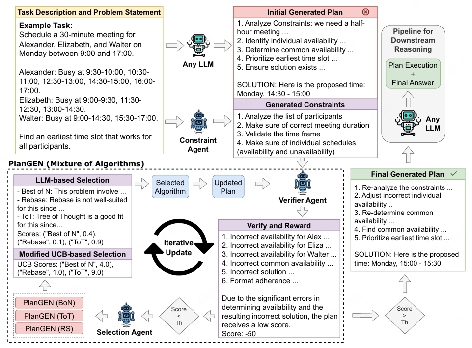

# 1. 资源

- Github (8 stars): https://github.com/cajias/plangen
- 论文：
  - https://arxiv.org/abs/2502.16111
  - PlanGEN: A Multi-Agent Framework for Generating Planning and Reasoning Trajectories for Complex Problem Solving
  - 2025.2.22

# 2. PlanGEN是什么
PlanGEN 是谷歌研究团队推出的多智能体框架，通过多智能体协作、约束引导和算法自适应选择，解决复杂问题的规划和推理。包含三个关键组件：约束智能体、验证智能体和选择智能体。智能体协同工作，形成一个强大的问题解决系统。

# 3. PlanGEN的主要功能
  * **多智能体协作** ：PlanGEN 包含三个关键智能体，协同完成复杂任务： 
    * **约束智能体（Constraint Agent）** ：深入解析问题描述，提取关键约束条件，包括显式和隐含约束。
    * **验证智能体（Verification Agent）** ：基于约束条件评估计划质量，分配奖励分数，并提供精确的质量反馈，指导迭代优化。
    * **选择智能体（Selection Agent）** ：根据问题复杂度动态选择最佳算法，平衡探索与利用。
  * **四种实现方式** ：PlanGEN 提供四种不同的实现方式，适应不同复杂度的问题： 
    * **PlanGEN (Best of N)** ：并行生成多个计划，选择奖励最高的方案，适合中等复杂度的规划问题。
    * **PlanGEN (Tree-of-Thought)** ：构建决策树，逐步探索和评估可能的解决路径，适合需要多步推理的复杂问题。
    * **PlanGEN (REBASE)** ：实现改进的深度优先搜索，允许从次优路径回溯，适合具有复杂约束和多个可行解的问题。
    * **PlanGEN (Mixture of Algorithms)** ：根据问题特性动态选择最适合的算法，实现实例级适应性。
  * **约束引导与迭代优化** ：PlanGEN 强调约束引导的迭代验证，通过约束智能体提取问题约束，验证智能体评估计划质量，根据反馈进行迭代优化。确保生成的计划不仅满足约束条件，能在多次迭代中逐步完善。
  * **自适应算法选择** ：PlanGEN 采用改进的 Upper Confidence Bound (UCB) 策略，动态选择最适合的推理算法。能根据问题复杂度和历史表现，灵活切换不同的算法，平衡探索和利用。
  * **模型不可知性与可扩展性** ：PlanGEN 是一个模型不可知的框架，能与不同的 LLM 模型结合使用。使 PlanGEN 具有良好的可扩展性，可以适应不同的任务和模型。

# 5. PlanGEN的应用场景
  * **智能客服系统** ：PlanGEN 可用于开发高性能的智能客服系统，支持多轮对话、准确理解用户意图、提供个性化回复，具备知识图谱推理能力。
  * **复杂任务规划** ：PlanGEN 在复杂任务规划中表现出色，例如日历调度、会议安排和旅行规划等。PlanGEN (Best of N) 通过并行生成多个计划并选择最优方案，适合中等复杂度的任务。在需要多步推理的复杂问题（如数学证明）中，PlanGEN (Tree-of-Thought) 构建决策树逐步探索解决方案。
  * **自动驾驶与无人机集群** ：PlanGEN 的多智能体协作机制也适用于自动驾驶车队和无人机集群。自动驾驶汽车通过多智能体框架实现协同驾驶，优化交通流量和安全性。无人机集群则可用于物流配送、农田监测和自然灾害救援等任务，通过协同作业提高效率。
  * **供应链优化** ：在供应链管理中，PlanGEN 可以帮助应对市场需求的突然变化或突发事件。通过多智能体协作，零售商、供应商和生产商可以迅速调整生产、运输和库存计划，确保供应链的稳定运行。
  * **科学与数学推理** ：PlanGEN 在科学和数学推理任务中也有显著表现。例如，在 OlympiadBench 基准测试中，PlanGEN (REBASE) 和 PlanGEN (Mixture of Algorithms) 通过灵活的算法选择和迭代优化，显著提高了数学和物理问题的解决准确率。
