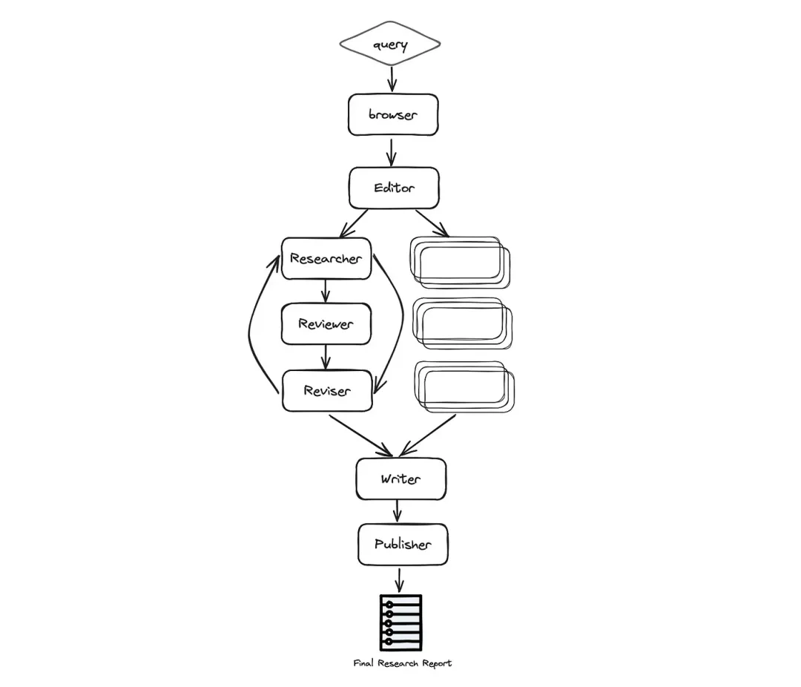

# 1. LangGraph概述
LangGraph是LangChain的增强版，专注于构建智能体及多智能体流程。其核心优势在于新增的循环流程构建功能以及内嵌的记忆机制，这些特性对于智能体的构建极为重要。

LangGraph为开发者提供了高度的控制能力，这在自定义智能体和流程的开发中极为关键。市面上绝大多数的智能体都是针对特定应用场景进行了定制。

LangGraph不仅赋予了开发者灵活定制智能体的能力，还提供了直观且易于操作的开发体验。

# 2 构建终极自主研究智能体
借助LangGraph的强大功能，我们能够通过集结具备专业技能的多个智能体，显著提高研究工作的深度与品质。每个智能体专注于其独特技能，这不仅能够优化任务分工，增强定制性，还为项目的扩展与规模化发展奠定了基础。

本示例展示了一个AI智能体团队如何通力合作，对特定主题进行全面研究，涵盖从策划到发布的全过程。在此过程中，会特别应用前沿的自主研究智能体——GPT Researcher。

## 2.1 研究智能体团队

研究团队由七个大型语言模型智能体组成：

- 主编智能体 —— 负责监督研究过程并管理整个团队。这是使用LangGraph协调其他智能体的“主”智能体，充当LangGraph的主要接口。

- GPT研究智能体 —— 一个专门进行特定主题深入研究的自主智能体。

- 编辑智能体 —— 负责规划研究大纲和结构。

- 审稿智能体 —— 根据一套标准验证研究结果的正确性。

- 修订智能体 —— 根据审稿智能体的反馈修订研究结果。

- 写作智能体 —— 负责汇编并撰写最终报告。

- 出版智能体 —— 负责将最终报告以多种格式发布。

## 2.2 架构

如下图，自动化过程基于以下阶段：规划研究、数据收集与分析、审查与修订、编写报告，最后是出版：



更具体的流程如下：

- 浏览器（gpt-researcher）——基于给定的研究任务，浏览互联网进行初步研究。这一步对于LLMs来说非常重要，以便根据最新和相关信息规划研究过程，而不是仅依赖于针对给定任务或主题的预训练数据。

- 编辑——根据初步研究规划报告大纲和结构。编辑还负责触发基于计划大纲的并行研究任务。

- 对于每个大纲主题（并行）：

- 研究员（gpt-researcher）——对子主题进行深入研究并撰写草稿。这个智能体利用GPT Researcher Python包，以优化、深入且符合事实的研究报告。

- 审稿人——根据一套指导方针验证草稿的正确性，并向修订者提供反馈（如果有的话）。

- 修订者——根据审稿人的反馈修订草稿，直到满意为止。

- 作者——汇编并撰写最终报告，包括引言、结论和参考文献部分。

- 出版商——将最终报告以多种格式（如PDF、Docx、Markdown等）发布。

我们不会深入所有代码，因为代码量很大，但会重点关注所发现的有价值或有趣部分进行分享。

## 2.3 定义图状态
在LangGraph中，状态管理采用一种结构化的方式，允许开发者定义一个GraphState对象，它能够包含整个应用程序的状态信息。这样，图中的每个节点都具备了修改状态的能力，可以根据交互过程中的上下文变化，实现动态的响应机制。

在每项技术设计的初期，需要确立整个应用程序的数据结构。针对本例，创建一个名为ResearchState的数据模型，将作为我们研究应用程序的核心数据架构。如下所示：

```python
class ResearchState(TypedDict):
    task: dict
    initial_research: str
    sections: List[str]
    research_data: List[dict]
    # 报告布局
    title: str
    headers: dict
    date: str
    table_of_contents: str
    introduction: str
    conclusion: str
    sources: List[str]
    report: str
```

如上所见，状态被分为两个主要区域：研究任务和报告布局内容。当数据通过图中的智能体流通时，每个智能体将根据现有状态生成新数据，并更新它以便在图中的其他智能体进一步处理。

然后，使用以下方式初始化图：

```python
from langgraph.graph import StateGraph
workflow = StateGraph(ResearchState)
```

## 2.4 使用LangGraph初始化图

如上所述，多智能体开发的一个伟大之处在于构建每个智能体具有专门化和限定范围的技能。以使用GPT Researcher Python包的Researcher智能体为例：

```python
from gpt_researcher import GPTResearcher

class ResearchAgent:
    def __init__(self):
        pass

    async def research(self, query: str):
        # 初始化研究员
        researcher = GPTResearcher(parent_query=parent_query, query=query, report_type=research_report, config_path=None)
        # 对给定查询进行研究
        await researcher.conduct_research()
        # 编写报告
        report = await researcher.write_report()

        return report
```

如上所见，已经创建了Research智能体的一个实例。现在假设我们已经为团队中的每个智能体都做了同样的事情。在创建了所有智能体之后，将使用LangGraph初始化图：

```python
def init_research_team(self):
    # 初始化智能体
    editor_agent = EditorAgent(self.task)
    research_agent = ResearchAgent()
    writer_agent = WriterAgent()
    publisher_agent = PublisherAgent(self.output_dir)
    
    # 定义一个Langchain StateGraph与ResearchState

    workflow = StateGraph(ResearchState)
    
    # 为每个智能体添加节点
    workflow.add_node("browser", research_agent.run_initial_research)
    workflow.add_node("planner", editor_agent.plan_research)
    workflow.add_node("researcher", editor_agent.run_parallel_research)
    workflow.add_node("writer", writer_agent.run)
    workflow.add_node("publisher", publisher_agent.run)
    
    workflow.add_edge('browser', 'planner')
    workflow.add_edge('planner', 'researcher')
    workflow.add_edge('researcher', 'writer')
    workflow.add_edge('writer', 'publisher')
    
    # 设置起始和结束节点
    workflow.set_entry_point("browser")
    workflow.add_edge('publisher', END)
    
    return workflow
```

如上所见，创建LangGraph图非常简单，主要由三个主要功能组成：add_node、add_edge和set_entry_point。通过这些主要功能，你可以首先向图中添加节点，连接边，并最终设置起始点。

重点检查：如果你一直按照代码和架构进行，会注意到在上面的初始化中缺少了Reviewer和Reviser智能体。让我们深入探讨！

## 2.5 图内嵌套图以实现状态化的并行处理

这个智能助手的一个亮点是其支持对每个研究任务进行并行处理，且每项任务都遵循一套预设的规范进行审查与修订。

在流程设计中，有效利用并行工作是提升效率的秘诀。然而，若所有智能体都向同一状态报告，如何协调它们的并行工作以避免竞争条件和数据不一致的问题呢？解决方案是构建一个子图，由主LangGraph实例触发，并为每次并行运行维护独立的状态，从而巧妙地解决了这一难题。

正如之前所做的，让我们定义LangGraph状态及其智能体。由于这个子图基本上是审查和修订研究草稿，我们将用草稿信息定义状态：

```python
class DraftState(TypedDict):
    task: dict
    topic: str
    draft: dict
    review: str
    revision_notes: str
```

如DraftState中所见，我们主要关心讨论的主题，以及审稿人和修订笔记，因为它们相互沟通以完成子主题研究报告。为了创建循环条件，我们将利用LangGraph的最后一个重要部分，即条件边：

```python
async def run_parallel_research(self, research_state: dict):
    workflow = StateGraph(DraftState)
    
    workflow.add_node("researcher", research_agent.run_depth_research)
    workflow.add_node("reviewer", reviewer_agent.run)
    workflow.add_node("reviser", reviser_agent.run)
    
    # 设置边 researcher->reviewer->reviser->reviewer...
    workflow.set_entry_point("researcher")
    workflow.add_edge('researcher', 'reviewer')
    workflow.add_edge('reviser', 'reviewer')
    workflow.add_conditional_edges('reviewer',
                                   (lambda draft: "accept" if draft['review'] is None else "revise"),
                                   {"accept": END, "revise": "reviser"})
```

通过定义条件边，如果审稿人有审稿笔记，图将指向修订者，或者循环将以最终草稿结束。如果你回到已经构建的主图，会看到这个并行工作是在由ChiefEditor智能体调用的名为“researcher”的节点下进行的。

## 2.6 运行研究助手
为了便于定制，助手使用给定的task.json文件运行：

```python
{
  "query": "Is AI in a hype cycle?",
  "max_sections": 3,
  "publish_formats": {
    "markdown": true,
    "pdf": true,
    "docx": true
  },
  "follow_guidelines": false,
  "model": "gpt-4-turbo",
  "guidelines": [
    "The report MUST be written in APA format",
    "Each sub section MUST include supporting sources using hyperlinks. If none exist, erase the sub section or rewrite it to be a part of the previous section",
    "The report MUST be written in spanish"
  ]
}
```

任务对象相当直观，但请注意，如果follow_guidelines为false，则会导致图忽略修订步骤和定义的准则。此外，max_sections字段定义了要研究的子标题数量。数量较少将生成较短的报告。

运行助手会生成最终研究报告，格式包括Markdown、PDF和Docx等。

# 参考

[1] 基于LangGraph多智能体技术，搭建AI写作自动化系统，https://mp.weixin.qq.com/s/w7btrbvJRi64K0djcID8dg