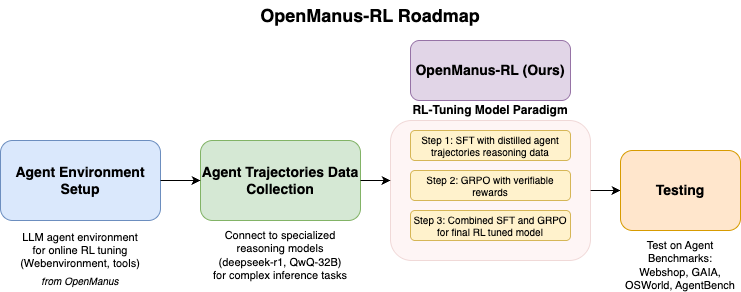
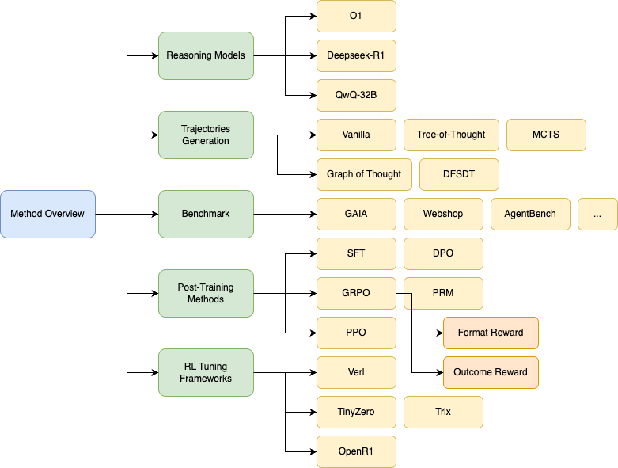

# 1. OpenManus-RL

- Gitub (3.1k stars): https://github.com/OpenManus/OpenManus-RL
- 数据：https://huggingface.co/datasets/CharlieDreemur/OpenManus-RL
- A live stream development of RL tunning for LLM agents



我们尝试了各种推出策略来提高代理规划效率和推理稳健性，包括：

- Tree-of-Thoughts (ToT) ： 采用基于树的推理路径，使代理能够系统地探索分支的可能性。
- 图谱 （GoT）：利用图结构有效地表示复杂的推理依赖关系。
- DFSDT （Depth-First Search Decision Trees）：通过深度优先搜索优化作选择，增强长期规划。
- Monte Carlo Tree Search （MCTS）：概率性地探索推理和决策路径，有效地平衡探索和开发。

支持的框架
- Verl
- TinyZero
- OpenR1
- Trlx



react数据样例：

```json
{
  "id": "os_0",
  "conversations": [
    {"role": "user", "content": "Count files in /etc"},
    {"role": "assistant", "content": "Think: Need reliable counting method\nAct: bash\n```bash\nls -1 /etc | wc -l\n```"},
    {"role": "user", "content": "OS Output: 220"},
    {"role": "assistant", "content": "Think: Verified through execution\nAct: answer(220)"}
  ]
}
```

# 2. RAGEN

- Gitub (2.1k stars): https://github.com/RAGEN-AI/RAGEN

具有基于规则的奖励的强化学习 （RL） 在增强大型语言模型 （LLM） 的推理能力方面显示出前景。但是，现有方法主要侧重于静态的单轮任务，例如数学推理和编码。将这些方法扩展到代理方案会带来两个基本挑战：

- 多轮交互：座席必须执行顺序决策并对环境反馈做出反应
- 随机环境：相同的行动可能导致不同结果的不确定性

为了应对这些挑战，我们提出了一个通用的 RL 框架：StarPO （State-T hinking-A ctions-R eward Policy Optimization），一个全面的 RL 框架，为训练多轮、轨迹级代理提供了一种统一的方法，可以灵活控制推理过程、奖励分配机制和提示推出结构。 在 StarPO 的基础上，我们引入了 RAGEN，这是一个模块化的智能体训练和评估系统，可实现完整的训练循环，包括推出生成、奖励计算和轨迹优化。RAGEN 是一个强大的研究基础设施，用于系统地分析多轮次和随机环境中的 LLM 代理训练动态。


# 3. ZeroSearch
- Github (1k stars): https://github.com/Alibaba-nlp/ZeroSearch
- 论文：https://arxiv.org/pdf/2505.04588

训练一个模拟的LLM，提供搜索结果