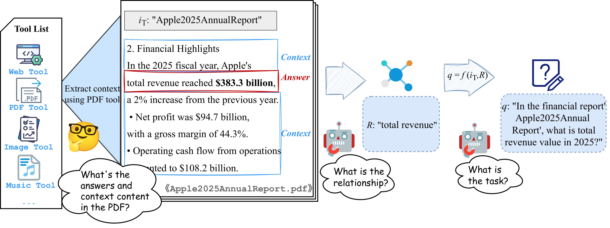
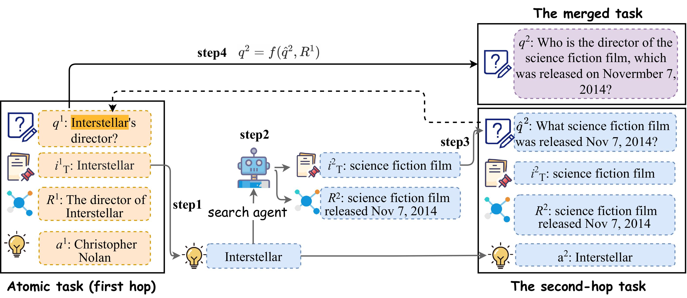

- Github (167 stars): https://github.com/OPPO-PersonalAI/TaskCraft
- 论文：TaskCraft: Automated Generation of Agentic Tasks
  - https://arxiv.org/html/2506.10055v2
  - June 17, 2025

taskcraft是一个用于生成具有执行轨迹的难度可扩展、多工具且可验证代理任务的库。它提供了：

✨ 无限任务复杂度扩展：通过基于深度（层级）和基于宽度（组合）的扩展策略，从简单的原子任务构建多层次复杂挑战，支持多跳推理和多工具协作。

🧑 💻 无缝多模态输入解析。直接处理异构数据源，如PDF/HTML/URL，自动提取关键信息生成原子问题，支持单模态（文本）和多模态（文本-图像混合）模式。

🤗 可验证的执行轨迹生成：为每个任务生成标准化的功能调用日志和工具调用链，实现对智能体执行过程的精确复现和评估。

🌐 难度评分与大规模数据生成：内置难度评分系统自动生成从简单（1步）到专家级（4步+）的任务，默认为36,000+的合成数据集，供模型训练使用。

原子任务生成

从PDF/HTML/URL/Image中提取内容，生成原子代理任务。

基于深度的扩展

从原子任务生成多跳推理任务，以模拟现实世界的智能体决策。

基于宽度的扩展