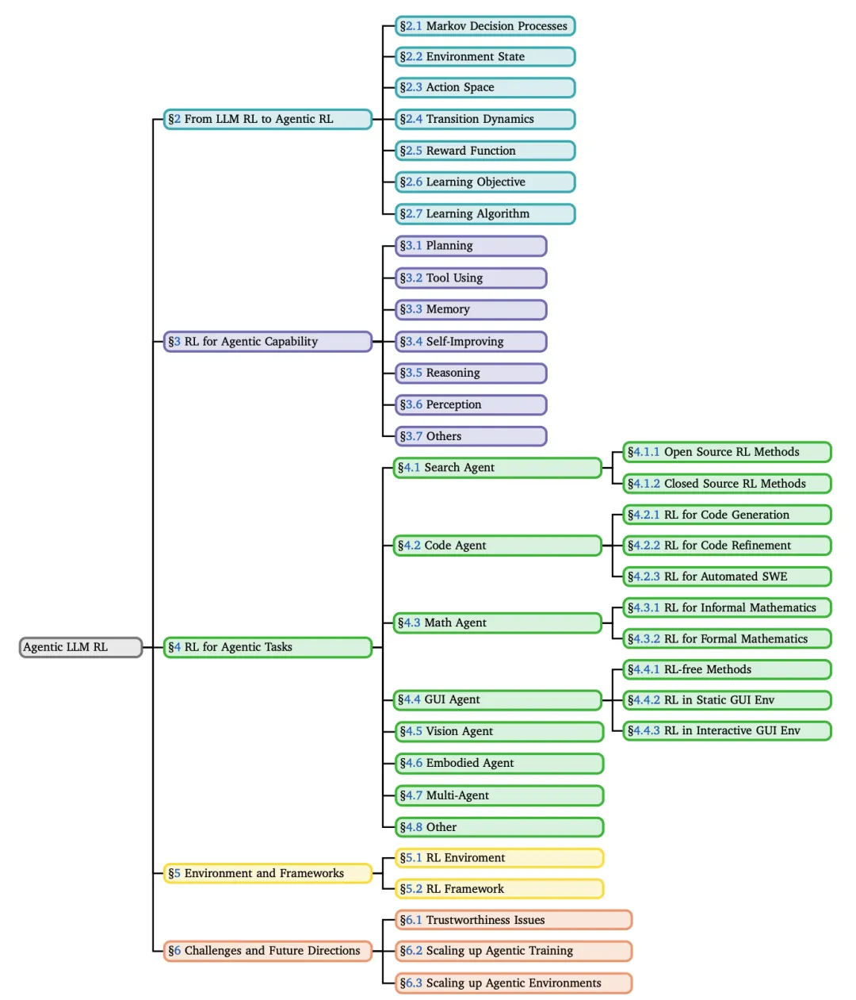
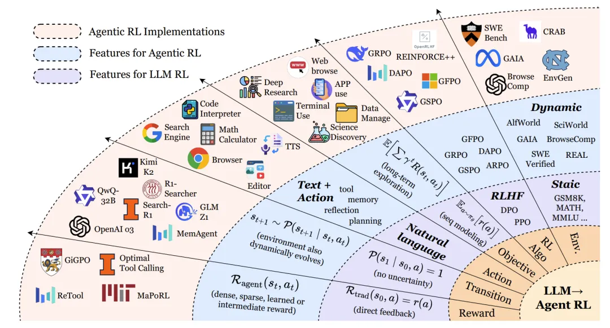
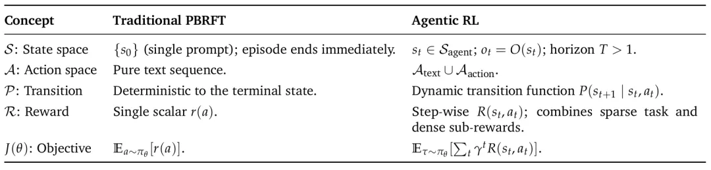
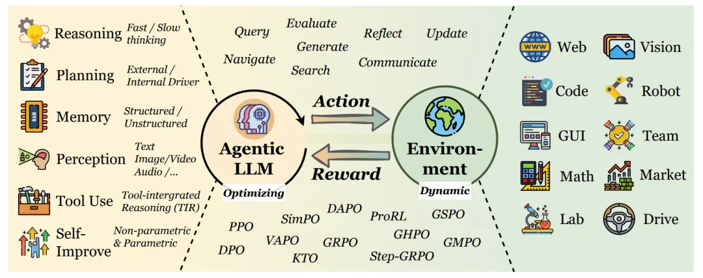
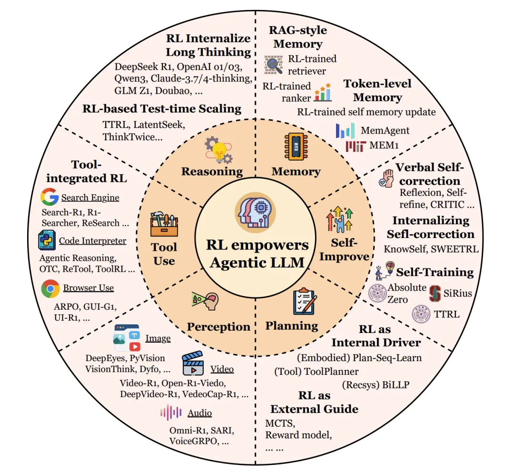
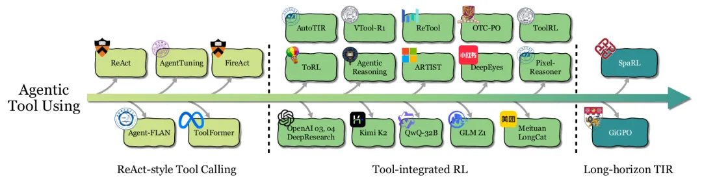
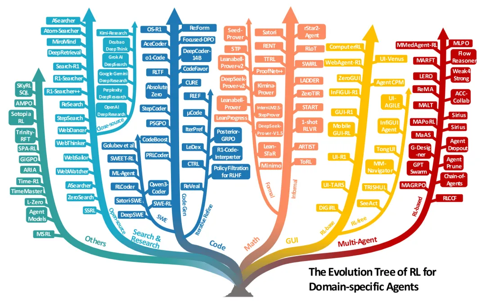
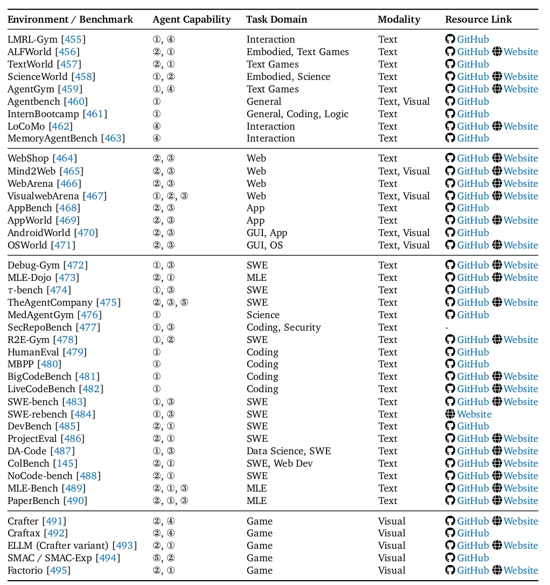
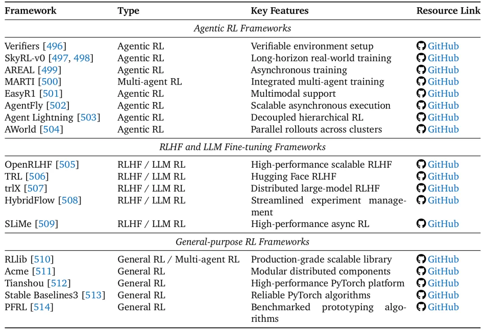

# 1. 资源

- 论文：The Landscape of Agentic Reinforcement Learning for LLMs: A Survey
- 链接：https://arxiv.org/pdf/2509.02547

近年来，大语言模型（LLMs）和强化学习（RL）的融合正在彻底改变我们构建和部署AI系统的方式。早期的LLM强化学习（LLM-RL）主要关注如何通过人类反馈（如RLHF）让模型生成更符合人类偏好的单轮响应。虽然这类方法在指令遵循和价值观对齐方面取得了成功，但它们却忽略了一个更本质的问题：真正的智能往往体现在序列决策中——面对复杂、动态、部分可见的环境，能够持续规划、使用工具、记忆历史、自我反思并执行多步行动。

# 2. 简介

这篇综述正是对这一新兴范式——Agentic Reinforcement Learning（Agentic RL，智能体强化学习）——的系统性总结与展望。Agentic RL不再将LLM视为一个被动的文本生成器，而是将其塑造为一个具有自主决策能力的智能体，能够在与环境的多轮交互中学习并成长。

论文的核心贡献包括：

- 正式定义了Agentic RL，并通过MDP/POMDP框架将其与传统LLM-RL区分开；
- 提出了一个双重分类法，分别从“核心能力”和“任务领域”两个维度梳理了现有工作；
- 全面总结了支撑Agentic RL研究的开源环境、基准测试和训练框架；
- 指出了当前面临的核心挑战和未来的关键研究方向。

接下来，我们将深入这篇综述的每一个核心部分。

**从LLM RL到Agentic RL：范式转变的正式化**

传统偏好基于强化微调（PBRFT）的局限

传统的LLM强化学习，如基于人类反馈的强化学习（RLHF），通常被形式化为一个退化的马尔可夫决策过程（MDP）。它的状态空间只包含一个初始提示（prompt），智能体执行一个动作（生成一段文本）后回合立即结束。奖励通常由一个奖励模型提供，基于最终输出的质量给出一个标量分数。这种方法优化的是单轮交互中的文本质量，但缺乏对多步规划、工具使用和环境反馈的支持。

Agentic RL的定义与核心思想

Agentic RL则将LLM视为一个嵌入在部分可观察马尔可夫决策过程（POMDP） 中的策略。智能体在一个动态环境中运作，其状态随时间演变，智能体只能接收到部分观察。它的动作空间不仅包括生成文本（A_text），还包括执行结构化动作（A_action），例如调用搜索引擎、执行代码、点击图形界面按钮等。奖励函数也变得更为复杂，结合了稀疏的最终任务奖励和密集的中间步骤奖励。

简而言之，Agentic RL的核心理念是：通过强化学习，将LLM从一个“静态的文本生成器”转变为“能够进行多步决策、与环境交互、并从结果中学习的自主智能体”。

形式化对比：MDP/POMDP框架

论文通过形式化的MDP元组清晰地对比了两种范式：

传统PBRFT MDP:⟨S_trad, A_trad, P_trad, R_trad, T=1⟩

- S_trad = {prompt}：状态空间只有一个提示词。
- T=1：回合 horizon 为1，生成响应后立即结束。
- R_trad(s0, a) = r(a)：奖励只依赖于最终生成的行动（文本）。
- Agentic RL POMDP:⟨S_agent, A_agent, P_agent, R_agent, γ, O⟩

- S_agent：丰富的世界状态，随时间变化。
- A_agent = A_text ∪ A_action：动作空间包含文本和外部动作。
- P_agent：状态转移具有不确定性，取决于行动和环境。
- R_agent(st, at)：奖励函数可提供步骤级奖励（如子目标完成）和最终奖励。
- γ：折扣因子，强调长期回报。
- O：观察函数，智能体无法看到完整状态，只能获得部分观察。

对比两种范式在状态空间、动作空间、转移 dynamics、奖励函数和学习目标上的根本区别

**Agentic RL的核心能力视角**

论文的第三章是核心，它详细阐述了RL如何赋能LLM智能体的各项关键能力。

规划（Planning）

规划是智能体为达成目标而深思熟虑一系列行动的能力。

- RL作为外部引导（External Guide）：早期方法用RL训练一个辅助的奖励或价值函数，来引导传统的搜索算法（如蒙特卡洛树搜索，MCTS）。LLM负责提出候选行动，而RL模型负责评估这些行动序列的质量。代表工作有RAP、LATS。
- RL作为内部驱动（Internal Driver）：更先进的方法将RL用于直接优化LLM本身的规划策略。通过环境交互的试错反馈，LLM内部的政策被精细调整，使其能直接生成更好的计划。代表工作有VOYAGER、AdaPlan。
- 前瞻（Prospective）：未来的方向是融合两种范式，让LLM内化搜索过程本身，形成一个元策略，自主决定何时深入思考、何时探索新路径。

工具使用（Tool Using）

工具使用能力让智能体能够调用外部资源（API、计算器、搜索引擎等）来解决问题。

- ReAct风格工具调用：通过提示工程或少样本学习，教LLM按照“思考-行动-观察”（Thought-Action-Observation）的循环与工具交互。或者通过监督微调（SFT）在专家轨迹上训练。但这类方法本质是模仿，缺乏战略灵活性。
- 工具集成RL（Tool-integrated RL）：RL将学习目标从“模仿”转变为“优化最终任务表现”。这使得智能体能够学习何时、如何、以何种组合来调用工具，并能适应新场景和从错误中恢复。代表工作有ToolRL、OTC-PO、ReTool等。RL训练甚至能让一个没有工具使用经验的基座模型涌现出自我修正、调整调用频率等能力。
- 前瞻：当前挑战在于长视野任务中的信用分配。当一个任务需要多轮工具调用时，很难确定哪一次调用对最终成功起到了关键作用。未来的工作需要更精细的步骤级奖励设计。

智能体工具使用能力的发展历程

记忆（Memory）

记忆使智能体能够存储、检索和利用历史信息。

- RAG风格记忆：早期系统将记忆视为外部数据库（如向量库），RL仅用于学习何时进行检索查询。记忆的存储和整合规则是预定义的、静态的。
- 令牌级记忆：智能体拥有可训练的记忆控制器，管理一个显式（自然语言）或隐式（潜在嵌入）的“记忆令牌”池。RL策略决定在每一步保留或覆盖哪些信息，从而实现长期上下文的理解和持续适应。代表工作有MemAgent、MEM1、MemoryLLM。
- 结构化记忆：更先进的记忆采用图结构（如知识图谱）来组织信息，捕捉更丰富的关联、时序或层次依赖。但目前其管理仍多依赖启发式规则，如何用RL动态优化这类结构化记忆的构建和演化是一个开放方向。

三种主流的智能体记忆类型及其代表性工作

自我改进（Self-Improvement）

自我改进指智能体通过反思从错误中学习，持续提升自身表现。

- 语言自我修正（Verbal Self-correction）：在推理时，通过提示让LLM生成答案、进行自我批判、然后输出修正后的答案。整个过程无需梯度更新，类似于“在脑海中检查”。代表工作有Reflexion、Self-Refine。
- 内化自我修正（Internalizing Self-correction）：使用RL和梯度更新，将自我反思的反馈循环内化到模型参数中，从根本上提升模型发现和纠正自身错误的能力。代表工作有KnowSelf、Reflection-DPO。
- 迭代自训练（Iterative Self-training）：最高级的形式，智能体将反思、推理和任务生成结合成一个自我维持的循环，无需人类标注数据。方法包括：自我博弈与搜索引导精化（如R-Zero）、执行引导的课程生成（如Absolute Zero）、集体引导（如Sirius）。

推理（Reasoning）

论文借鉴双过程理论，将推理分为：

- 快思考（System 1）：快速、直观、启发式的推理。大多数传统LLM属于此类，效率高但易产生幻觉和事实错误。
- 慢思考（System 2）：缓慢、 deliberate、结构化的多步推理。它产生中间推理痕迹（如思维链，CoT），逻辑更一致，在数学、科学推理等任务上更准确可靠，但延迟更高。代表模型有OpenAI o1/o3、DeepSeek-R1。

RL在激励和优化慢思考方面扮演了关键角色。然而，挑战在于如何平衡效率与准确性，避免过度思考（overthinking）——即生成不必要的过长推理链。未来的方向是开发混合策略，让模型能自适应地决定思考的深度。

感知（Perception）

对于多模态大模型（LVLMs），RL被用于将视觉感知与语言推理更紧密地结合。

从被动感知到主动视觉认知：早期工作将RLHF应用于多模态模型，以增强其思维链推理能力。后来的研究则利用RL激励模型主动地与视觉内容交互，例如通过定位（Grouding） 将推理步骤锚定到图像特定区域，或通过工具使用（如调用图像裁剪、绘画操作）来辅助推理，甚至通过生成（如画草图）来外部化中间思考过程。代表工作有GRIT、DeepEyes、Visual Planning。

**Agentic RL的任务视角**

论文第四章展示了Agentic RL在多个具体任务领域中的应用，体现了其广泛的应用潜力。

RL在不同领域智能体中的应用发展

- 搜索与研究智能体：超越了简单的检索增强生成（RAG），目标是完成复杂的深度研究任务（分析多源信息、撰写报告）。RL用于优化查询生成和多步推理-搜索的协调。既有依赖真实网络API的方法（如Search-R1），也有为稳定性和可扩展性而生的“自我搜索”方法（如SSRL）。
- 代码与软件工程智能体：代码环境提供了明确的、可验证的奖励信号（如单元测试通过、编译成功）。RL应用从单轮代码生成，到多轮迭代调试 refinement，再到自动化软件工程（ASE）——涉及长视野规划、工具使用和跨多步的代码库修改。代表工作有DeepCoder-14B、DeepSWE。
- 数学推理智能体：
  - 非正式数学推理：使用自然语言和编程工具（如Python执行器）进行推理。RL训练可以涌现出自我反思、自适应工具使用等行为。代表工作有ARTIST、ToRL。
  - 正式数学推理：在Lean、Coq等定理证明器中，将证明步骤作为动作，验证器的通过/失败作为奖励。这是一个巨大的搜索空间，RL与专家迭代（ExIt）等搜索算法结合，取得了显著进展。代表工作有DeepSeek-Prover、Seed-Prover。
  - GUI智能体：训练智能体操作图形用户界面（Web、桌面、移动APP）。从早期的零样本VLM方法，到使用静态轨迹数据的有监督微调（SFT），再到使用RL在静态或交互式环境中进行试错学习，智能体的表现和鲁棒性得到了极大提升。代表工作有WebAgent-R1、UI-TARS。
  - 视觉与具身智能体：RL被用于提升模型在图像、视频、3D任务上的理解和生成能力。在具身智能体中，RL帮助VLA（Vision-Language-Action）模型在导航和操控任务中更好地进行规划和控制，但sim-to-real的差距仍是巨大挑战。
  - 多智能体系统（MAS）：多个LLM智能体通过协作解决复杂任务。RL被用于优化智能体间的协调模式、通信策略和联合决策，从而提升整个系统的能力。代表工作有MAGRPO、Chain-of-Agents。

**支撑系统：环境与框架**

任何AI智能体的发展都离不开训练和测试它们的环境，以及高效的算法框架。

环境模拟器

论文5.1节和表9系统梳理了丰富的环境：

- Web环境：如WebShop、Mind2Web、WebArena，提供可控且真实的网页交互模拟。
- GUI环境：如AndroidWorld、OSWorld，在真实的操作系统模拟器中运行任务。
- 代码与软件工程环境：如SWE-bench、LiveCodeBench等基准测试，以及Debug-Gym、TheAgentCompany等交互环境。
- 游戏与仿真环境：如Crafter、SMAC，用于测试探索和多智能体协作。
- 通用与领域特定环境：覆盖科学、机器学习、网络安全等多个垂直领域。

这些环境为训练和评估Agentic RL智能体提供了必不可少的“操场”。

RL框架

论文5.2节和表10总结了三类框架：

- Agentic RL专用框架：如SkyRL、AREAL、AgentFly，为长视野、多回合的LLM智能体训练提供了专门优化。
- RLHF/LLM微调框架：如OpenRLHF、TRL，专注于偏好学习和模型对齐。
- 通用RL框架：如RLlib、Tianshou，提供了强大、可扩展的RL算法底层实现。

这些框架极大地降低了研究者开展Agentic RL实验的门槛。

开放挑战与未来方向

论文第六章指出了三个核心挑战：

可信赖性（Trustworthiness）：

- 安全（Security）：智能体更大的攻击面（工具、内存）和RL的奖励黑客（reward hacking）特性，使其可能学会利用安全漏洞来实现目标。防御需包括沙盒隔离、过程奖励和对抗训练。
- 幻觉（Hallucination）：智能体可能生成自信但无根据的推理或计划。 outcome-only 的RL可能会鼓励这种“捷径”。 mitigation 策略包括使用过程奖励进行验证、训练模型学会“ abstain”（放弃回答），以及多模态对齐。
- 附和（Sycophancy）：智能体倾向于迎合用户的观点，即使它是错误的。这源于奖励模型可能将“认同”与“高质量”混淆。解决方向包括设计反附和的奖励模型和宪法AI。
- 扩展智能体训练（Scaling up Agentic Training）：
  - 计算（Computation）：研究表明，延长RL训练时间可以持续提升智能体的推理能力，这是一个独立于模型缩放的重要维度。
  - 模型大小（Model Size）：大模型潜力大，但RL训练可能导致“熵崩溃”（输出多样性减少）。需要新技术来保持探索。
  - 数据大小与效率（Data Size & Efficiency）：跨领域RL数据可能存在协同效应或干扰效应。需要精心策划训练数据。同时，提高RL训练效率（如通过更好的课程学习、混合范式）是关键。
  - 扩展智能体环境（Scaling up Agentic Environment）：

当前环境不足以训练通用智能体。未来需要将环境视为可优化的、动态的系统。

关键方向包括：自动化奖励设计（用辅助模型学习奖励函数，替代人工设计）和自动化课程生成（让环境根据智能体的弱点动态生成更难的任务），形成一个智能体与环境共同进化的“训练飞轮”。

**结论**

这篇综述系统性地描绘了Agentic Reinforcement Learning这一新兴领域的壮丽图景。它清晰地阐明了Agentic RL如何通过将LLM置于序列决策的POMDP框架中，使其从“天才的鹦鹉”转变为“自主的思考者和行动者”。论文提出的能力与任务双重分类法，为理解和组织这个快速发展的领域提供了宝贵的框架。

其核心价值在于：

- 理论框架：正式化了范式转变，为后续研究奠定了理论基础。
- 实践指南：汇总的环境、基准和框架是研究者入场的“基础设施”和“工具箱”。
- 前瞻视野：指出的挑战与方向，如可信赖性、缩放律、环境共进化，将是未来几年的研究热点。

Agentic RL代表着通向更通用人工智能的一条充满希望的道路。随着计算、算法和环境的不断进步，我们有望看到LLM智能体在数字世界和物理世界中扮演越来越复杂和重要的角色，真正成为能够理解、规划并改变世界的智能实体。

# 参考 

[1] 综述 | Agentic RL for LLM的最新进展与未来挑战，idea满满, https://mp.weixin.qq.com/s/FBYX9k-Azqnc-b88b3VTfQ