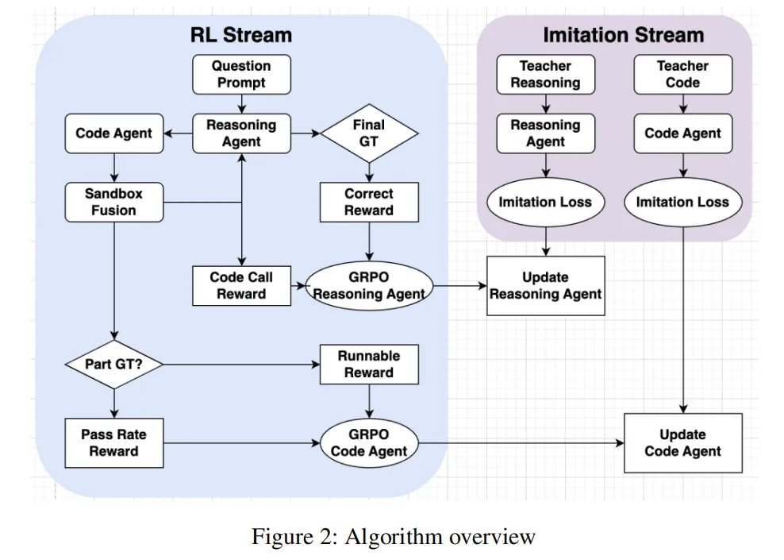
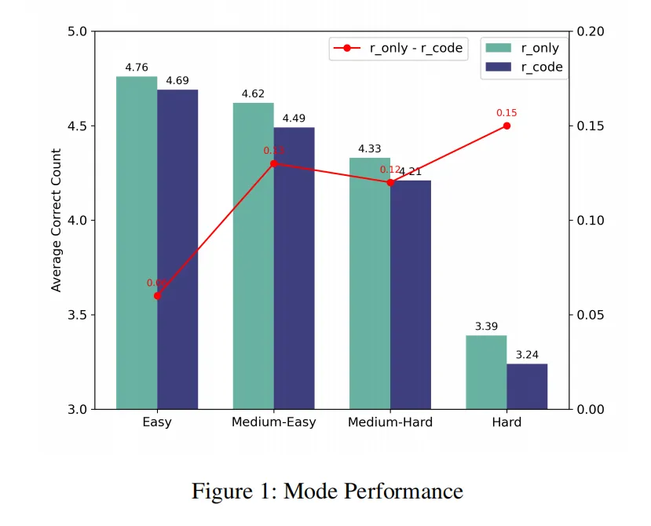

# 1. 资源

- Reducing Cognitive Load in Multi-Agent Reinforcement Learning for Mathematical Problem Solving: Decoupling Reasoning and Code Generation
  - https://arxiv.org/pdf/2508.08882

本文提出了一种双智能体框架，通过将数学问题求解中的“推理”与“代码生成”任务解耦，来降低单一模型的认知负荷干扰，从而提升长链推理的稳定性和准确性。

# 2. 动机

研究内容
本文研究如何解决大语言模型在集成了代码执行等工具后，因同时承担长程推理和精确编程两种认知任务而导致的性能下降问题。

研究动机
认知负荷干扰现象 ： 当前的单智能体范式要求模型在一次生成中同时处理高层次的抽象推理和低层次的精确编码。实验发现，赋予模型代码执行能力（工具）不仅未能提升其推理能力，反而因增加了认知负担而损害了其生成正确推理路径的概率。基于此实验，作者提出了认知负荷干扰现象：在LLM中，两种截然不同的认知任务会相互干扰，导致推理质量下降。

解决方案

1.提出双智能体架构：
推理智能体：负责将数学问题分解为一步步的自然语言逻辑，并决定在哪个步骤调用编码智能体来执行计算。
编码智能体：接收推理智能体的具体计算指令，生成并执行Python代码，然后将结果返回给推理智能体。

2.混合训练流程：
模仿学习： 在初始阶段，两个智能体通过学习包含正确解题步骤和代码的专家数据，分别掌握基本的问题分解和编码能力。
双通道强化学习：对于推理智能体，主要依据最终答案的正确性给予奖励，并通过优势估计将奖励信号分配给中间的各个推理步骤。
对于编码智能体，当其输出能匹配中间步骤的标准答案时给予强奖励，若无真实答案可比对，则根据代码能否成功执行给予弱奖励 。

# 3. 实验结果
论文的实验分为两个阶段，初步结果已验证了框架的有效性：

动机实验： 清晰地证明了单智能体在同时处理推理和编码时，其推理路径的正确性会显著下降，有力地验证了“认知负荷”假设的存在。

初步训练结果： 论文指出，即使仅在模仿学习阶段，所提出的双智能体设计的性能（在最终答案准确率和中间推理正确性上）也已经超越了单智能体基线，证明了该解耦架构本身的优越性。
未来展望： 作者预期，后续的强化学习阶段将进一步提升模型在复杂和全新任务上的鲁棒性和性能。

综上，该论文通过一个巧妙的验证性实验，精准地指出了当前工具增强型LLM存在的“认知负荷干扰”问题。其提出的解耦双智能体框架，通过明确的职责划分和精心设计的混合训练策略，为解决这一问题提供了有效的新范式。该研究为构建更稳定、更强大的AI数学问题解决系统开辟了新的思路。

# 参考

[1] 百度提出双智能体RL框架，解耦推理与代码生成, https://mp.weixin.qq.com/s/AxpvQRKK2-vGc4y6rQ0QSQ?scene=1