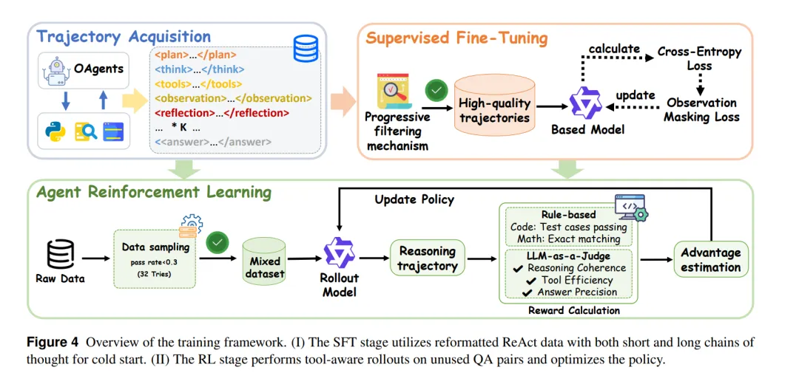

Chain‑of‑Agents: End‑to‑End Agent Foundation Models via Multi‑Agent Distillation and Agentic RL

这篇文章我觉得主要讲故事和选场景上取了巧，作者提出了一种新的范式——称为 Chain-of-Agents (CoA)，其核心思想是：用一个LLM来模拟多 agent 系统的角色协作流程，而不是在外部搭建多个独立 agent 通过 prompt／workflow 协调。具体来说，他们先通过 “多 agent 知识蒸馏（multi-agent distillation）” 从已有的多 agent 系统（包含角色扮演、工具调用、观察反馈等）生成轨迹，再用这些轨迹对模型做SFT，最后在可验证的 agentic 任务上做 RL 优化。

在奖励设计上，除了正常的最后结果的奖励也有：

对于 Web agent 任务，他们放弃了传统的 F1、EM 等指标，因为在开放域场景下这些指标容易失效。取而代之的是LLM-as-Judge」机制：用 Qwen‑2.5‑72B‑Instruct 来判断模型输出是否与标准答案语义匹配，结果为 0 或 1 二值奖励。
这样就使得 SFT 阶段先取得一个“角色协作流程”的冷启动，RL 阶段则优化模型在真实 agentic 执行中的效果（包括工具调用、角色切换、链式思考、验证、自反等）。

