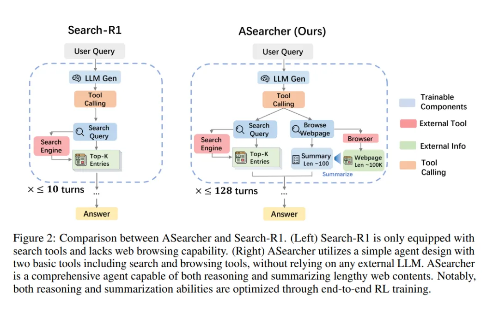

- Github (466 stars): https://github.com/inclusionAI/ASearcher

ASearcher:Beyond Ten Turns: Unlocking Long-Horizon Agentic Search with Large-Scale Asynchronous RL

现在主流的 online rl训练数据轮数都少于10轮，训练数据质量也不高 经常出现理解不了不确定性的问题，网页信息无法精确提取以及会被误导答案干扰（实验了search R1和Search o1都不行）。所以他的核心有两个

一个是做了一个更难的数据集：用一个数据合成的agent 在一些qa问题中 既注入有关的上下文确保正确性 又进行题目模糊化增加理解的难度 增加难度
提出并实现了一个大规模、异步训练引擎，使得 agent 能够在“长‐回合”搜索中训练，而不是局限于 ≤10 轮调用。具体而言，他们允许每条轨迹更长（数十轮工具调用，以及极大的输出token数）并通过“完全异步”收集轨迹并训练，从而显著提升训练效率。
当然和标准的agentic rl流程不同，agent上专门多了一个总结网页内容的环节，这个和Search-R1一开始那个reasoning-in-document类似
