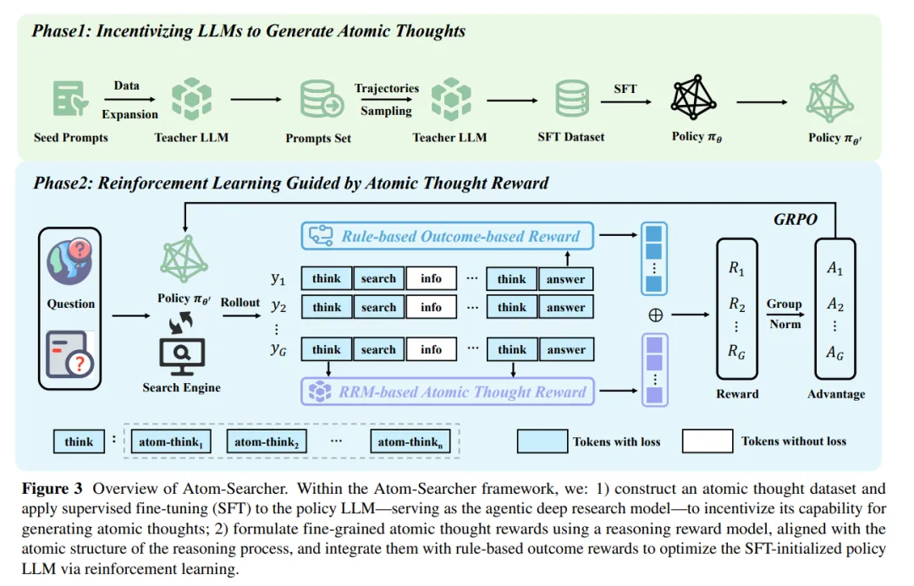

Atom-Searcher: Enhancing Agentic Deep Research via Fine-Grained Atomic Thought Reward

作者觉得之前的文章奖励太稀疏 — 传统做法主要在最终答案正确与否上打分（outcome-based reward），导致中间过程几乎没有信号，优化效率低下。另外之前的 “Think”太粗糙／太笼统 — 在很多 agentic 系统中，模型只是被要求 “思考（think）” 然后做动作，但并没有具体引导去做「反思 (reflection)」「验证 (verification)」「规划 (planning)」等细粒度的思维步骤。论文认为这限制了 reasoning 的效率和可解释性。

为了解决这两点，作者提出了两个核心思路：

Atomic Thought（原子思维）范式：将一个较大的 <|think|> 模块细分为多个功能上明确的子单元（Atomic Thoughts），比如 <|Plan|>, <|Reflection|>, <|Verification|> 等。这样模型在 rollout 过程中不仅“思考”，而是以更结构化、更可监督的方式「思考」。
过程 + 结果混合奖励＋动态调度（这个和Agent RL Scaling Law那篇文章的结论对应了）：除了继续使用最终答案的 outcome reward，作者设计了一个专门的 Reasoning Reward Model (RRM) 来对这些 Atomic Thought 单元打分，从而得到 Atomic Thought Reward (ATR)，作为过程级别的信号。在训练初期，因为模型尚未擅长产生正确答案，这时 ATR（过程奖励）权重大，鼓励模型先“学会正确思考路径”。随着训练推进，最终答案的重要性提升，模型的思考路径能力渐强，过程奖励的权重逐渐下降，这样可以转向强调结果。
另外可能觉得template比较多，所以也是先sft再rl的方式进行训练。
