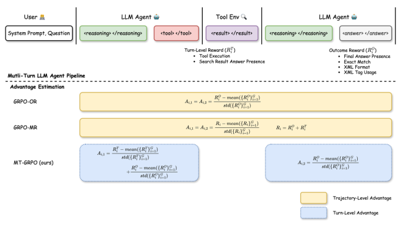
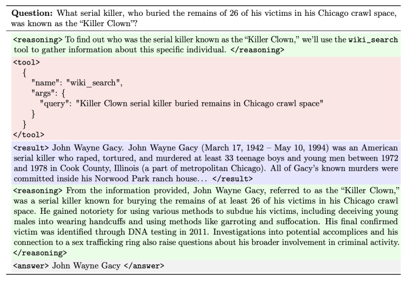
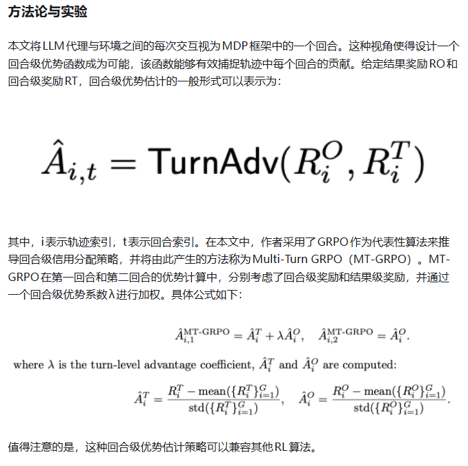

# 1. 资源

- 论文： Reinforcing Multi-Turn Reasoning in LLM Agents via Turn-Level Credit Assignment
- Github (95 stars): https://github.com/SiliangZeng/Multi-Turn-RL-Agent

# 2. 原理

引言
大型语言模型（LLMs）在复杂决策任务中的推理能力取得了显著进展，尤其是在长链思维（CoT）的探索和完善方面。然而，纯文本推理的LLM在需要精确数值计算、信息检索或代码执行的任务中仍存在局限性。将LLM作为自主代理，并赋予其访问外部工具（如搜索引擎、科学计算器、代码解释器）的能力，可以显著扩展其功能。

尽管如此，训练LLM作为自主代理在交互式环境中运行面临独特的挑战。代理设置通常要求模型在复杂推理任务中做出顺序的、多轮决策。现有方法通常将这些多轮交互任务视为赌博问题，仅依赖于结果层面的奖励（如答案或格式的正确性）。然而，这种赌博公式对于长时程推理来说是不够的，因为它将整个轨迹视为单一决策步骤，忽略了任务的多轮结构，特别是忽略了回合级奖励——指示单个步骤是否有用或有害的中间信号。缺乏回合级反馈使得代理难以完善其行为，从而难以学习健壮和连贯的推理链，或在多步骤中与动态环境有效交互。

本文《Reinforcing Multi-Turn Reasoning in LLM Agents via Turn-Level Credit Assignment》深入探讨了如何通过强化学习（RL）增强大型语言模型（LLM）代理的推理能力。作者提出了一种细粒度的回合级信用分配策略，以解决现有方法在多轮推理任务中信用分配不精确的问题。本文将详细解析这篇论文的核心思想、技术细节以及实验结果。

问题背景与现有方法的局限性
当前，许多训练多轮LLM代理的方法将多轮交互任务视为上下文赌博问题，并采用轨迹级优势估计的强化学习算法进行训练。在这种设置中，优势函数在整个轨迹中被统一分配，而不区分单个令牌的贡献。这种设计与赌博设置一致，但对于长时程推理来说是不够的，因为它将整个轨迹视为单一决策步骤，忽略了任务的多轮结构。

具体来说，现有方法忽略了回合级奖励——这些中间信号可以指示单个步骤是有益还是有害。例如，在一个搜索代理中，早期选择一个好的查询对于检索相关信息至关重要；如果没有回合级反馈，代理就无法学习哪些查询有助于获得正确答案。虽然最近的研究开始纳入回合级奖励（如工具执行），但它们仍然通过合并结果和回合级奖励来估计轨迹级的优势，这缺乏细粒度的信用分配。当奖励用于分配整个轨迹的信用时，很难识别哪些特定决策对最终结果产生了积极或消极贡献。有效多轮推理需要更精确的回合级信用分配，以使代理能够完善单个步骤，而不是将所有行动视为对成功或失败负有同等责任。缺乏细粒度的信用分配最终限制了多轮LLM代理的性能和适应性。

论文核心思想：回合级信用分配
为了解决上述局限性，本文提出了一种细粒度的回合级信用分配策略，用于多轮LLM代理的训练。作者将LLM代理与环境之间的每次交互视为马尔可夫决策过程（MDP）中的一个回合。这种视角使得设计一个回合级优势函数成为可能，该函数能够有效捕捉轨迹中每个回合的贡献。论文中以GRPO（Group Relative Preference Optimization）算法为例，提出了Multi-Turn GRPO（MT-GRPO）方法。MT-GRPO在第一回合和第二回合的优势计算中，分别考虑了回合级奖励和结果级奖励，并通过一个回合级优势系数λ进行加权。

图：多轮LLM代理管道概述及不同优势估计方法的比较。代理在多个步骤中与工具环境进行交互：推理、工具使用和答案生成，并获得轮次级和结果级的奖励。GRPO被用作代表性算法，以说明不同的优势估计策略。GRPO-OR和GRPO-MR作为基线，采用轨迹级优势估计，而MT-GRPO是我们提出的变体，采用细粒度的回合级优势估计。
奖励设计
为了与多轮工具调用LLM代理的环境保持一致，论文设计了两种可验证的奖励函数：

回合级可验证奖励（Turn-Level Verifiable Rewards）：
这些奖励仅取决于LLM代理执行的第一个回合。为了计算回合级奖励，作者纳入了与工具执行和搜索结果相关的验证器，以确保搜索工具被正确调用，并且真实答案出现在检索到的结果中。

• 工具执行奖励（Tool Execution Reward）：如果工具被正确执行，奖励0.2分。这通过检查是否存在格式正确的工具调用（<tool>…</tool>）以及环境返回的响应不以“Error:”开头来确定。

• 搜索结果答案存在奖励（SearchResultAnswerPresence）：如果任何接受的答案出现在工具返回的搜索结果中（从<result>…</result>标签中提取），奖励0.5分。使用不区分大小写的比较。

基于结果的可验证奖励（Outcome-Based Verifiable Rewards）：
这些奖励评估模型生成的最终响应。具体来说，它们评估答案的正确性及其格式，确保输出与预期结构和内容一致。

• 最终答案存在奖励（Final Answer Presence Reward）：如果模型最终响应中存在任何接受的答案（从<answer>…</answer>标签中提取），奖励0.5分。

• 精确匹配奖励（Exact Match Reward）：如果模型答案（从<answer>…</answer>提取）在标准文本预处理（即小写和去除空格）后与任何接受的答案精确匹配，奖励1.0分。

• XML格式奖励（XML Format Reward）：根据预期模式评估模型输出的结构完整性：<reasoning>…</reasoning>后跟<tool>…</tool>或<answer>…</answer>。检查包括：(1) 至少存在一个预期字段（<reasoning>、<tool>、<answer>），(2) 正确的间距（标签内无前导或尾随空格），(3) 消息以<reasoning>开头，(4) 消息以</tool>或</answer>结尾。根据这些标准（加权：40%字段存在，20%间距，20%正确起始标签，20%正确结束标签）授予部分信用，最终得分乘以0.2。

• XML标签使用奖励（XML Tag Usage Reward）：评估定义字段的XML标签的正确使用。对于每个标签，奖励验证是否存在一个开始标签和一个结束标签。奖励是正确使用标签的比例（按检查的标签数量归一化），乘以0.2。

很明显，回合级奖励仅评估代理第一个回合的性能，而结果级奖励评估整个轨迹的质量。这种区别导致了几种典型的场景：

• 工具调用成功但最终答案不佳：代理在第一个回合中正确调用了工具，满足了回合级标准，但未能产生正确或格式良好的最终答案，导致获得回合级奖励但很少或没有结果级奖励。

• 工具使用不正确或缺失但最终答案有效：代理跳过工具使用或错误调用工具（例如，由于格式错误或错误响应），但仍然生成了正确且结构良好的最终答案。在这种情况下，代理获得了部分或全部结果级奖励，尽管没有获得回合级奖励。

• 两个层面都失败：代理既没有正确调用工具，也没有产生有效的最终答案，导致零奖励和强烈的负面学习信号。

实验设置
为了分析信用分配对多轮工具使用任务中LLM代理训练的影响，作者将提出的MT-GRPO与香草GRPO进行了比较：

• GRPO-OR：仅使用结果奖励的原始GRPO。

• GRPO-MR：使用合并的结果奖励和回合级奖励的原始GRPO。

• MT-GRPO (本文方法)：使用回合级优势估计的GRPO变体，同时使用结果奖励和回合级奖励。

实验基于开源项目verifiers，该项目训练LLM代理执行多轮工具使用任务。任务和数据集方面，作者专注于多轮推理和基于搜索的工具使用任务，并使用TriviaQA数据集训练LLM代理，通过与Wikipedia搜索引擎交互来回答问题。基准模型采用Qwen2.5-7B。训练在配备8个NVIDIA H100 GPU的节点上进行，其中一个GPU用于生成Rollout，其余七个用于模型训练。

主要结果
论文中展示了不同算法在训练过程中不同奖励分量曲线。从答案存在和精确匹配奖励曲线可以看出，MT-GRPO明显优于GRPO-OR和GRPO-MR，这表明细粒度的信用分配增强了多轮LLM代理的性能。回合级奖励（包括工具执行和搜索结果答案存在奖励）显示，MT-GRPO在工具执行方面实现了100%的成功率，而GRPO-OR在问答任务中逐渐停止调用搜索工具，并最终表现更差。这表明回合级反馈在多轮交互任务中的重要性。

# 参考

[1] 提升LLM代理多轮推理能力：细粒度回合级信用分配, https://zhuanlan.zhihu.com/p/1934603256392315499