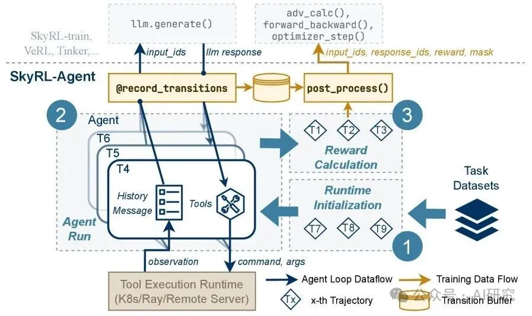
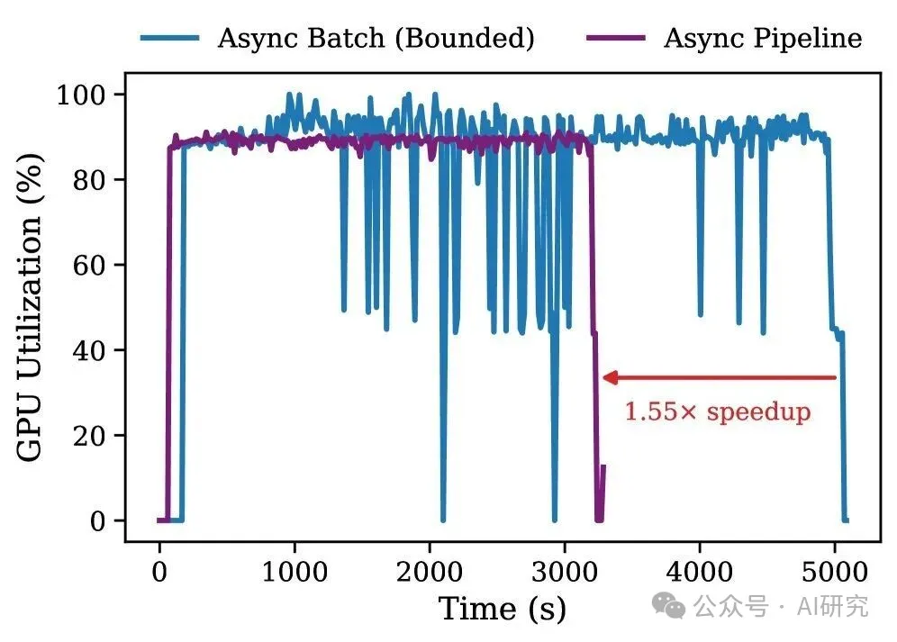
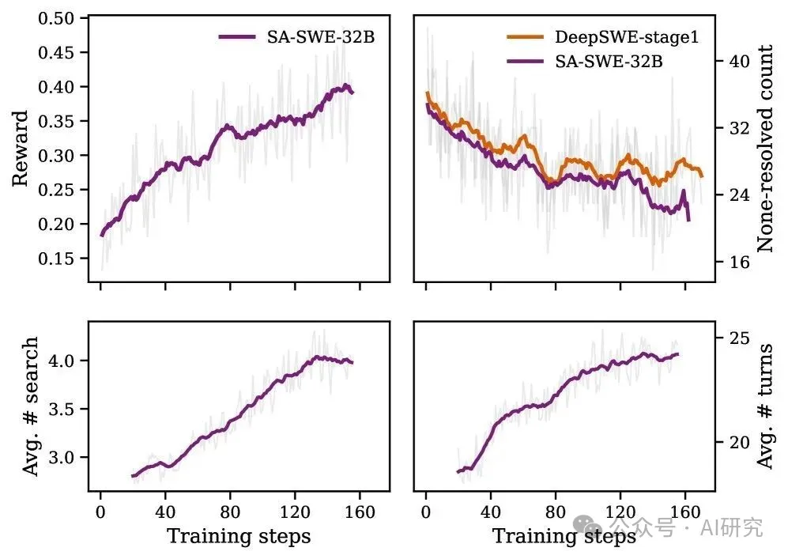
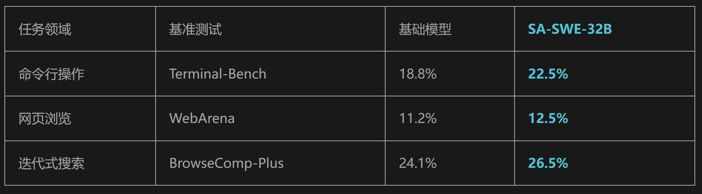

# 1. 资源

- 论文标题：SkyRL-Agent: Efficient RL Training for Multi-turn LLM Agent
- ArXiv URL：http://arxiv.org/abs/2511.16108v1
- Github (1.2k stars): https://github.com/NovaSky-AI/SkyRL

来自加州大学伯克利分校和Anyscale的研究者们给出了答案。他们推出了SkyRL-Agent，一个专为多轮、长周期的AI Agent打造的高效强化学习（RL）训练与评估框架。基于该框架，他们仅用纯粹的强化学习，就将一个开源模型在软件工程基准测试SWE-Bench上的通过率从24.4%提升至39.4%，而训练成本仅为同类先进模型的一半不到！

# 2. 原理

智能体训练的“老大难”问题
传统的Agent训练方法常常面临几大痛点：

1. 效率低下：训练过程涉及大量CPU密集型（如环境交互）和GPU密集型（如模型推理）操作，但两者常因调度不当而无法并行，导致昂贵的GPU资源闲置。
2. 集成困难：为Agent添加新工具或适应新任务，往往需要重构代码，灵活性差。
3. 后端绑定：Agent的实现通常与特定的RL训练后端（如VeRL, Tinker）紧密耦合，难以迁移和复用。
SkyRL-Agent的设计初衷，正是为了解决这些“老大难”问题。

SkyRL-Agent：模块化的高效训练框架
SkyRL-Agent的架构设计精巧而高效，其核心在于三大组件的协同工作。

1. 工具为中心的智能体循环
在SkyRL-Agent中，一切皆工具。Agent的所有行为都通过调用标准化的工具接口（类似OpenAI的函数调用）完成。无论是与代码仓库交互、执行shell命令，还是总结对话历史，都可以被封装成一个工具。这种设计极大地简化了新功能的集成，让开发者可以专注于工具逻辑本身，而无需改动主训练循环。

2. 异步流水线调度器：加速核心
这是SkyRL-Agent实现效率飞跃的“秘密武器”。

传统方法通常将一次完整的Agent交互（rollout）视为一个整体任务，导致CPU和GPU资源交替等待。SkyRL-Agent则将每个rollout拆解为三个独立的阶段：运行时初始化（CPU密集）、智能体运行（CPU/GPU混合）和奖励计算（CPU密集）。

通过一个精细的异步流水线调度器（asynchronous pipeline dispatcher），系统可以智能地将来自不同rollout的、不同类型的阶段性任务调度到对应的硬件上并行执行。这种“流水线”作业模式，极大地提升了异构资源的利用率。

实验数据显示，相比传统的异步批处理方法，这种流水线调度器带来了1.55倍的训练加速，并显著提高了GPU的利用率。

3. 解耦的后端桥接
SkyRL-Agent通过一个“后端桥接”层，将Agent的执行逻辑与具体的RL训练系统完全解耦。这意味着，同一套Agent代码可以无缝切换不同的训练后端，无论是本地的SkyRL-train、VeRL，还是基于API的大模型服务，都能轻松接入。这为算法的公平比较和技术的灵活迁移提供了巨大便利。

SA-SWE-32B：实战炼成编程智能体
为了验证框架的威力，研究团队使用SkyRL-Agent训练了一个名为SA-SWE-32B的软件工程智能体。该Agent基于Qwen3-32B模型，在SWE-Bench任务上进行纯粹的强化学习训练。

训练的成功不仅依赖于高效的框架，还得益于一套精心设计的工具增强训练配方（tool-enhanced training recipe）：

• 引导式工具使用：研究发现，Agent在代码库中定位错误时，常常低效地逐行查看文件，而不是使用搜索工具。为此，他们引入了一个基于抽象语法树（Abstract Syntax Tree, AST）的强大搜索工具，并辅以提示，引导Agent学会更高效地导航代码。
• 失败中学习：当Agent执行失败或陷入循环时，系统会注入结构化的提示（hints），帮助Agent分析错误、自我纠正，从而显著提高了训练轨迹的质量和成功率。

最终，SA-SWE-32B在SWE-Bench Verified测试集上达到了39.4%的Pass@1，性能媲美顶尖水平，而训练成本降低了超过2倍。

卓越的泛化能力
更令人惊喜的是，尽管SA-SWE-32B只在软件工程任务上进行了训练，但它习得的工具使用和规划能力却成功泛化到了其他领域。

在命令行操作（Terminal-Bench）、网页浏览（WebArena）和复杂搜索（BrowseComp-Plus）等多个完全不同的基准测试中，SA-SWE-32B的表现均超越了其强大的基础模型，证明了其强大的通用Agent能力。

结语
SkyRL-Agent的出现，为AI Agent的强化学习训练提供了一套兼具效率、灵活性和可扩展性的开源解决方案。它通过创新的异步流水线调度系统，将训练速度提升了1.55倍，并将成本降低了一半以上，极大地降低了研发高性能Agent的门槛。

这项研究清晰地表明，通过精巧的系统设计与巧妙的算法策略相结合，我们能够更经济、更快速地“炼成”强大的AI Agent。这不仅是软件工程领域的一大步，也为未来在更多复杂场景中部署通用智能体铺平了道路。

# 参考

[1] Agent训练成本减半！SkyRL-Agent框架揭秘加速秘诀, https://mp.weixin.qq.com/s/WX11bBXAUxWOykxVORjwPA