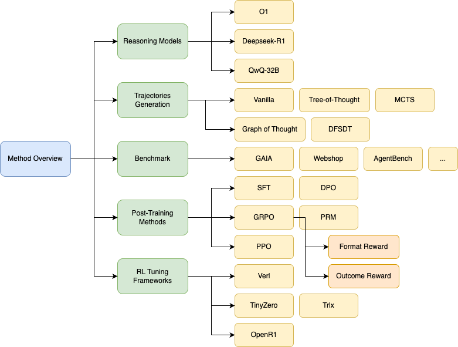

# 1. OpenManus-RL

- Gitub (3.1k stars): https://github.com/OpenManus/OpenManus-RL
- 数据：https://huggingface.co/datasets/CharlieDreemur/OpenManus-RL
- A live stream development of RL tunning for LLM agents


我们尝试了各种推出策略来提高代理规划效率和推理稳健性，包括：

- Tree-of-Thoughts (ToT) ： 采用基于树的推理路径，使代理能够系统地探索分支的可能性。
- 图谱 （GoT）：利用图结构有效地表示复杂的推理依赖关系。
- DFSDT （Depth-First Search Decision Trees）：通过深度优先搜索优化作选择，增强长期规划。
- Monte Carlo Tree Search （MCTS）：概率性地探索推理和决策路径，有效地平衡探索和开发。

支持的框架
- Verl
- TinyZero
- OpenR1
- Trlx



react数据样例：

```json
{
  "id": "os_0",
  "conversations": [
    {"role": "user", "content": "Count files in /etc"},
    {"role": "assistant", "content": "Think: Need reliable counting method\nAct: bash\n```bash\nls -1 /etc | wc -l\n```"},
    {"role": "user", "content": "OS Output: 220"},
    {"role": "assistant", "content": "Think: Verified through execution\nAct: answer(220)"}
  ]
}
```

# 2. GUI-R1

- Github (143 stars): https://github.com/ritzz-ai/GUI-R1


