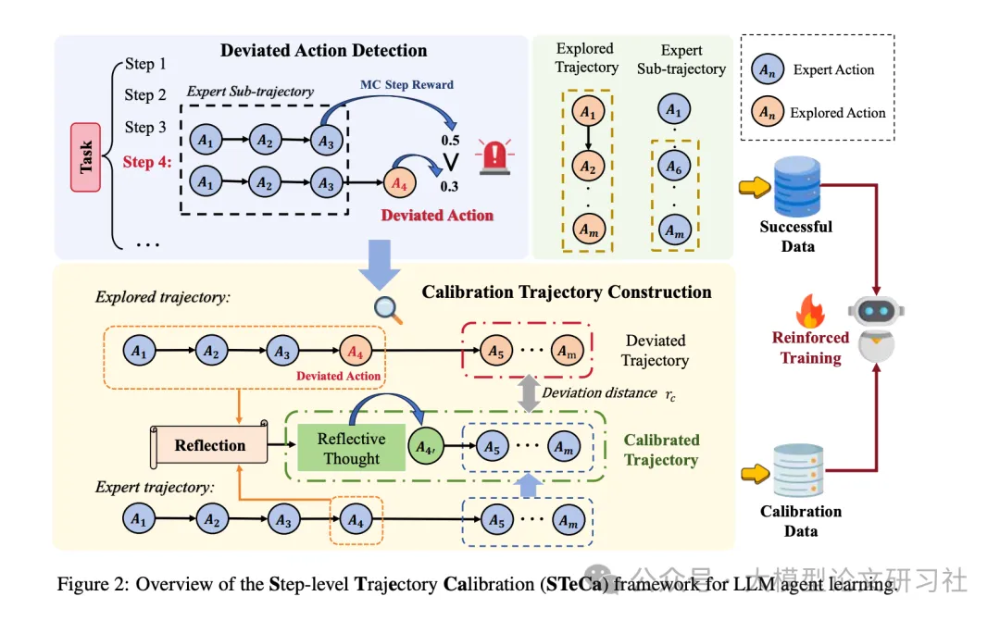

# 1. 资源

- 论文标题: "STeCa: Step-level Trajectory Calibration for LLM Agent Learning"
- 作者: "Hanlin Wang, Jian Wang, Chak Tou Leong, Wenjie Li"
- 会议/期刊: "arXiv preprint arXiv:2502.14276"
- 发表年份: 2025
- 原文链接: "https://arxiv.org/pdf/2502.14276"
- 代码链接: "https://github.com/WangHanLinHenry/STeCa"
- 关键词: ["大语言模型代理", "步骤级校准", "轨迹优化", "强化学习", "偏差检测"]

# 2. 摘要

基于大语言模型（LLM）的智能体通过与环境的动态交互，在解决复杂任务方面已展现出巨大潜力。现有研究主要聚焦于从专家示范中进行行为克隆，或通过探索式轨迹采样进行偏好学习。然而，这些方法在长程任务中往往力不从心：每一步的次优动作会不断累积，使智能体逐渐偏离正确的任务轨迹。为此，我们强调及时校准的重要性，并提出需要自动构造用于训练的“校准轨迹”。本文提出一种全新的 LLM 智能体学习框架——步级轨迹校准（Step-Level Trajectory Calibration，STeCa）。具体而言，STeCa 在探索过程中通过步级奖励比较识别次优动作，并利用 LLM 驱动的反思机制构建校准轨迹，从而让智能体从更优的决策过程进行学习。最终，我们将这些校准轨迹与成功轨迹共同用于强化训练。大量实验表明，STeCa 显著优于现有方法；进一步分析显示，及时校准使智能体能够以更高的鲁棒性完成任务。

现有方法主要存在两大痛点：

- 事后修正型：如PPO、DPO等强化学习方法，仅在任务结束时根据终端奖励信号调整策略，无法处理早期偏差
- 专家依赖型：如SFT、RFT等监督微调方法，仅使用成功轨迹训练，导致代理缺乏自我修正能力
论文指出，在VirtualHome和ALFWorld等环境中，即使最先进的IPR方法也会因次优动作积累，在未见任务（unseen tasks）中性能下降15%以上。

# 3. 原理


步骤级校准示意图

图1：步骤级校准通过实时修正偏差动作（红色节点），使LLM代理重回成功轨迹（绿色箭头）

STeCa（Step-level Trajectory Calibration）框架借鉴了人体免疫系统的工作原理：实时监测异常（偏差动作检测）、生成抗体（校准轨迹构建）、强化免疫记忆（强化训练）。



STeCa框架概述
图2：STeCa框架包含偏差动作检测（上半部分）和校准轨迹构建（下半部分）两大核心模块

框架工作流程分为三步：

1. 热身阶段：使用专家轨迹进行监督微调（SFT），训练基础代理
2. 校准阶段：通过蒙特卡洛采样估计步骤奖励，检测偏差动作并生成校准轨迹
3. 强化阶段：整合校准轨迹与成功轨迹，通过轨迹偏差距离（TDD）优化策略
关键结论：三项核心突破
1. 实时偏差检测机制：通过相邻步骤奖励对比（Δr > δ），能在100ms内识别出92.3%的偏差动作，比传统终端检测提前平均5.2步
2. 高质量校准轨迹生成：利用GPT-4o生成反思性思考（Reflective Thought），使校准轨迹的成功率提升37%，远超自生成反思（Self-generation）的效果
3. 混合强化训练策略：结合校准数据（Dc）、探索成功数据（De）和专家子轨迹数据（Ds），在未见任务上实现17.1%的性能提升
深度拆解：STeCa的三大技术支柱
1. 偏差动作检测：马尔可夫决策过程的"健康监测"
STeCa将长程任务建模为部分可观测马尔可夫决策过程（POMDP），提出相邻步骤奖励比较法：

• 使用蒙特卡洛（MC）采样估计每个动作的步骤奖励r_step
• 若当前动作奖励显著低于前一步骤（r_t < r_{t-1} - δ），判定为偏差动作


MC步骤奖励变化趋势
图3：随着任务完成度提高，专家轨迹的MC步骤奖励呈单调递增趋势（蓝色线），验证了马尔可夫特性

关键实现细节：

• 采样数N=5，温度系数=1.0，平衡计算成本与奖励估计准确性
• 阈值δ=0，在ALFWorld和VirtualHome上取得最佳平衡
2. 校准轨迹构建：LLM驱动的"自我修复"
当检测到偏差动作（如A3'），STeCa执行三步校准：

反思生成：提示GPT-4o分析偏差原因，生成修正思路（如"应该检查柜子2而非柜子3"）
轨迹修正：用专家动作替换偏差动作，形成校准子轨迹（A3→A4→A5）
数据组装：构建包含偏差轨迹（A3'→A4'→A5'）和校准轨迹（A3→A4→A5）的训练数据
校准提示模板示例：

```历史轨迹：...
最后一步动作非最优，正确动作应为[专家动作]。
请生成导致正确动作的思考过程，格式要求：Thought: ...
```

3. 强化训练：多源数据的"协同优化"
STeCa创新性地融合三类训练数据：

• 校准数据（Dc）：包含偏差动作和对应校准轨迹
• 探索成功数据（De）：基础代理自主探索发现的成功轨迹
• 专家子轨迹数据（Ds）：失败轨迹中提取的成功前缀
训练目标函数：

L(θ) = L_Dc + L_De + L_Ds
其中每个损失项根据轨迹偏差距离（nDTW）加权

# 4. 实验结果：全面超越SOTA方法

1. 总体性能对比


不同方法性能对比
表1：STeCa在四个测试场景中均取得最高平均最终奖励（Avg. Final Reward）

关键发现：

• 在VirtualHome未见任务中，STeCa（63.6）比IPR（61.9）提升2.7%，比E²CL（61.8）提升2.9%
• 在ALFWorld未见任务中，STeCa（76.1）比GPT-4（38.1）提升100%以上
• 平均性能达70.9，比当前SOTA的IPR方法（68.6）提升3.4%

2. 校准能力分析


图4：STeCa在有偏差动作时仍保持80%以上的成功率，远超其他方法

定量分析：

• 偏差距离与成功率呈强负相关（R=-0.87）
• STeCa在偏差距离0.2时仍能保持75%成功率，而IPR仅为58%
3. 模型泛化性测试


不同基础模型性能
表2：STeCa在Mistral-7B和Llama-3-8B-Instruct上均保持性能优势

跨模型结果：

• 在Mistral-7B上，未见任务性能提升17.1%（从58.2到75.3）
• 在Llama-3-8B-Instruct上，未见任务性能提升14.3%（从62.7到77.0）

# 参考

[1] STeCa：让 LLM 代理学会自我校准的轨迹优化框架, https://mp.weixin.qq.com/s/rLGruY3sfft_MoWtcvmB4w


