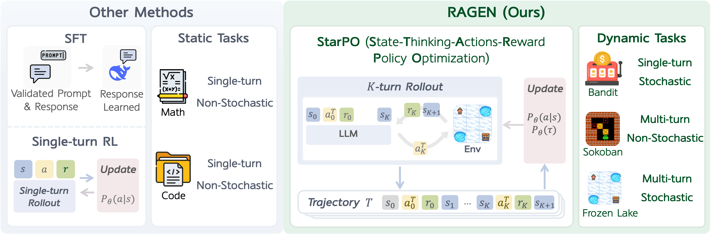
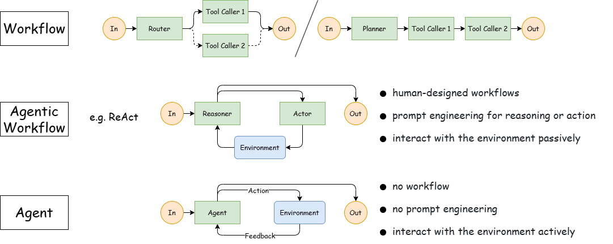
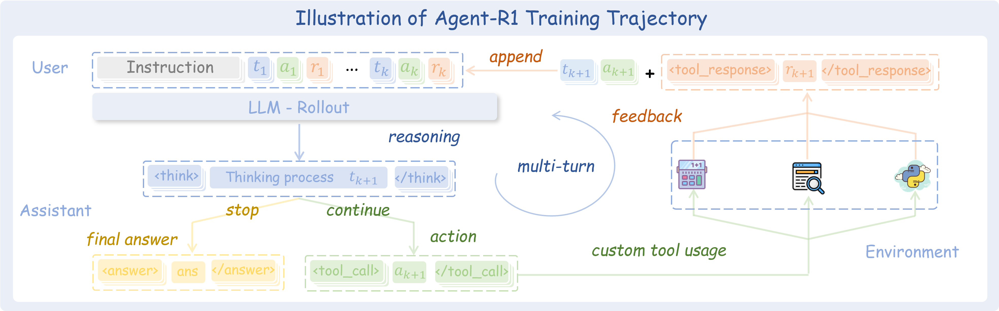
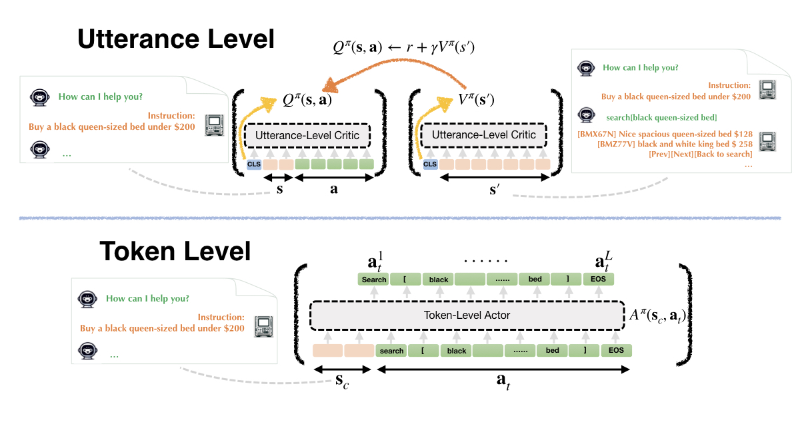

# 1. RAGEN

- Gitub (2.1k stars): https://github.com/RAGEN-AI/RAGEN

具有基于规则的奖励的强化学习 （RL） 在增强大型语言模型 （LLM） 的推理能力方面显示出前景。但是，现有方法主要侧重于静态的单轮任务，例如数学推理和编码。将这些方法扩展到代理方案会带来两个基本挑战：

- 多轮交互：座席必须执行顺序决策并对环境反馈做出反应
- 随机环境：相同的行动可能导致不同结果的不确定性

为了应对这些挑战，我们提出了一个通用的 RL 框架：StarPO （State-T hinking-A ctions-R eward Policy Optimization），一个全面的 RL 框架，为训练多轮、轨迹级代理提供了一种统一的方法，可以灵活控制推理过程、奖励分配机制和提示推出结构。 在 StarPO 的基础上，我们引入了 RAGEN，这是一个模块化的智能体训练和评估系统，可实现完整的训练循环，包括推出生成、奖励计算和轨迹优化。RAGEN 是一个强大的研究基础设施，用于系统地分析多轮次和随机环境中的 LLM 代理训练动态。

# 2. Agent-R1
- Github (629 stars): https://github.com/0russwest0/Agent-R1

主要特点
- 多轮次工具调用：对完整的交互轨迹进行端到端强化学习，允许代理从一系列作中学习
- 多工具协调：训练代理有效协调并同时使用多种工具来解决复杂任务
- 流程奖励：根据其有效性为每个工具调用分配奖励，并通过规范化与结果奖励相平衡
- 自定义工具和环境：兼容主流 LLM 工具调用格式，轻松使用自己的工具和场景进行扩展
- 多种强化学习算法：支持多种强化学习方法，包括 、 和PPOGRPOREINFORCE++
- 多模态支持：与视觉语言模型 （VLM） 和多模态强化学习兼容

# 2. ArCHer

- Github (181 stars): https://github.com/YifeiZhou02/ArCHer
- 论文：https://arxiv.org/abs/2402.19446
- 博客：https://yifeizhou02.github.io/archer.io/

多轮指代用户和robot之间的多轮RL训练

大型语言模型 （LLM） 由于其通用性 能力。在这样的问题中，与其在一回合内优化“短视”的替代目标，如人类的偏好， 我们希望直接优化长期目标，例如与 LLM 的整个对话的用户满意度或 Web 导航中的延迟成功指标。 多轮强化学习 （RL） 提供了一种有吸引力的方法来直接优化长期目标， 但是我们如何为 LLM 设计有效且高效的多轮 RL 算法呢？在这项工作中， 我们提出了一个算法框架来为 LLM 进行多轮 RL，该框架保留了 在单轮 RL 问题中使用逐个标记的 RL，同时仍然适应长范围和 延迟奖励更有效。我们的框架 Actor-C ritic 框架与 Hierarchical Structure （ArCHer） 相结合，结合了高级 非策略 RL 算法，它使用低级 RL 算法训练逐个标记策略来训练值函数。虽然 ArCHer 可以使用多个 RL 算法进行实例化，一个特别方便的实例化是在 低级别的高级别和策略令牌级别的策略梯度。 实证表明，ArCHer 显著提高了多轮 LLM 任务的效率和性能，与以前的策略方法相比，样本效率提高了约 100 倍，并且比其他非策略方法的性能要好得多。

LLM 的 RL 中的先前工作要么完全在令牌级别运行，要么在话语（一系列令牌）级别运行，但它们面临不同的挑战：

令牌级方法面临着极长的视野（每轮令牌数量 * 交互次数）的挑战，导致数值不稳定和收敛缓慢
话语级方法面临指数级动作空间（每个话语的令牌数呈指数级）的挑战，导致难以在如此大的动作空间上进行优化
我们的 ArCHer for RL 语言模型可以享受两全其美的优势， 其中，非策略时间差异学习方法可以在高级别训练话语级值函数， 而任何策略梯度算法都可以在低级交互的每一轮 token 生成进行优化，将高级值函数视为该轮的最终奖励。

这允许样本重用和更快的收敛，同时避免了对每个单独的令牌执行 Bellman 备份的需要，因为高级评论家都经过培训 在话语给出的更粗略的时间尺度上。它还直接从任何 为具有首选项的单轮 RL 开发的现有令牌级策略梯度算法， 但话语级 value 函数继承了 reward 模型的角色。通过这种方式，我们能够获得基于话语和基于令牌的最佳效果。 以及用于培训 LLM 的非政策和政策方法。

# 3. ToRL

- Github (238 stars): https://github.com/GAIR-NLP/ToRL

此存储库介绍了 ToRL （工具集成强化学习），该框架使 LLM 能够通过强化学习自主发现和优化工具使用策略，从而挑战了语言模型中工具集成的传统方法。与以前受监督微调或预定义工具模式约束的方法不同，ToRL 表明，使用计算工具的探索驱动学习可以解锁紧急认知行为，并在复杂推理任务中实现最先进的性能。值得注意的是，我们的方法直接从基本模型运行，无需模仿学习，在 7B 模型AIME2024上实现了 43.3% 的准确率，这与使用 RL 训练的大型 32B 模型的性能相当。

主要发现
- 自主工具集成：模型通过 RL 驱动的探索学习何时以及如何调用工具（例如代码解释器），从而消除对人工策划工具使用模式的依赖。
- 新兴认知能力：
  - 通过使用推理步骤交叉验证代码执行结果进行自我纠正
  - 基于工具和纯推理方法之间的自适应策略选择
  - 在没有明确监督的情况下对无效的工具调用进行自我调节

# 4. RL-Factory

- Github (1.3k stars): https://github.com/Simple-Efficient/RL-Factory

RLFactory 是一个简单高效的 RL 后培训框架，用于代理学习。

RL-Factory 将环境与 RL 后训练解耦，只需使用工具配置和奖励函数即可进行训练，同时支持异步工具调用，使 RL 后训练速度提高 2 倍。

当前版本原生支持一键式 DeepSearch 训练，具有多轮工具调用、模型判断奖励和包括 Qwen3 在内的多个模型的训练功能。即将推出的功能中将添加更多更轻松、更高效的代理学习模块。

现在，每个人都可以使用 Qwen3（作为基本模型）和 MCP 工具轻松快速地训练代理！

