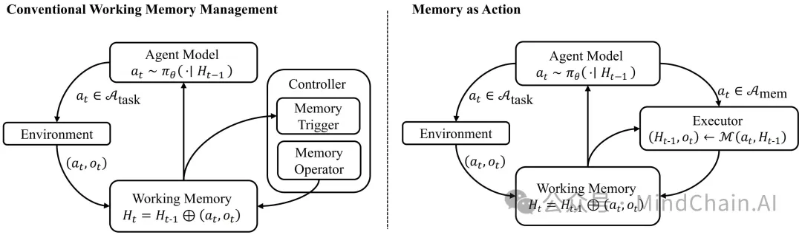
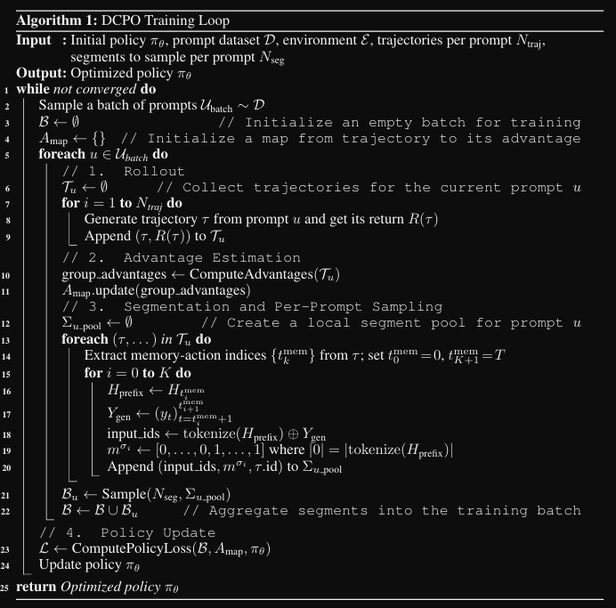

- 论文原文： https://arxiv.org/abs/2510.12635
- 2025.10.14
- 北京交通 & 华为诺亚

📌 一句话总结：
本工作提出 MemAct（Memory-as-Action） 框架，将“记忆管理”本身视为一种可学习的行动，使大模型在长程任务中学会主动整理上下文，从而以更低成本实现更强的推理能力。
🔍 背景问题：长程智能体的“记忆瓶颈”
当前大型语言模型（LLM）在长程智能体任务（如科研助理、代码代理）中面临两大挑战：
1️⃣ 上下文噪声积累：
随着任务推进，模型的工作记忆（working memory）被无关信息填满，导致推理失焦、冗余计算严重。
2️⃣ 外部控制割裂：
现有记忆管理多由“外部模块”或“手工规则”执行（如滑动窗口、摘要压缩），与智能体的核心决策过程割裂，无法实现策略级学习与优化。
🧩 结果：模型“看得多但想得乱”，计算开销高、泛化能力差。
因此，如何让模型自主决定记忆的保留与舍弃，成为长程智能体迈向真正自治的关键。
💡 方法简介：记忆 ≠ 被动缓存，而是主动行动
作者提出 Memory-as-Action（MemAct） 框架，将“记忆编辑”直接纳入智能体的行动空间：
“模型不只是调用工具，更能学会何时、如何整理自己的记忆。”
核心思想：
统一决策空间：
智能体的动作空间被划分为任务行动 (Atask) 与记忆行动 (Amem)，记忆管理成为强化学习可优化的策略一部分；
显式记忆操作：
模型可通过函数调用执行 “prune”、“summarize”、“retain”等操作，实现上下文的主动裁剪；
强化学习优化：
通过奖励信号平衡任务成功率与资源消耗，训练出适应不同模型能力的“记忆策略”。
⚙️ 技术亮点：DCPO 动态上下文优化算法
🧩 问题：
一旦智能体可以“编辑”自己的上下文，原本基于“前缀增长”的强化学习假设就被打破，标准梯度更新将失效。
🚀 解决方案：Dynamic Context Policy Optimization (DCPO)
将“记忆编辑点”视为轨迹断裂（trajectory fracture）；
通过动态分段重建因果一致的学习轨迹；
对每个段落进行独立优势估计（advantage estimation），实现稳定端到端训练。
这一机制让 LLM 能在非线性上下文中稳定学习，首次实现“记忆可编辑”的强化学习范式。
📊 实验结果：小模型也能跑赢大模型
实验覆盖 多目标问答（Multi-Objective QA） 与 多跳问答（Multi-hop QA） 场景，结果令人惊艳：
🥇 性能超越大模型：
MemAct-14B-RL 平均准确率达 59.1%，超过 Qwen3-235B，在任务复杂度提升时仍保持平稳下降趋势；
⚡ 成本显著降低：
平均每轮输入仅 3.4K tokens，是传统 RL 智能体（8.6K tokens）的不到一半；
🧩 跨任务鲁棒性强：
在五个多跳问答基准上（2Wiki、HotpotQA、Musique、Frames 等），MemAct 平均得分 0.567，几乎追平 Search-R1 的 0.572，但计算量更低；
🔄 策略自适应：
大模型学会“精简式”策略：更少外部工具调用；
小模型学会“补偿式”策略：更多外部信息检索+主动记忆压缩。
👉 同一算法，不同模型学出差异化的智能行为。
📄 论文原文
https://arxiv.org/abs/2510.12635
🧩 意义与启示
MemAct 的核心价值在于将“记忆管理”从外部机制转化为内部智能：
它让智能体具备“元认知”能力 —— 知道该记什么、删什么、何时总结。
这种从“扩展上下文”到“优化记忆”的范式转变，为未来的 自进化型长程智能体 打开了新方向，也为高效训练提供了可落地的实践途径。

# 参考

[1] Memory-as-Action：让智能体“自己管理记忆”的长程推理革命, https://mp.weixin.qq.com/s/EDv05oy9f554FxgN1B0mgQ