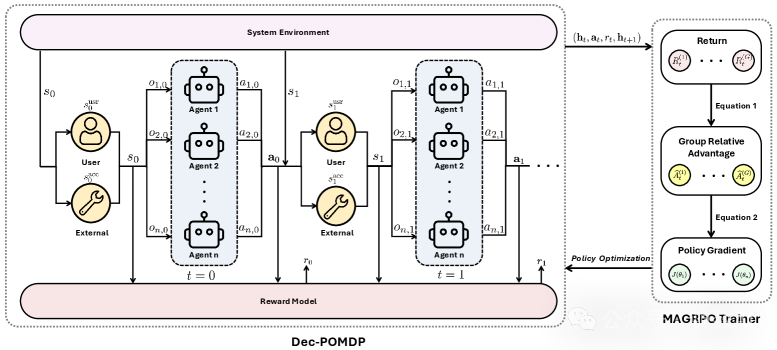
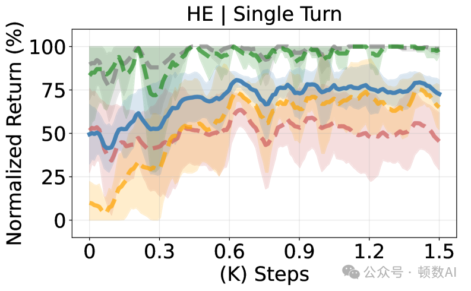
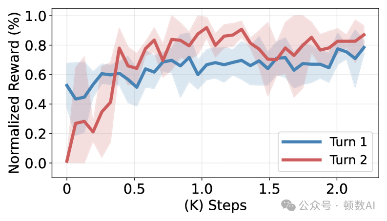

# 1. 资源

- 论文链接：https://arxiv.org/abs/2508.04652
- 论文PDF：https://arxiv.org/pdf/2508.04652
- 论文HTML版本：https://arxiv.org/html/2508.04652v2
- 多智能体强化学习书籍：https://www.marl-book.com

# 2. 原理

1. 研究背景与意义
随着大语言模型(LLM)技术的飞速发展，如何使多个LLM有效协作以解决复杂任务已成为一个关键研究方向。传统方法主要依赖于提示工程或单独微调各个模型，这些方法往往缺乏系统性的协作优化框架。本文提出了一种创新性的方法，将LLM协作建模为一个合作型多智能体强化学习(MARL)问题，并开发了多智能体组相对策略优化(MAGRPO)算法来解决这一问题。

多智能体系统(MAS)在过去几十年中已被广泛研究，在建模和解决涉及多个交互智能体的问题上取得了显著进展。然而，大多数LLM都是独立预训练的，并未针对协作进行专门优化。现有的LLM微调框架依赖于个体奖励，这需要为每个智能体设计复杂的奖励机制以鼓励协作，这种方式不仅工程复杂，而且缺乏理论保证。

2. 研究方法与技术创新
2.1 LLM协作的形式化建模
作者将LLM协作建模为一个去中心化部分可观察马尔可夫决策过程(Dec-POMDP)，这是一种特殊的MARL问题形式。在这个框架中，多个LLM智能体基于各自的观察生成响应，而不需要直接通信。形式上，LLM Dec-POMDP被定义为一个元组⟨ℐ,𝒮,{𝒪i},{𝒜i},R,T,H⟩，其中：

ℐ={1,⋯,n}表示n个LLM智能体
𝒮表示全局状态空间
𝒪i是智能体i的观察空间
𝒜i是智能体i的动作空间
R:𝒮acc×𝒜→ℝ是联合奖励函数
T:𝒮×𝒜→Δ(𝒮)是状态转移函数
H是回合视界（对话的回合限制）
这种建模方式允许通过联合奖励进行协作，同时保持可扩展的分散控制，避免了传统POSG(部分可观察随机博弈)中可能出现的纳什均衡不是联合最优的问题。

2.2 MAGRPO算法
作者提出的MAGRPO算法是一种创新的多智能体、多轮算法，它结合了单智能体GRPO(组相对策略优化)和MARL技术的优点。算法流程如下：

从数据集中采样任务，初始化观察和历史
在每个回合t，每个智能体生成一组响应
获取联合奖励并更新历史
使用集中式组相对优势进行联合优化
关键的技术创新点在于，MAGRPO使用集中式组相对优势估计来稳定训练：

A^t(g) = Rt(g) - (1/G)∑g=1^|𝒢|Rt(g)

其中Rt(g)=∑τ=t^(H-1)rτ(g)是第g个分支的累积奖励。这种方法允许在不需要大型价值模型的情况下生成集中式估计，平衡了去中心化执行和集中式训练的优势。

3. 实验设计与结果分析
3.1 实验设置
作者设计了一个代码协作任务，让2个Qwen2.5-Coder-3B智能体共同生成Python函数，其中一个辅助智能体生成辅助函数，另一个主智能体生成主函数。实验在两个数据集上进行评估：

HumanEval(HE)：包含164个手写编程问题
CoopHumanEval(CHE)：专门为协作设计的数据集
奖励模型基于四个层次设计：结构完整性、语法正确性、测试通过率和协作质量。

3.2 实验结果
实验结果表明，MAGRPO在单轮(MAGRPO-ST)和多轮(MAGRPO-MT)设置下都能提高代码生成的质量和效率：

在CHE数据集上，MAGRPO-MT最终达到了最高的测试通过率和总回报。这表明，当在具有明确合作结构的数据集上训练并由可靠建议指导时，智能体可以有效地整合反馈并提高响应质量。

与基线方法相比，MAGRPO在速度(tokens/s)和pass@k指标上都表现出色。特别是MAGRPO-MT在大多数pass@k指标上达到了最高的通过率和总回报。

3.3 协作模式分析
研究发现了四种主要的协作模式：

后备模式(Fallback)
主智能体为辅助函数提供备用逻辑，增强代码的鲁棒性
装饰器模式(Decorator)
主智能体添加补充功能以增强输出
协调器模式(Coordinator)
主智能体将任务分解并分配给辅助智能体
策略过滤器模式(Strategy Filter)
辅助智能体作为特定逻辑分支的过滤器
这些协作模式是在训练过程中自然涌现的，没有明确的指导或规则。这表明MAGRPO能够有效地学习多种协作策略，以适应不同类型的问题。

4. 技术细节与实现挑战
4.1 LLM协作中的独特挑战
LLM协作相比传统MARL问题面临一些独特挑战：

自然语言表示：LLM智能体通过自然语言接收指令和生成响应，这使得动作和观察空间非常大。作者选择在提示/响应级别而非标记级别建模问题，以实现高效和稳定的训练。

训练范式：标准的集中式训练分散式执行(CTDE)方法使用集中式价值模型，但这些架构难以扩展到非常大的动作和观察空间。作者使用基于组的蒙特卡洛估计来平衡去中心化执行和集中式训练。

4.2 多轮学习模式
在多轮设置中，智能体可以通过不同的模式学习协作：

自我进化模式
智能体主要通过任务本身进化，没有外部反馈
引导学习模式
LLM利用外部反馈提高性能

实验表明，当使用Claude-Sonnet-4提供具体建议时，第二轮的性能超过第一轮，两者都优于自我进化模式，表明适当的指导有助于智能体改进响应。

5. 应用前景与影响
基于多智能体强化学习的LLM协作框架具有广泛的应用前景：

软件开发
多个LLM协作开发大型软件系统，每个智能体专注于特定模块
内容创作
不同专长的LLM协作创作复杂内容，如技术文档、营销材料等
决策支持
多个LLM从不同角度分析问题，提供综合建议
教育辅助
专门的LLM协作提供个性化教学内容和反馈
与基于提示的协调相比，MAGRPO建立在合作MARL的坚实理论基础上，明确优化智能体以实现联合最优性。这项工作还为通过集成MARL技术来增强现有的测试时多智能体交互方法提供了机会。

此外，这项研究探索了通过合作MARL加速LLM推理的新视角。与主流加速技术(如知识蒸馏、剪枝和量化)不同，该方法建议在专门的智能体之间进行分散协调，从而减轻单个模型的长上下文记忆和联合决策的负担。

6. 局限性与未来研究方向
尽管取得了显著成果，本研究仍存在一些局限性：

同质智能体假设：研究关注同质智能体，假设它们执行类似任务。未来研究可以探索具有不同能力和功能的异质智能体之间的LLM协作。

计算资源限制：由于计算限制，研究使用相对较小的语言模型在有限数据集上训练。在更大规模的项目中，可能会出现更多样化和复杂的协作模式。

奖励模型简单性：简单的奖励模型可能导致狭窄的奖励信号和潜在的奖励黑客行为。设计更具表现力和细粒度的奖励模型对于更好地将智能体协作与人类偏好保持一致至关重要。

6.1 未来研究展望
基于本研究的发现，未来研究可以在以下方向进行拓展：

异质智能体协作框架：开发支持不同规模、架构和专长的LLM协作的框架，使每个智能体能够贡献其独特优势。

动态角色分配机制：设计能够根据任务需求和智能体能力动态分配角色的机制，提高协作效率和灵活性。

多层次奖励设计：开发多层次、多方面的奖励模型，更好地捕捉协作的不同维度，如效率、质量、创新性等。

可解释协作学习：研究如何使LLM协作过程更加可解释，使人类能够理解和干预协作决策。

跨模态智能体协作：扩展框架以支持不同模态(文本、图像、音频等)的智能体协作，解决更复杂的多模态任务。

人机协作增强：将MAGRPO框架扩展到人机混合团队，使LLM智能体能够有效地与人类协作者协调。

这些研究方向不仅具有理论意义，而且有望在实际应用中产生重大影响，推动LLM协作技术的发展和应用。

7. 结论
本研究将LLM协作建模为一个合作型MARL问题，并提出了MAGRPO算法来优化智能体协作。实验结果表明，MAGRPO使智能体能够通过有效协调高效生成高质量解决方案。这项工作突显了MARL方法在可扩展和稳健的LLM协作中的潜力，并鼓励未来在大型软件系统中探索更多协作模式。

# 参考

[1] 基于多智能体强化学习的大语言模型协作机制研究, https://mp.weixin.qq.com/s/OMRjPcpDrh3AosNdFDqzZg