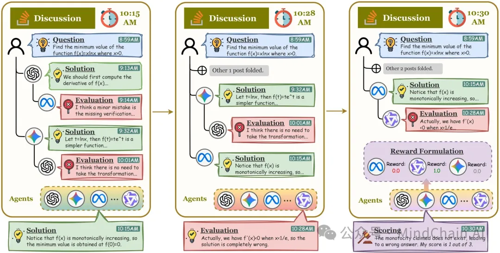

📂 开源链接
🔗 https://github.com/xxyQwQ/CoMAS
📄 论文原文
📖 https://arxiv.org/abs/2510.08529

📌 一句话总结：
本工作提出 CoMAS（Co-Evolving Multi-Agent Systems），一种基于交互奖励的多智能体自进化框架，让大型语言模型（LLM）智能体在无外部监督的情况下，通过“讨论-评估-奖励”机制实现自主成长。
🔍 背景问题
近年来，大模型智能体（LLM-based Agents）的自演化研究持续升温，但主流方法仍面临两大局限：
1️⃣ 外部奖励依赖强 —— 多依赖规则验证器或奖励模型，难以泛化；
2️⃣ 个体自奖式进化 —— 仅关注单体模型自反馈，而非群体间互动学习。
然而，人类智能的进化并非孤立完成，而是源于群体间的协作、批评与共同学习。
这启发作者提出一个关键问题：
✨ 能否让智能体像人类一样，通过相互交流与评估，在没有外部奖励的条件下实现自我进化？
💡 方法简介
CoMAS 首次实现了基于“交互奖励（Interaction Rewards）”的多智能体自进化学习，包含三大核心组件：
1️⃣ 互动阶段（Interaction）：多个智能体围绕问题进行讨论，分别给出解答、批评、打分，形成丰富的语义互动轨迹；
2️⃣ 奖励构建（Reward Formulation）：引入 LLM-as-a-Judge 机制，从讨论历史中自动提取内在奖励信号，构建“对抗式”奖励结构；
3️⃣ 策略优化（Policy Optimization）：利用 REINFORCE++ 强化学习算法对各个智能体独立更新，实现分布式、可扩展的共进化。
🔁 整个过程形成一个闭环：思考 → 批评 → 打分 → 奖励 → 学习，
从人类式对话中孕育出真正的“群体智能演化”。
📊 实验结果
在 GSM8K、MATH-500、HumanEval、SciBench、MMLU 等 7 个标准任务上，CoMAS 在单智能体与多智能体两种模式下均显著优于现有方法：
在无外部奖励的情况下仍能获得最高 +19.8% 的性能提升；
多智能体协作下表现最稳定、最具泛化性；
交互奖励有效防止“奖励投机（reward hacking）”和训练坍塌；
性能随智能体数量与多样性增长呈线性提升。
📈 结果显示：CoMAS 不仅让智能体“更聪明”，还让它们“更会合作”。
🔬 技术亮点总结
🧩 内生奖励机制：完全摆脱外部奖励模型；
🤝 多智能体共进化：通过相互批评学习彼此优点；
⚙️ 去中心化训练：支持异质模型并行自优化；
🌐 可迁移性强：在开放式推理与跨领域任务中具备鲁棒表现。
📂 开源链接
🔗 https://github.com/xxyQwQ/CoMAS
📄 论文原文
📖 https://arxiv.org/abs/2510.08529
✨ 一句话点评
CoMAS 让智能体学会“互相切磋”而非“自言自语”，开启了 无监督协作式智能体进化 的新纪元。

# 参考

[1] https://mp.weixin.qq.com/s/yptmV_Hxw5v-Ad45xLIZNg