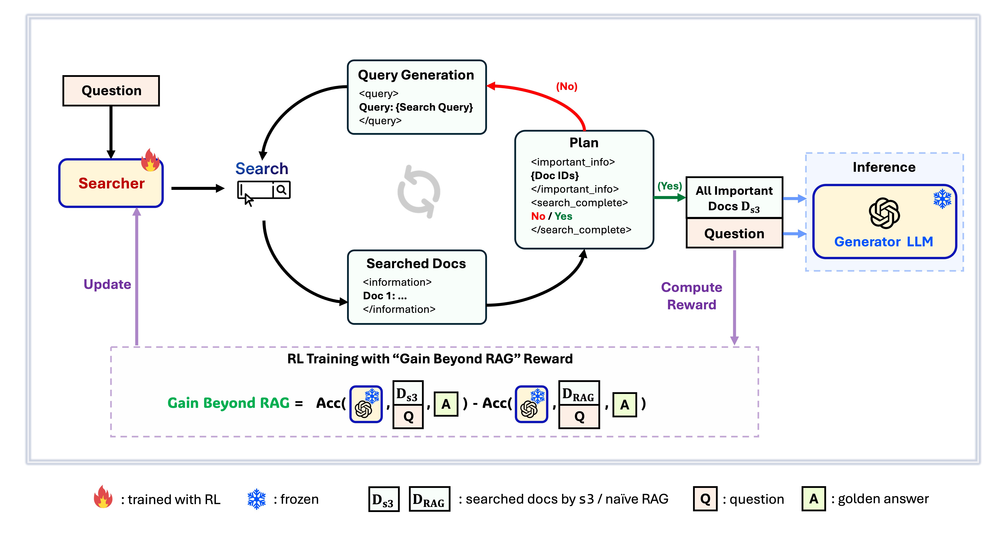
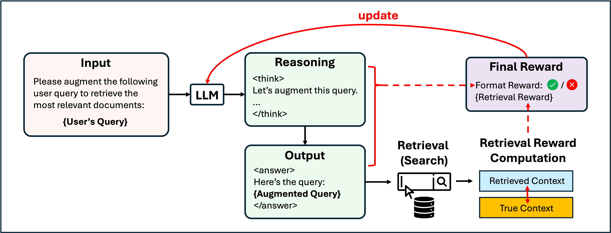

# 1. ZeroSearch
- Github (1k stars): https://github.com/Alibaba-nlp/ZeroSearch
- 论文：https://arxiv.org/pdf/2505.04588

训练一个模拟的LLM，提供搜索结果

# 2. Search-R1

- Github (2.8k stars): https://github.com/PeterGriffinJin/Search-R1
- 论文：https://arxiv.org/pdf/2503.09516

Search-R1 是一个强化学习框架，旨在训练推理和搜索交错 LLM，这是一种学习推理并以协调方式进行工具调用（例如，向搜索引擎调用）的语言模型。

Search-R1 基于 veRL 构建，通过整合交错搜索引擎访问扩展了 DeepSeek-R1（-Zero） 的理念，并提供了一个完全开源的 RL 训练管道。它是 OpenAI DeepResearch 的替代和开放解决方案，支持工具增强 LLM 推理的研发。

我们支持不同的 RL 方法（例如 PPO、GRPO、reinforce）、不同的 LLM（例如 llama3、Qwen2.5 等）和不同的搜索引擎（例如，本地稀疏/密集检索器和在线搜索引擎）。

# 3. s3

- Github (383 stars):  https://github.com/pat-jj/s3
- s3是一个简单而强大的框架，用于在检索增强生成 （RAG） 中训练搜索代理。它教语言模型如何更有效地搜索，而无需更改生成器本身。通过仅关注搜索组件，只需使用先前方法使用的一小部分数据，即可在 QA 任务中实现强大的性能。它是模块化的、高效的，旨在与任何黑盒 LLM 无缝协作。s3

# 4. RL-Factory

- Github (1.3k stars): https://github.com/Simple-Efficient/RL-Factory

RLFactory 是一个简单高效的 RL 后培训框架，用于代理学习。

RL-Factory 将环境与 RL 后训练解耦，只需使用工具配置和奖励函数即可进行训练，同时支持异步工具调用，使 RL 后训练速度提高 2 倍。

当前版本原生支持一键式 DeepSearch 训练，具有多轮工具调用、模型判断奖励和包括 Qwen3 在内的多个模型的训练功能。即将推出的功能中将添加更多更轻松、更高效的代理学习模块。

现在，每个人都可以使用 Qwen3（作为基本模型）和 MCP 工具轻松快速地训练代理！

# 4. DeepRetrieval

- Github (580 stars): https://github.com/pat-jj/DeepRetrieval
- DeepRetrieval - Hacking Real Search Engines & Retrievers with LLM via RL

DeepRetrieval 是一种新颖的强化学习方法，可训练大型语言模型 （LLM） 生成查询，以提高信息检索性能。与依赖带有标记的查询增强对的监督学习的传统方法不同，DeepRetrieval 允许模型通过直接试错来学习，使用检索指标作为奖励来生成查询，从而最大限度地提高检索性能。

该系统的工作原理是让 LLM 在一个部分生成推理步骤，然后在一个部分中生成最终的增强查询。这种结构化方法允许在提交查询公式之前进行明确的思维链推理。<think><answer>

主要特点和结果

- 无需监督：无需昂贵的人工注释或蒸馏参考查询
- 强大的性能：明显优于以前的先进方法
- 65.07% 的出版物检索召回率（与之前的 SOTA 24.68% 相比）
- 临床试验检索的召回率为 63.18%（与之前的 SOTA 32.11% 相比）
- 多功能应用： 在各种检索任务中表现出色： （1） 使用真实世界搜索引擎进行文献搜索 （2） 证据检索 （3） 经典信息检索 （4） SQL 数据库搜索
- 参数高效：仅使用 3B 参数即可获得卓越的结果，优于 GPT-4o 和 Claude-3.5-Sonnet 等大型模型

# 5. DeepResearcher

- Github (499 stars): https://github.com/GAIR-NLP/DeepResearcher

DeepResearcher 是第一个全面的框架，通过在真实环境中扩展强化学习 （RL） 和真实的 Web 搜索交互，对基于 LLM 的深度研究代理进行端到端训练。我们的定性分析揭示了端到端 RL 训练中涌现的认知行为，包括制定计划的能力、交叉验证来自多个来源的信息、进行自我反省以重新定向研究的能力，以及在无法找到明确答案时保持诚实的能力。

# 6. Atom-Searcher