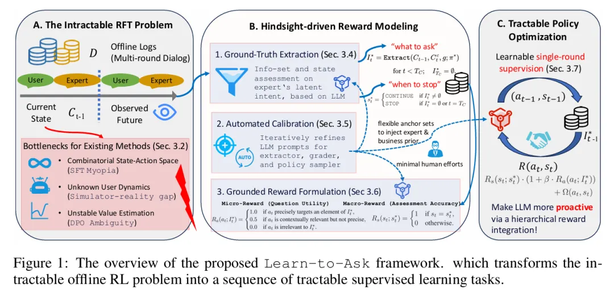

标题：Grounded in Reality: Learning and Deploying Proactive LLM from Offline Logs

日期：2025-10-29

机构：Alibaba Group

链接：http://arxiv.org/pdf/2510.25441v1

一句话总结：本文提出"学习式提问"框架，该无需模拟器的方案使大语言模型能够通过利用对话轨迹的观测未来推断奖励，直接从离线专家对话日志中学习主动的、目标导向的对话策略（提问与终止时机）。

# 参考

【1】 只会被动回答？阿里提出“学习式提问”，让大语言模型学会主动引导对话，https://mp.weixin.qq.com/s/b7vYjh1EeCJ2HkLO9lhzBw 
