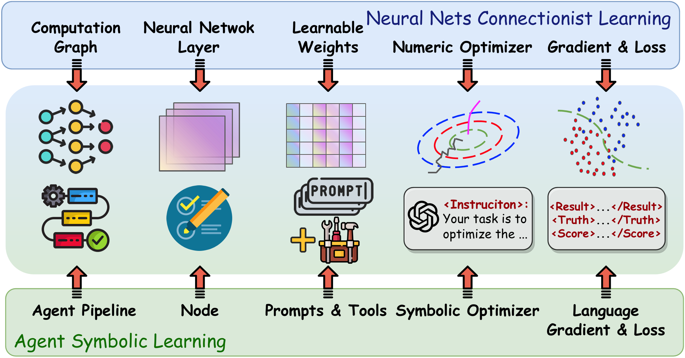
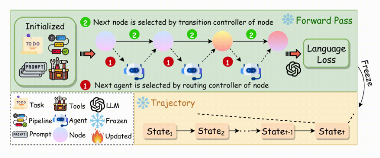

- github (5.8k stars): https://github.com/aiwaves-cn/agents
- 论文;Symbolic Learning Enables Self-Evolving Agents 

智能体符号学习是一个用于训练语言智能体的系统框架，其灵感来自用于训练神经网络的联结主义学习过程。我们对语言代理和神经网络进行了类比：代理的代理管道对应神经网络的计算图，代理管道中的节点对应神经网络中的一层，节点的提示和工具对应一层的权重。通过这种方式，我们能够在使用基于语言的损失、梯度和权重的代理训练的上下文中实现联结主义学习的主要组成部分，即向后传播和基于梯度的权重更新。

我们在智能体训练的上下文中实现损失函数、反向传播和权重优化器，并具有精心设计的提示管道。对于一个训练示例，我们的框架首先进行“前向传递”（代理执行），并将每个节点的输入、输出、提示和工具使用情况存储在“轨迹”中。然后，我们使用基于提示的损失函数来评估结果，从而导致“语言丢失”。然后，我们沿着轨迹将语言损失从最后一个节点反向传播到第一个节点，从而对每个节点内的符号组件进行文本分析和反思，我们称之为语言梯度。最后，我们根据语言梯度更新每个节点中的所有符号组件，以及由节点及其连接组成的计算图，并带有另一个精心设计的提示。我们的方法还自然地支持优化多代理系统，将节点视为不同的代理或允许多个代理在一个节点中执行作。

