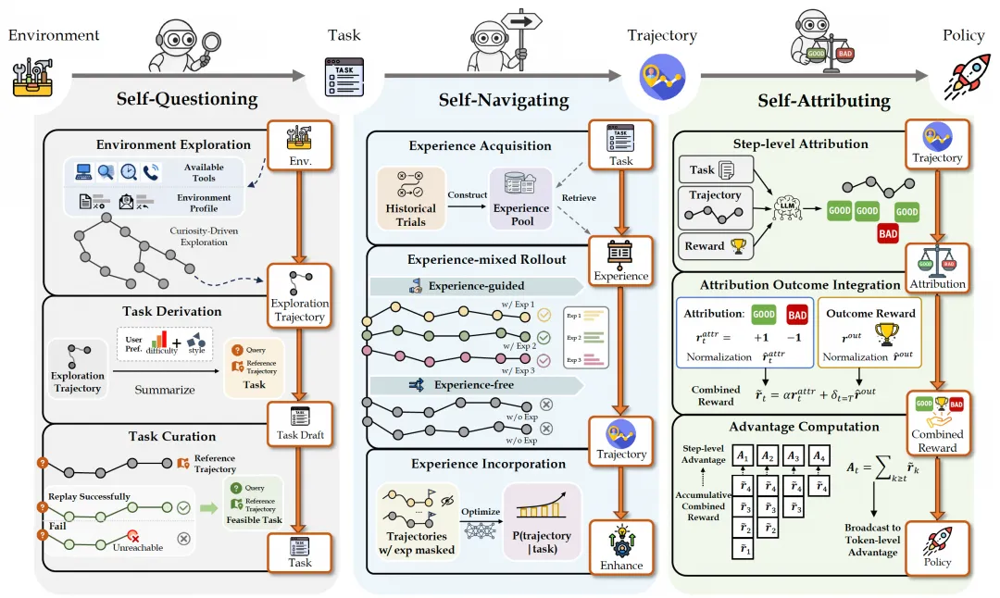
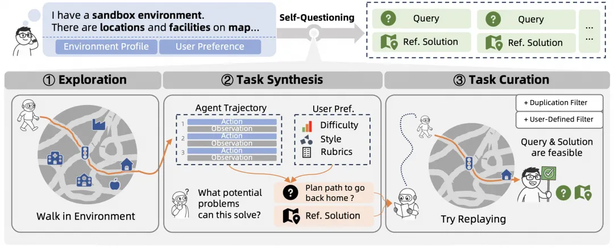
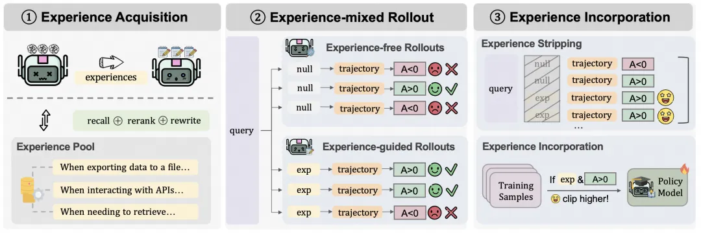
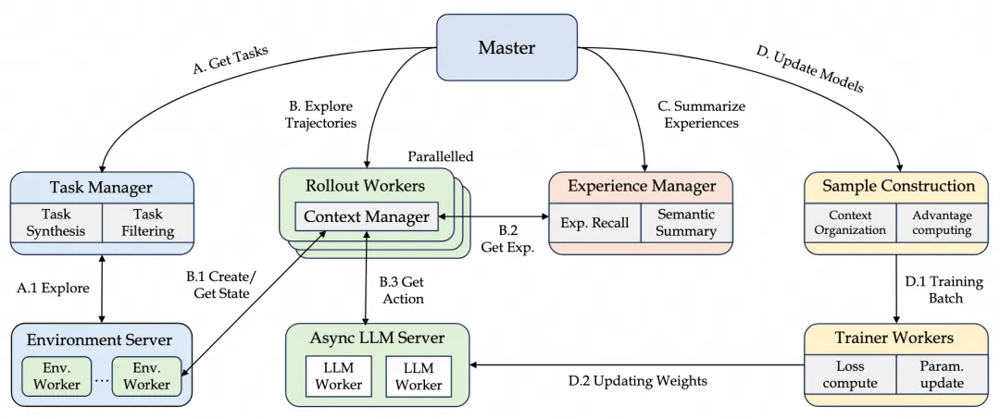
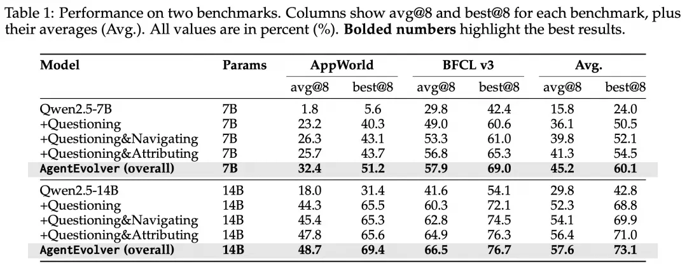

# 1. 资源

💻 GitHub 仓库:

https://github.com/modelscope/AgentEvolver（点击底部阅读原文可跳转）

📃 技术报告:

https://arxiv.org/abs/2511.10395

# 2. 原理

01

🌱 为何需要“自我进化”？

尽管智能体技术发展迅速，大多数系统仍停留在“按照指令完成任务”的层面——缺乏持续学习、适应变化的能力。这背后通常存在三大瓶颈：

任务构建成本高：

新的环境往往需要重新定义任务与目标，人工成本高、覆盖面有限。

探索效率低：

强化学习依赖大量交互采样，训练成本与时间消耗巨大。

样本利用不充分：

奖励稀疏且模糊，模型难以判断哪些中间步骤真正起作用。

AgentEvolver 的出现，将这些难题转化为新的突破点。它通过系统内部的多模块协同——让智能体学会提问、整理经验、分析因果——实现持续的自我演化，而无需依赖人工持续介入。

02

🧠 三大机制：驱动系统自进化的核心引擎

AgentEvolver 的核心，是一个由三大机制驱动的动态学习闭环。它让智能体不再是被动执行任务的“工具”，而是一个能不断学习、总结、改进的动态系统。它的核心在于三大机制的协同作用，驱动智能体在复杂环境中持续优化和演化：

自我任务生成（Self-Questioning）：自主生成探索任务，摆脱对人工数据集的依赖。

自我经验导航（Self-Navigating）：高效复用历史经验，提升探索效率。

自我反思归因（Self-Attributing）：精细评估步骤级奖励，提升样本利用率。

💭 机制①：自我任务生成（Self-Questioning）
在多数传统方法中，训练任务都由人来定义——写规则、设场景、造目标。但这样的训练集总是有限，如同为系统预设了一张固定的地图，边界清晰但想象力有限。一旦走出地图，系统便会迷失方向。

AgentEvolver 的自我任务生成机制，让系统学会主动“提出问题”。它结合长期目标与当前环境，自主生成新的探索任务，去主动探测未知的功能边界。换句话说，智能体系统不再等待投喂，而是学会反躬自问：“我还有什么不知道？”，并以此获得源源不断的内生探索动力。

「“自我任务生成”流水线，包括环境探索、任务合成和任务筛选。」

其关键技术流程包括：

好奇心引导的环境探索：将环境配置作为先验知识提供给LLM，引导模型在环境中进行自由探索，从而生成多样化、高质量的交互轨迹。

适应性任务合成：LLM 分析探索轨迹，结合用户偏好逆向生成任务查询，并从轨迹中抽取出对应的操作序列作为参考解。

任务筛选与验证：通过语义去重过滤冗余任务，并在真实环境中回放参考解，以验证任务的可行性并剔除幻觉任务。

基于参考的合成奖励：引入 LLM 裁判，通过对比智能体轨迹与参考解，评估关键步骤的覆盖度与执行效率，生成稠密、可靠的奖励信号用于策略优化。

机制②：自我经验导航（Self-Navigating）
在传统的学习范式中，智能体的每次探索往往是孤立的事件。经验无法有效沉淀，导致系统即便面对相似的情境，仍会重复已知的错误，探索效率低下。

AgentEvolver的自我经验导航机制，让系统学会主动“沉淀经验”。它将多轮交互中的成功与失败，提炼为结构化的“可迁移知识”，自主构建起关于策略有效性与环境反馈的内部认知地图。这些经验不再是散乱的数据点，而是成为指导未来决策的导航信标。于是，探索因此不再是随机的撞南墙，而是一种带着记忆和方向感的学习。

「“自我经验导航”流水线，包括经验获取、经验混合探索和经验内化。」

其关键技术流程包括：

经验获取：将历史成败轨迹提炼为结构化的自然语言经验，并将其向量化，构建一个可供随时检索的经验池。

经验混合探索：采用混合策略进行探索，部分轨迹由检索到的相关经验引导，部分进行纯粹探索，以平衡探索与利用。

经验内化：

经验剥离：将指导探索的经验文本从训练样本中移除，迫使模型学习其背后的推理逻辑，而非简单记忆文本。

选择性增强：针对那些由成功经验引导并产生正向收益的轨迹，在计算梯度时给予其更高的权重。

⚖ 机制③：自我反思归因（Self-Attributing）
在长程任务中，由于奖励信号的滞后与模糊，传统的信用分配机制难以定位关键动作，导致策略优化效率低下。

AgentEvolver的自我反思归因机制，让系统学会主动进行“决策归因”。它通过回溯任务轨迹，进行复盘分析，将笼统的最终奖励，精细化地分配到真正起作用的关键动作上。这意味着，智能体系统从被动的“黑箱”执行者，转变为能够自我剖析的分析单元。它不再依赖模糊的最终信号，而是通过识别并强化“关键动作”，在对关键行为的微观洞察中高效迭代策略，显著提升长程任务的样本效率。

其关键技术流程包括：

步级贡献归因：任务完成后，系统调用一个“复盘专家”的 LLM，对整个执行轨迹进行回溯分析，为每一步行为的贡献打上“好”(GOOD) 或“坏”(BAD) 的定性标签。目的是评估过程的合理性。

构建双通道复合奖励：为了全面评估，系统将上述“归因”与“结果”结合，构建一个复合奖励

归因奖励 (过程分)：将上一步的“好”/“坏”标签量化为 +1 / -1。

结果奖励 (结果分)：保留任务的最终得分。

这两部分奖励会先独立进行标准化，然后再加权融合，形成一个既看重过程又看重结果的综合性奖励信号。

优势计算与策略优化：

将上述综合奖励转化为每一步的优势函数（Advantage），并将该优势值广播至此步骤对应的所有token上，最终通过 GRPO 算法高效地进行策略优化。

💫 三个机制形成了一个持续自我演化的闭环：环境 → 任务 → 经验 → 策略 。AgentEvolver 不再依赖外部指令，而是凭借自身循环不断成长。

03

⚙️ 架构设计：面向扩展与适配性的模块化系统

强大的进化机制，需要同样强大且灵活的系统架构作为支撑。为此，AgentEvolver 采用模块化、易扩展的系统结构，不仅确保了核心机制可独立演进，更能无缝适配多样的工具、环境与任务需求。

其核心由两大支柱构成：Env Service 与 Context Manager。一个面向外部世界，一个服务内部推理逻辑。它们相互协同，确保系统在多任务、多环境中保持稳定与连贯，为自我任务生成、自我经验导航、自我反思归因等机制提供统一的运行基础。

🌍 Env Service：连接外部世界的桥梁
Env Service 负责管理智能体与外部环境的交互。它提供标准化接口以支持多种任务沙箱、工具 API 与仿真环境（如 AppWorld、BFCL等）。这一模块不仅执行环境调用与状态同步，还负责反馈执行结果，让系统具备跨环境运行与迁移的能力。

🧠 Context Manager：组织推理与交互逻辑的中枢
Context Manager 定义了智能体“如何思考、如何行动”。它负责管理多轮交互的上下文信息与推理模版，AgentEvolver 内嵌了多种上下文管理模版，这使得它无论面对简单任务、复杂任务、还是长序列任务，Context Manager 都能保持智能体的逻辑连贯与策略自洽。

💫 这两个模块相互独立、又彼此协作—— Env Service 让系统走进环境，Context Manager 让系统理解环境。

它们共同支撑起三大自进化机制（任务生成、经验导航、反思归因），让 AgentEvolver 成为一个能适应不同工具、环境与推理场景的通用进化系统。同时，该体系也降低了研究者的实验门槛，使其能够将更多精力专注于算法本身的设计与验证。

04

📈 实验表现

在 AppWorld 与 BFCL-v3 两大公开基准测试中，AgentEvolver 的有效性得到了充分验证。

更高的参数效率：搭载 AgentEvolver 完整架构的 7B 模型，平均任务成功率达到 45.2%，显著超越了参数量为其两倍的 14B 基线模型（29.8%）。

显著的性能提升：在同尺寸的 14B 模型上，AgentEvolver 将基线模型的成功率从 29.8% 大幅提升至 57.6%。

机制的协同效应：消融实验证实，自我任务生成、经验导航与反思归因三大机制均对性能有明确的正向贡献，验证了系统设计的完整性。

# 参考

[1] https://mp.weixin.qq.com/s/LJIwIjuqnREwJkX2ghH3ng